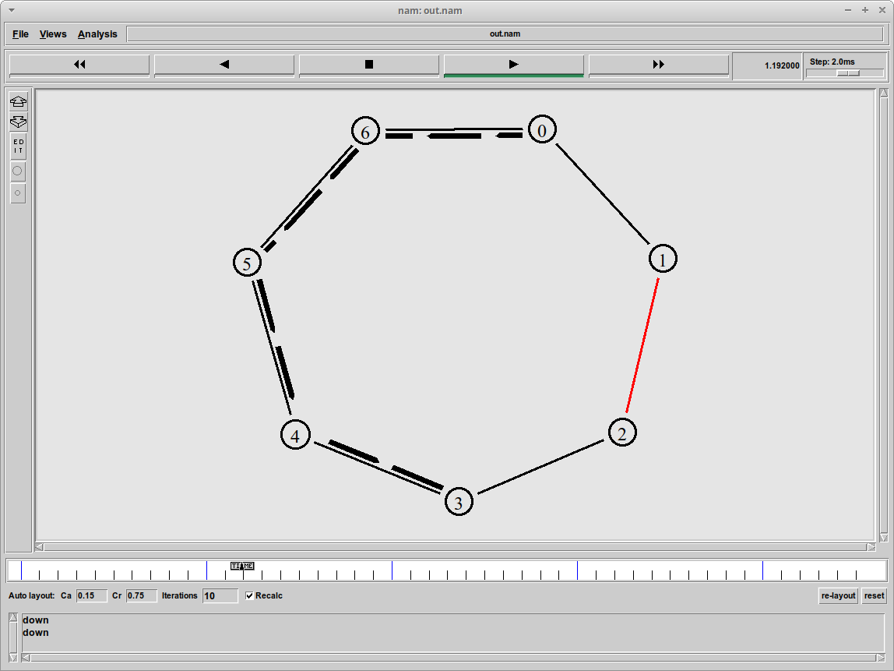

---
## Front matter
lang: ru-RU
title: Простые модели компьютерной сети
subtitle: Лабораторная работа №1.
author:
  - Рогожина Н.А.
institute:
  - Российский университет дружбы народов, Москва, Россия
date: 15 февраля 2025

## i18n babel
babel-lang: russian
babel-otherlangs: english

## Formatting pdf
toc: false
toc-title: Содержание
slide_level: 2
aspectratio: 169
section-titles: true
theme: metropolis
header-includes:
 - \metroset{progressbar=frametitle,sectionpage=progressbar,numbering=fraction}
---

# Информация

## Докладчик

:::::::::::::: {.columns align=center}
::: {.column width="70%"}

  * Рогожина Надежда Александровна
  * студентка 3 курса НФИбд-02-22
  * Российский университет дружбы народов
  * <https://mikogreen.github.io/ru/>

:::
::: {.column width="30%"}

# Вводная часть

## Цели и задачи

- Приобретение навыков моделирования сетей передачи данных с помощью средства имитационного моделирования NS-2
- Анализ полученных результатов моделирования.

# Выполнение работы

## Начало

Создание директории и файла шаблона (рис. [-@fig:001]).

{#fig:001 width=70%}

## Создание шаблона

Далее, вводим сам код шаблона (рис. [-@fig:002]).

{#fig:002 width=70%}

## Первый запуск

Впервые запускаем nam (рис. [-@fig:003]).

{#fig:003 width=70%}

## Задача 1.

Далее, нам была поставлена задача реализовать примитивную модель сети, состоящей из 2 узлов:

*Требуется смоделировать сеть передачи данных, состоящую из двух узлов, соединённых дуплексной линией связи с полосой пропускания 2 Мб/с и задержкой 10 мс, очередью с обслуживанием типа DropTail. От одного узла к другому по протоколу UDP осуществляется передача пакетов, размером 500 байт, с постоянной скоростью 200 пакетов в секунду.*

## Запуск

{#fig:006 width=70%}

Здесь мы видим 2 узла (0 и 1) и соединяющую их дуплексную линию связи с полосой пропускания 2 Мб/с. 

## Задача 2

Следующим заданием было реализовать чуть более сложную сеть, состоящую из  4 узлов:
- сеть состоит из 4 узлов (n0, n1, n2, n3);
- между узлами n0 и n2, n1 и n2 установлено дуплексное соединение с пропускной способностью 2 Мбит/с и задержкой 10 мс;
- между узлами n2 и n3 установлено дуплексное соединение с пропускной способностью 1,7 Мбит/с и задержкой 20 мс;
- каждый узел использует очередь с дисциплиной DropTail для накопления пакетов, максимальный размер которой составляет 10;
- TCP-источник на узле n0 подключается к TCP-приёмнику на узле n3 (по-умолчанию, максимальный размер пакета, который TCP-агент может генерировать, равняется 1KByte)
- TCP-приёмник генерирует и отправляет ACK пакеты отправителю и откидывает полученные пакеты;
- UDP-агент, который подсоединён к узлу n1, подключён к null-агенту на узле n3 (null-агент просто откидывает пакеты);
- генераторы трафика ftp и cbr прикреплены к TCP и UDP агентам соответственно;
- генератор cbr генерирует пакеты размером 1 Кбайт со скоростью 1 Мбит/с;
- работа cbr начинается в 0,1 секунду и прекращается в 4,5 секунды, а ftp начинает работать в 1,0 секунду и прекращает в 4,0 секунды.

## Задача 2

В 1 секунду у нас заработали оба инициатора, маршрутизация пакетов выглядела следующим образом (рис. [-@fig:009]):

{#fig:009 width=70%}

## Задача 3

Далее, по примеру из текста лабораторной работы был реализован пример сети с кольцевой топологией (рис. [-@fig:010]):
- сеть состоит из 7 узлов, соединённых в кольцо;
- данные передаются от узла n(0) к узлу n(3) по кратчайшему пути;
- с 1 по 2 секунду модельного времени происходит разрыв соединения между узлами n(1) и n(2) ;
– при разрыве соединения маршрут передачи данных должен измениться на резервный.

## Задача 3

{#fig:010 width=70%}

## Задача 3

Сеть была настроена таким образом, что пакеты данных должны были ходить из 0 узла в 3 по кратчайшему пути. 
Также, для наглядности, мы указали отключение линии между 0 и 1 узлами на 1 секунду (с 1 по 2 сек). 
В момент времени, равный 1 с, пакеты данных пошли по пути 0-6-5-4-3, для достижения цели (рис. [-@fig:011]):

## Разрыв

{#fig:011 width=70%}

## Упражнение

Последним заданием было реализовать сеть с кольцево-линейной топологией (комбинация линейной и кольцевой топологий).
Узлы с 0 по 4 должны были образовывать кольцо, 5 узел соединяться с 1. Также:
- передача данных должна осуществляться от узла n(0) до узла n(5) по кратчайшему пути в течение 5 секунд модельного времени;
- передача данных должна идти по протоколу TCP (тип Newreno), на принимающей стороне используется TCPSink-объект типа DelAck; 
поверх TCP работает протокол FTP с 0,5 до 4,5 секунд модельного времени;
- с 1 по 2 секунду модельного времени происходит разрыв соединения между узлами n(0) и n(1);
- при разрыве соединения маршрут передачи данных должен измениться на резервный, после восстановления соединения пакеты снова должны пойти по кратчайшему пути

## Упражнение

После, запустив `ns run` в терминале, получили следующую сеть (рис. [-@fig:014]):

{#fig:014 width=70%}

## Разрыв

В момент времени, равный 1с, связь между 0 и 1 узлами разорвалась, в связи с чем некоторое количество пакетов было потеряно (рис. [-@fig:015]):

{#fig:015 width=70%}

## Восстановление соединения

Спустя несколько секунд реального времени, пакеты пошли по единственно существующему, a-k-a короткому пути (рис. [-@fig:016]):

{#fig:016 width=70%}

# Выводы

## Выводы 

В ходе выполнения лабораторной работы были получены навыки моделирования сетей передачи данных с помощью средства имитационного моделирования NS-2, а также проведен анализ полученных результатов моделирования.
