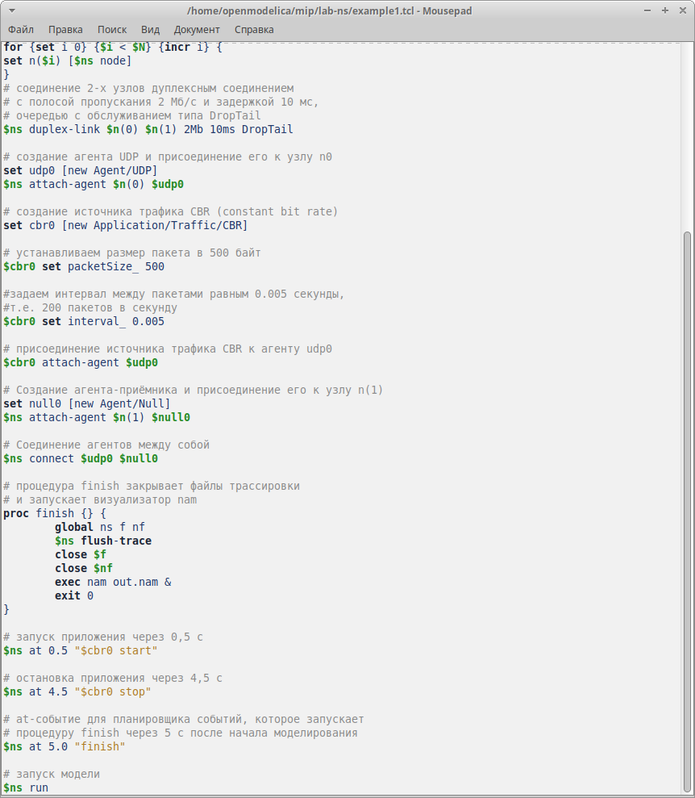
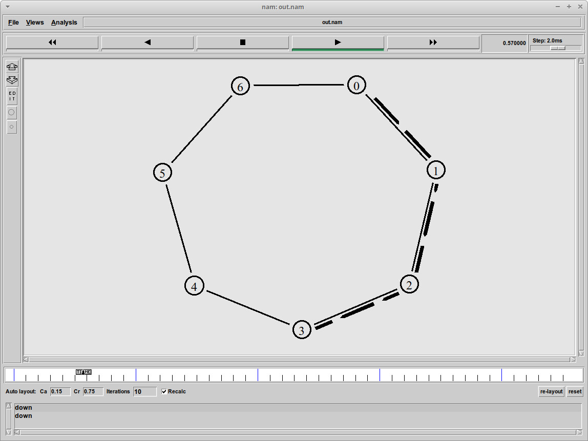

---
## Front matter
title: "Отчёт по лабораторной работе №1"
subtitle: "Простые модели компьютерной сети"
author: "Надежда Александровна Рогожина"

## Generic otions
lang: ru-RU
toc-title: "Содержание"

## Bibliography
bibliography: bib/cite.bib
csl: pandoc/csl/gost-r-7-0-5-2008-numeric.csl

## Pdf output format
toc: true # Table of contents
toc-depth: 2
lof: true # List of figures
lot: true # List of tables
fontsize: 12pt
linestretch: 1.5
papersize: a4
documentclass: scrreprt
## I18n polyglossia
polyglossia-lang:
  name: russian
  options:
	- spelling=modern
	- babelshorthands=true
polyglossia-otherlangs:
  name: english
## I18n babel
babel-lang: russian
babel-otherlangs: english
## Fonts
mainfont: IBM Plex Serif
romanfont: IBM Plex Serif
sansfont: IBM Plex Sans
monofont: IBM Plex Mono
mathfont: STIX Two Math
mainfontoptions: Ligatures=Common,Ligatures=TeX,Scale=0.94
romanfontoptions: Ligatures=Common,Ligatures=TeX,Scale=0.94
sansfontoptions: Ligatures=Common,Ligatures=TeX,Scale=MatchLowercase,Scale=0.94
monofontoptions: Scale=MatchLowercase,Scale=0.94,FakeStretch=0.9
mathfontoptions:
## Biblatex
biblatex: true
biblio-style: "gost-numeric"
biblatexoptions:
  - parentracker=true
  - backend=biber
  - hyperref=auto
  - language=auto
  - autolang=other*
  - citestyle=gost-numeric
## Pandoc-crossref LaTeX customization
figureTitle: "Рис."
tableTitle: "Таблица"
listingTitle: "Листинг"
lofTitle: "Список иллюстраций"
lotTitle: "Список таблиц"
lolTitle: "Листинги"
## Misc options
indent: true
header-includes:
  - \usepackage{indentfirst}
  - \usepackage{float} # keep figures where there are in the text
  - \floatplacement{figure}{H} # keep figures where there are in the text
---

# Цель работы

Приобретение навыков моделирования сетей передачи данных с помощью средства имитационного моделирования NS-2, 
а также анализ полученных результатов моделирования.

# Задание

1. Создать шаблон на основе кода, который дан в тексте лабораторной работы.
2. Смоделировать сеть передачи данных, состоящую из двух узлов, соединённых дуплексной линией связи с полосой пропускания
 2 Мб/с и задержкой 10 мс, очередью с обслуживанием типа DropTail, основываясь на шаблоне, созданном в предыдущем пункте. 
От одного узла к другому по протоколу UDP осуществляется передача пакетов, размером 500 байт, с постоянной скоростью 200 пакетов в секунду.

# Теоретическое введение

Network Simulator (NS-2) — один из программных симуляторов моделирования
процессов в компьютерных сетях. NS-2 позволяет описать топологию сети, кон-
фигурацию источников и приёмников трафика, параметры соединений (полосу
пропускания, задержку, вероятность потерь пакетов и т.д.) и множество других
параметров моделируемой системы. Данные о динамике трафика, состоянии со-
единений и объектов сети, а также информация о работе протоколов фиксируются
в генерируемом trace-файле.

NS-2 является объектно-ориентированным программным обеспечением. Его ядро
реализовано на языке С++. В качестве интерпретатора используется язык скриптов
(сценариев) OTcl (Object oriented Tool Command Language). NS-2 полностью поддер-
живает иерархию классов С++ и подобную иерархию классов интерпретатора OTcl.
Обе иерархии обладают идентичной структурой, т.е. существует однозначное соот-
ветствие между классом одной иерархии и таким же классом другой. Объединение
для совместного функционирования С++ и OTcl производится при помощи TclCl
(Classes Tcl). В случае, если необходимо реализовать какую-либо специфическую
функцию, не реализованную в NS-2 на уровне ядра, для этого используется код на С++.

Процесс создания модели сети для NS-2 состоит из нескольких этапов:
1. создание нового объекта класса Simulator, в котором содержатся методы, необ-
ходимые для дальнейшего описания модели (например, методы new и delete
используются для создания и уничтожения объектов соответственно);
2. описание топологии моделируемой сети с помощью трёх основных функциональ-
ных блоков: узлов (nodes), соединений (links) и агентов (agents);
3. задание различных действий, характеризующих работу сети.

Для создания узла используется метод node. При этом каждому узлу авто-
матически присваивается уникальный адрес. Для построения однонаправленных
и двунаправленных линий соединения узлов используют методы simplex-link
и duplex-link соответственно.

Важным объектом NS-2 являются агенты, которые могут рассматриваться как про-
цессы и/или как транспортные единицы, работающие на узлах моделируемой сети.
Агенты могут выступать в качестве источников трафика или приёмников, а также
как динамические маршрутизирующие и протокольные модули. Агенты создаются
с помощью методов общего класса Agent и являются объектами его подкласса, т.е.
Agent/type, где type определяет тип конкретного объекта. Например, TCP-агент
может быть создан с помощью команды:
```
set tcp [ new Agent/TCP ]
```
Для закрепления агента за конкретным узлом используется метод attach-agent.
Каждому агенту присваивается уникальный адрес порта для заданного узла (ана-
логично портам tcp и udp). Чтобы за конкретным агентом закрепить источник,
используют методы attach-source и attach-traffic. Например, можно при-
крепить ftp или telnet источники к TCP-агенту. Есть агенты, которые генерируют
свои собственные данные, например, CBR-агент (Constant Bit-Rate) — источник
трафика с постоянной интенсивностью.

Действия разных агентов могут быть назначены планировщиком событий (Event
Scheduler) в определённые моменты времени (также в определённые моменты време-
ни могут быть задействованы или отключены те или иные источники данных, запись
статистики, разрыв, либо восстановление соединений, реконфигурация топологии
и т.д.). Для этого может использоваться метод at. Моделирование начинается при
помощи метода run.


# Выполнение лабораторной работы

В своём рабочем каталоге создайте директорию mip , к которой будут выполняться 
лабораторные работы. Внутри mip создайте директорию lab-ns , а в ней файл
shablon.tcl :
```
mkdir -p mip/lab-ns
cd mip/lab-ns
touch shablon.tcl
```
Создание директории и файла шаблона (рис. [-@fig:001]).

{#fig:001 width=70%}

Далее, вводим сам код шаблона (рис. [-@fig:002]).

{#fig:002 width=70%}

Впервые запускаем nam (рис. [-@fig:003]).

{#fig:003 width=70%}

Далее, нам была поставлена задача реализовать примитивную модель сети, состоящей из 2 узлов:

*Требуется смоделировать сеть передачи данных, состоящую из двух узлов, соединённых дуплексной линией связи с полосой пропускания 2 Мб/с и задержкой 10 мс, очередью с обслуживанием типа DropTail. От одного узла к другому по протоколу UDP осуществляется передача пакетов, размером 500 байт, с постоянной скоростью 200 пакетов в секунду.*

По коду, который был указан в тексте лабораторной работы, повторили данную сеть (рис. [-@fig:004], рис. [-@fig:005]).

{#fig:004 width=70%}


{#fig:005 width=70%}

После этого, в консоли выполнили еще раз **ns run** (рис. [-@fig:006]).

{#fig:006 width=70%}

Здесь мы видим 2 узла (0 и 1) и соединяющую их дуплексную линию связи с полосой пропускания 2 Мб/с. 
Следующим заданием было реализовать чуть более сложную сеть, состоящую из  4 узлов (рис. [-@fig:007], рис. [-@fig:008]):
- сеть состоит из 4 узлов (n0, n1, n2, n3);
- между узлами n0 и n2, n1 и n2 установлено дуплексное соединение с пропускной способностью 2 Мбит/с и задержкой 10 мс;
- между узлами n2 и n3 установлено дуплексное соединение с пропускной способностью 1,7 Мбит/с и задержкой 20 мс;
- каждый узел использует очередь с дисциплиной DropTail для накопления пакетов, максимальный размер которой составляет 10;
- TCP-источник на узле n0 подключается к TCP-приёмнику на узле n3 (по-умолчанию, максимальный размер пакета, который TCP-агент может генерировать, равняется 1KByte)
- TCP-приёмник генерирует и отправляет ACK пакеты отправителю и откидывает полученные пакеты;
- UDP-агент, который подсоединён к узлу n1, подключён к null-агенту на узле n3 (null-агент просто откидывает пакеты);
- генераторы трафика ftp и cbr прикреплены к TCP и UDP агентам соответственно;
- генератор cbr генерирует пакеты размером 1 Кбайт со скоростью 1 Мбит/с;
- работа cbr начинается в 0,1 секунду и прекращается в 4,5 секунды, а ftp начинает работать в 1,0 секунду и прекращает в 4,0 секунды.

{#fig:007 width=70%}

{#fig:008 width=70%}

В 1 секунду у нас заработали оба инициатора, маршрутизация пакетов выглядела следующим образом (рис. [-@fig:009]):

{#fig:009 width=70%}

Далее, по примеру из текста лабораторной работы был реализован пример сети с кольцевой топологией (рис. [-@fig:010]):
- сеть состоит из 7 узлов, соединённых в кольцо;
- данные передаются от узла n(0) к узлу n(3) по кратчайшему пути;
- с 1 по 2 секунду модельного времени происходит разрыв соединения между узлами n(1) и n(2) ;
– при разрыве соединения маршрут передачи данных должен измениться на резервный.

{#fig:010 width=70%}

Сеть была настроена таким образом, что пакеты данных должны были ходить из 0 узла в 3 по кратчайшему пути. 
Также, для наглядности, мы указали отключение линии между 0 и 1 узлами на 1 секунду (с 1 по 2 сек). 
В момент времени, равный 1 с, пакеты данных пошли по пути 0-6-5-4-3, для достижения цели (рис. [-@fig:011]):

{#fig:011 width=70%}

Последним заданием было реализовать сеть с кольцево-линейной топологией (комбинация линейной и кольцевой топологий).
Узлы с 0 по 4 должны были образовывать кольцо, 5 узел соединяться с 1. Также:
- передача данных должна осуществляться от узла n(0) до узла n(5) по кратчайшему пути в течение 5 секунд модельного времени;
- передача данных должна идти по протоколу TCP (тип Newreno), на принимающей стороне используется TCPSink-объект типа DelAck; 
поверх TCP работает протокол FTP с 0,5 до 4,5 секунд модельного времени;
- с 1 по 2 секунду модельного времени происходит разрыв соединения между узлами n(0) и n(1);
- при разрыве соединения маршрут передачи данных должен измениться на резервный, после восстановления соединения пакеты снова должны пойти по кратчайшему пути

Реализованный алгоритм (рис. [-@fig:012], рис. [-@fig:013]).

{#fig:012 width=70%}

{#fig:013 width=70%}

После, запустив `ns run` в терминале, получили следующую сеть (рис. [-@fig:014]):

{#fig:014 width=70%}

В момент времени, равный 1с, связь между 0 и 1 узлами разорвалась, в связи с чем некоторое количество пакетов было потеряно (рис. [-@fig:015]):

{#fig:015 width=70%}

Спустя несколько секунд реального времени, пакеты пошли по единственно существующему, a-k-a короткому пути (рис. [-@fig:016]):

{#fig:016 width=70%}

# Выводы

В ходе выполнения лабораторной работы были получены навыки моделирования сетей передачи данных с помощью средства имитационного моделирования NS-2, 
а также проведен анализ полученных результатов моделирования.

# Список литературы{.unnumbered}

::: {#refs}
:::
