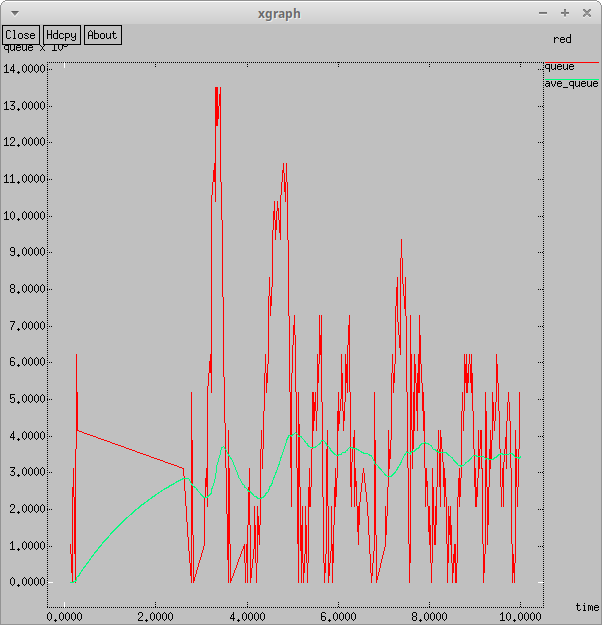

---
## Front matter
lang: ru-RU
title: Исследование протокола TCP и алгоритма управления очередью RED
subtitle: Лабораторная работа №2.
author:
  - Рогожина Н.А.
institute:
  - Российский университет дружбы народов, Москва, Россия
date: 22 февраля 2025

## i18n babel
babel-lang: russian
babel-otherlangs: english

## Formatting pdf
toc: false
toc-title: Содержание
slide_level: 2
aspectratio: 169
section-titles: true
theme: metropolis
header-includes:
 - \metroset{progressbar=frametitle,sectionpage=progressbar,numbering=fraction}
---

# Информация

## Докладчик

:::::::::::::: {.columns align=center}
::: {.column width="70%"}

  * Рогожина Надежда Александровна
  * студентка 3 курса НФИбд-02-22
  * Российский университет дружбы народов
  * <https://mikogreen.github.io/>

:::
::::::::::::::

# Цель работы

## Цель работы 

Проанализировать разницу между 3-мя протоколами передачи данных:

1. TCP Reno

2. TCP NewReno

3. TCP Vegas

# Выполнение лабораторной работы

## Первый шаг

Первым делом мы копировали шаблон в новый файл и открыли его на редактирование.

{#fig:001 width=35%}

## Написание модели 

В тексте лабораторной работы был дан код алгоритма, который было необходимо реализовать. Мы его переписали в новый созданный файл.

## Реализация модели

{#fig:002 width=40%}

## Реализация модели

{#fig:003 width=40%}

## Реализация модели

{#fig:004 width=40%}

## Результаты первого запуска

{#fig:005 width=40%}

## Результаты первого запуска

{#fig:006 width=40%}

## Изменения

Для более приятной и понятной визуализации, я изменила график:

1. -bg white для белого фона

2. 0.Color=purple для цвета первой рисуемой линии

3. 1.Color=orange для цвета второй рисуемой линии

4. Третью линию оставила как есть, красной.

## Изменения

{#fig:007 width=40%}

## Изменения

{#fig:008 width=40%}

## Смена протокола

{#fig:009 width=40%}

## Смена протокола

{#fig:010 width=40%}

## Повторная смена протокола

{#fig:011 width=40%}

## Повторная смена протокола

{#fig:012 width=40%}

## Анализ данных

Т.к. у нас Reno и NewReno похожи по подходу, графики тоже похожи, но у NewReno стабильнее график и меньше разброс значений, т.к. у Reno увеличение окна происходит линейно и регулируется только при потере пакетов, а у NewReno есть регуляризация принятия пакетов после потери (увеличенный быстрый старт), а у TCP Vegas совершенно иной подход к регуляризации трафика - управление на основе показателя задержки, в следствие чего среднее число пакетов в очереди выглядит еще более стабильно. А также пик размера окна у него сильно меньше, чем у двух предыдущих алгоритмов.

# Выводы

## Выводы

В ходе лабораторной работы мы определили различия между 3-мя протоколами TCP и приобрели базовые навыки работы со средством визуализации `xgraph`.
