---
## Front matter
title: "Отчёт по лабораторной работе №2"
subtitle: "Исследование протокола TCP и алгоритма управления очередью RED"
author: "Надежда Александровна Рогожина"

## Generic otions
lang: ru-RU
toc-title: "Содержание"

## Bibliography
bibliography: bib/cite.bib
csl: pandoc/csl/gost-r-7-0-5-2008-numeric.csl

## Pdf output format
toc: true # Table of contents
toc-depth: 2
lof: true # List of figures
lot: true # List of tables
fontsize: 12pt
linestretch: 1.5
papersize: a4
documentclass: scrreprt
## I18n polyglossia
polyglossia-lang:
  name: russian
  options:
	- spelling=modern
	- babelshorthands=true
polyglossia-otherlangs:
  name: english
## I18n babel
babel-lang: russian
babel-otherlangs: english
## Fonts
mainfont: IBM Plex Serif
romanfont: IBM Plex Serif
sansfont: IBM Plex Sans
monofont: IBM Plex Mono
mathfont: STIX Two Math
mainfontoptions: Ligatures=Common,Ligatures=TeX,Scale=0.94
romanfontoptions: Ligatures=Common,Ligatures=TeX,Scale=0.94
sansfontoptions: Ligatures=Common,Ligatures=TeX,Scale=MatchLowercase,Scale=0.94
monofontoptions: Scale=MatchLowercase,Scale=0.94,FakeStretch=0.9
mathfontoptions:
## Biblatex
biblatex: true
biblio-style: "gost-numeric"
biblatexoptions:
  - parentracker=true
  - backend=biber
  - hyperref=auto
  - language=auto
  - autolang=other*
  - citestyle=gost-numeric
## Pandoc-crossref LaTeX customization
figureTitle: "Рис."
tableTitle: "Таблица"
listingTitle: "Листинг"
lofTitle: "Список иллюстраций"
lotTitle: "Список таблиц"
lolTitle: "Листинги"
## Misc options
indent: true
header-includes:
  - \usepackage{indentfirst}
  - \usepackage{float} # keep figures where there are in the text
  - \floatplacement{figure}{H} # keep figures where there are in the text
---

# Цель работы

Проанализировать разницу между 3-мя протоколами передачи данных:
- TCP Reno
- TCP NewReno
- TCP Vegas

# Задание

На основе приведенной в лабораторной работе модели с 6 узлами, изменить типы протоколов и проанализировать результаты. Поменять визуализацию графиков.

# Теоретическое введение

Протокол управления передачей (Transmission Control Protocol, TCP) имеет средства управления потоком и коррекции ошибок, ориентирован на установление соединения.

- Флаг Указатель срочности (Urgent Pointer, URG) устанавливается в 1 в случае использования поля Указатель на срочные данные.
- Флаг Подтверждение (Acknowledgment, ACK) устанавливается в 1 в случае, если поле Номер подтверждения (Acknowledgement Number) содержит данные. В противном случае это поле игнорируется.
- Флаг Выталкивание (Push, PSH) означает, что принимающий стек TCP должен немедленно информировать приложение о поступивших данных, а не ждать, пока буфер заполниться.
- Флаг Сброс (Reset, RST) используется для отмены соединения из-за ошибки приложения, отказа от неверного сегмента, попытки создать соединение при отсутствии затребованного сервиса.
- Флаг Синхронизация (Synchronize, SYN) устанавливается при инициировании соединения и синхронизации порядкового номера.
- Флаг Завершение (Finished, FIN) используется для разрыва соединения. Он указывает, что отправитель закончил передачу данных.

Управление потоком в протоколе TCP осуществляется при помощи скользящего окна переменного размера:
- поле Размер окна (Window) (длина 16 бит) содержит количество байт, которое может быть послано после байта, получение которого уже подтверждено;
- если значение этого поля равно нулю, это означает, что все байты, вплоть до байта с номером Номер подтверждения - 1, получены, но получатель отказывается принимать дальнейшие данные;
- разрешение на дальнейшую передачу может быть выдано отправкой сегмента с таким же значением поля Номер подтверждения и ненулевым значением поля Размер окна.

Регулирование трафика в TCP:
- контроль доставки — отслеживает заполнение входного буфера получателя с помощью параметра Размер окна (Window);
- контроль перегрузки — регистрирует перегрузку канала и связанные с этим потери, а также понижает интенсивность трафика с помощью Окна перегрузки (Congestion Window, CWnd) и Порога медленного старта (Slow Start Threshold, SSThreth).

Например, в табл. [-@tbl:std-dir] приведено краткое описание анализируемых протоколов передачи данных.

: Описание некоторых протоколов передачи данных {#tbl:std-dir}

| Характеристика       |  TCP Reno                 |  TCP NewReno                |  TCP Vegas                     |
|----------------------|---------------------------|-----------------------------|--------------------------------|
| Основной подход      | Реакция на потери пакетов | Реакция на потери пакетов   | Управление на основе задержек  |
| Множественные потери | Неэффективно              | Эффективно                  | Нет потерь (проактивно)        |
| Агрессивность        | Высокая                   | Высокая                     | Низкая                         |
| Стабильность         | Средняя                   | Средняя                     | Высокая                        |
| Сложность реализации | Простая                   | Средняя                     | Сложная                        |

# Выполнение лабораторной работы

Первым делом мы копировали шаблон в новый файл и открыли его на редактирование (рис. [-@fig:001]).

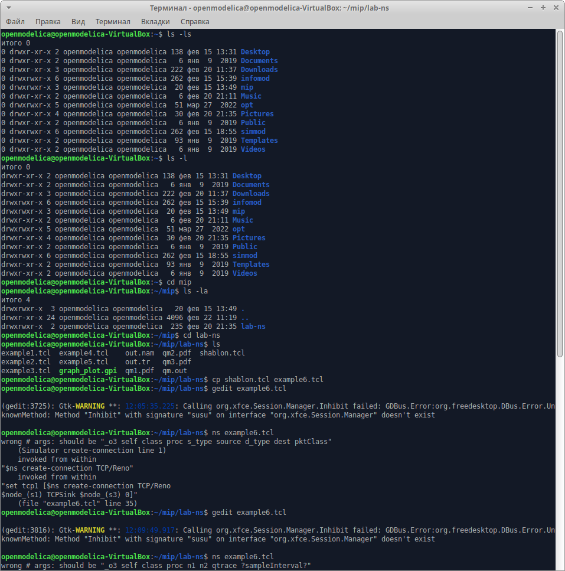{#fig:001 width=70%}

 
В тексте лабораторной работы был дан код алгоритма, который было необходимо реализовать. Мы его переписали в новый созданный файл (рис. [-@fig:002], рис. [-@fig:003], рис. [-@fig:004]).

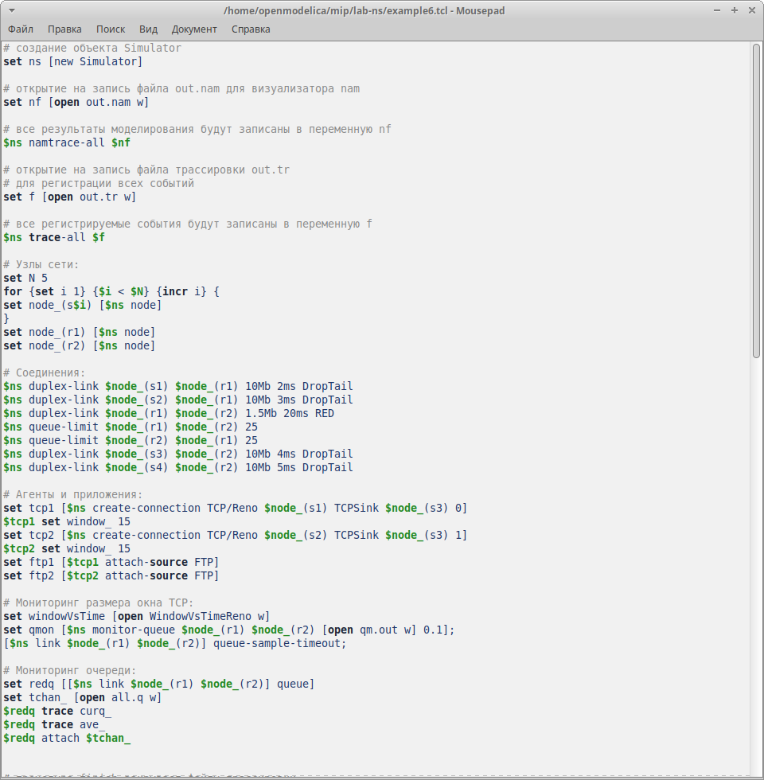{#fig:002 width=70%}

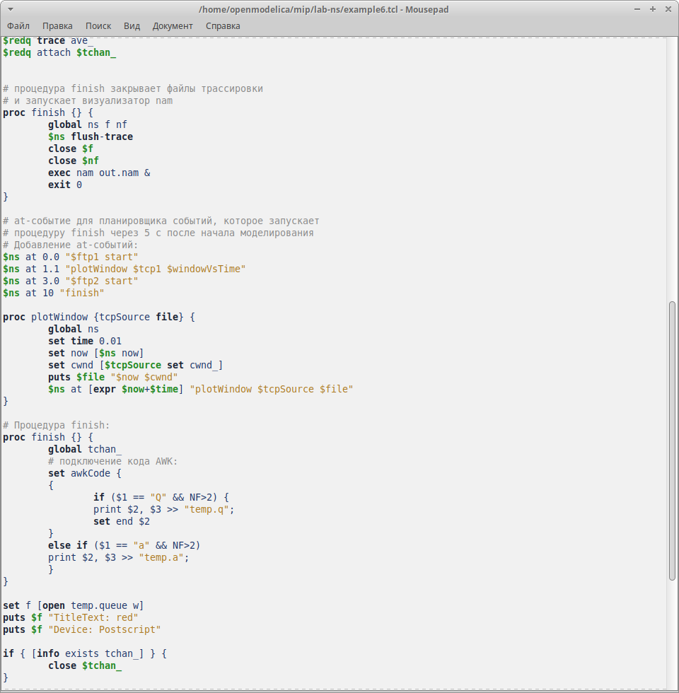{#fig:003 width=70%}

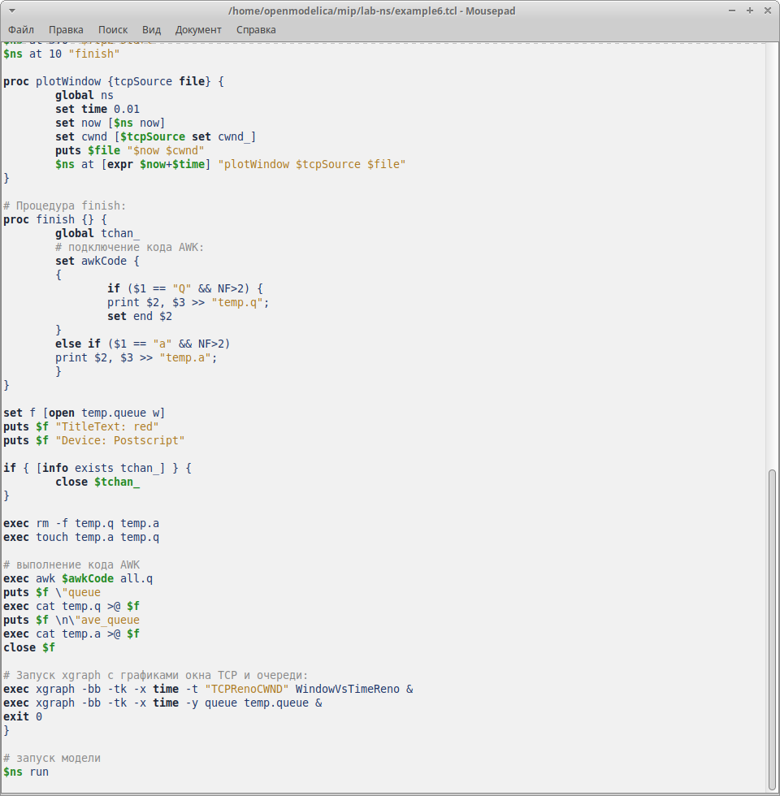{#fig:004 width=70%}

Запустив в терминале команду `ns example6.tcl`, мы получили первый результат (рис. [-@fig:005], рис. [-@fig:006]).

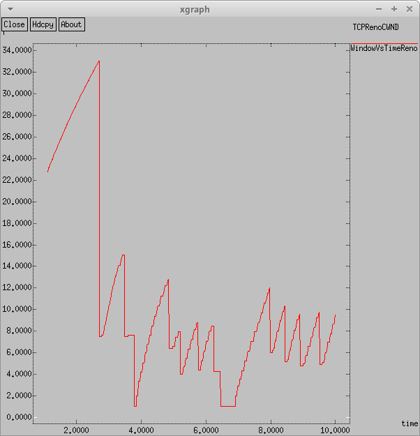{#fig:005 width=70%}

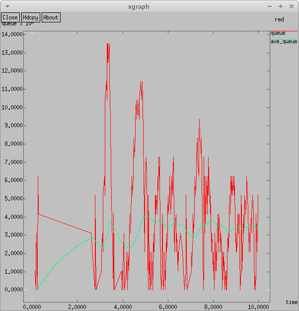{#fig:006 width=70%}

Для более приятной и понятной визуализации, я изменила график:
- -bg white для белого фона
- 0.Color=purple для цвета первой рисуемой линии
- 1.Color=orange для цвета второй рисуемой линии
- третью линию оставила как есть, красной (рис. [-@fig:007], рис. [-@fig:008]).

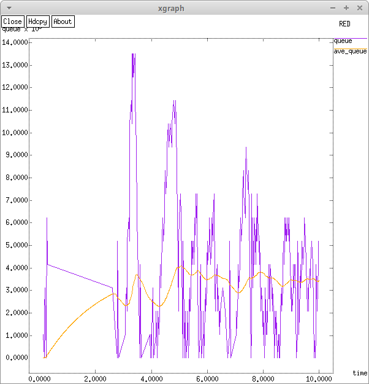{#fig:007 width=70%}

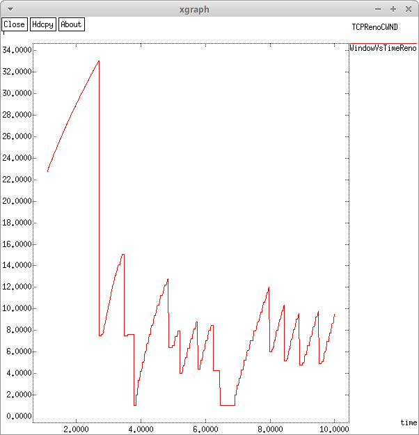{#fig:008 width=70%}

Далее, мы поменяли тип протокола TCP c Reno на NewReno (рис. [-@fig:009], рис. [-@fig:010]).

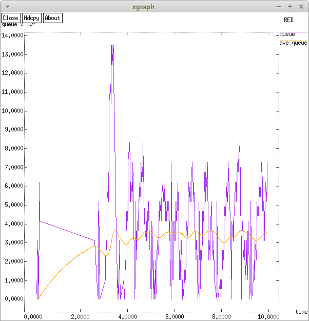{#fig:009 width=70%}

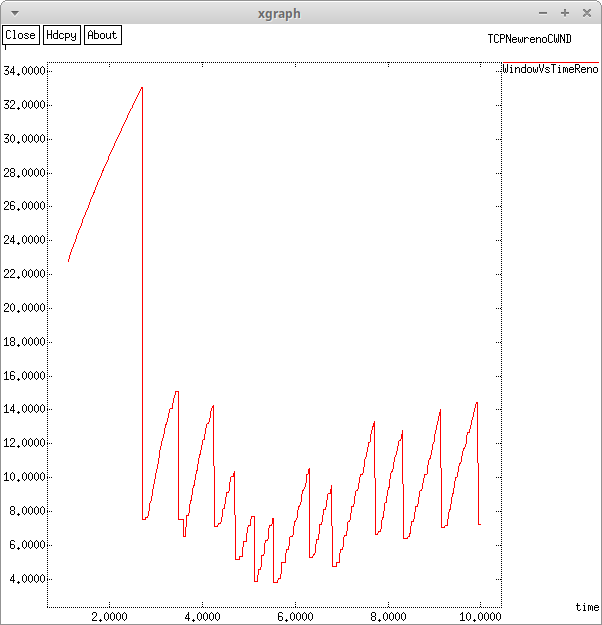{#fig:010 width=70%}

После, мы поменяли тип протокола TCP c NewReno на Vegas (рис. [-@fig:011], рис. [-@fig:012]).

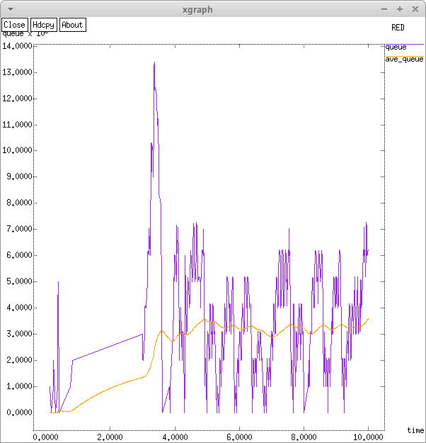{#fig:011 width=70%}

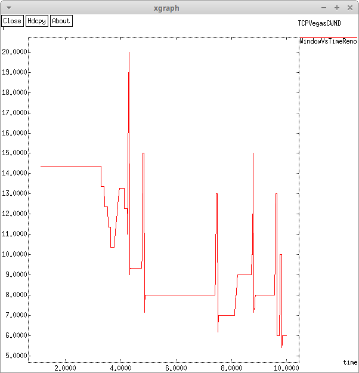{#fig:012 width=70%}

Т.к. у нас Reno и NewReno похожи по подходу, графики тоже похожи, но у NewReno стабильнее график и меньше разброс значений, т.к. у Reno увеличение окна происходит линейно и регулируется только при потере пакетов, а у NewReno есть регуляризация принятия пакетов после потери (увеличенный быстрый старт), а у TCP Vegas совершенно иной подход к регуляризации трафика, в следствие чего среднее число пакетов в очереди выглядит еще более стабильно. А также пик размера окна у него сильно меньше, чем у двух предыдущих алгоритмов.

# Выводы

В ходе лабораторной работы мы определили различия между 3-мя протоколами TCP и приобрели базовые навыки работы со средством визуализации `xgraph`.

# Список литературы{.unnumbered}

::: {#refs}
:::
