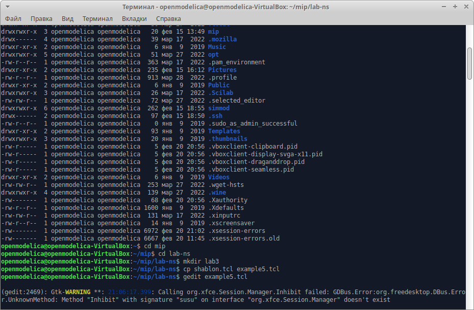
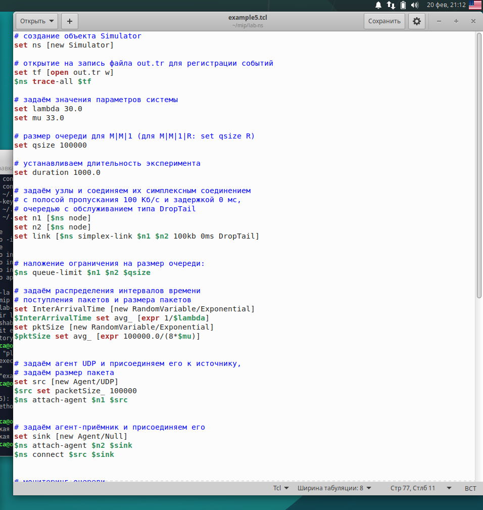
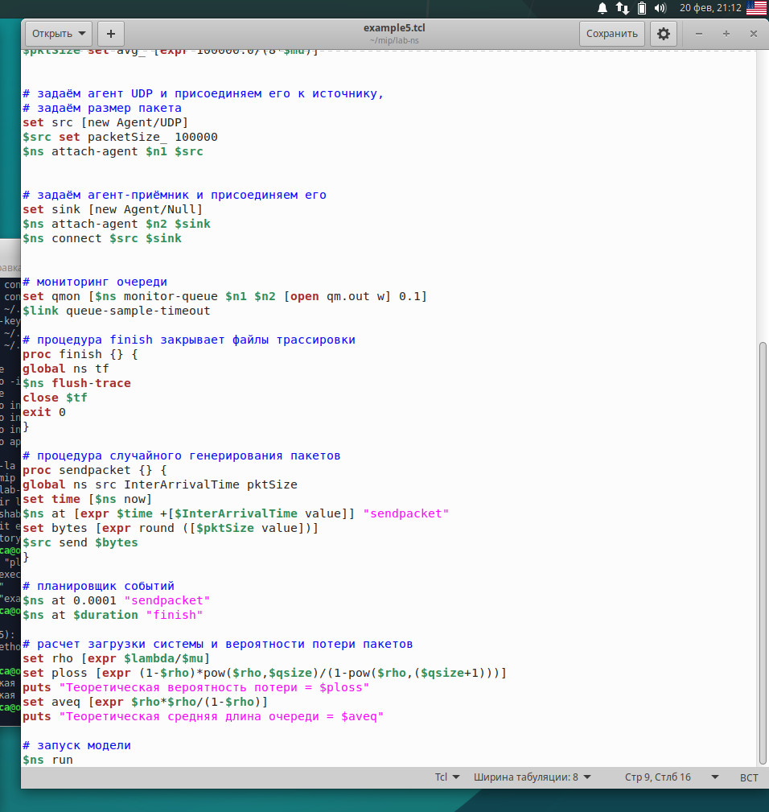
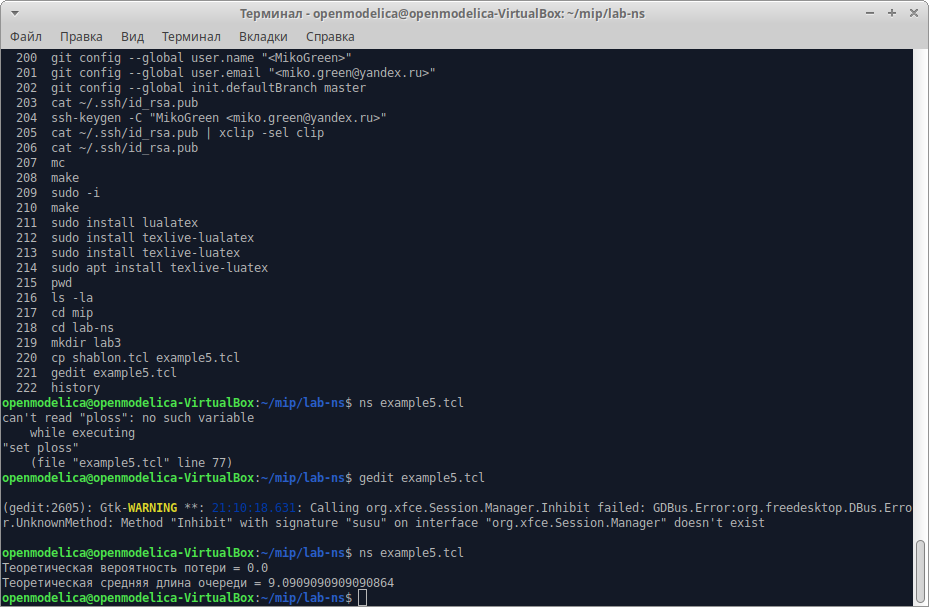
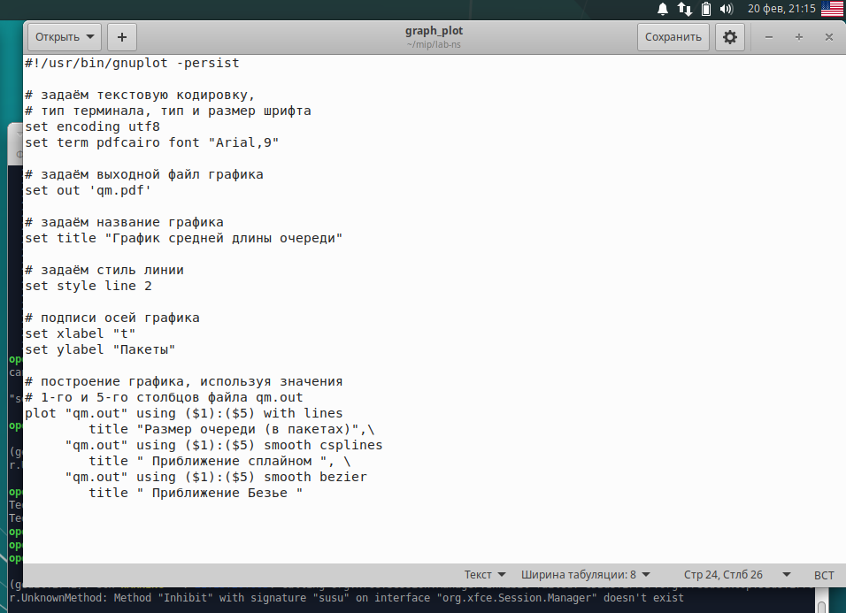
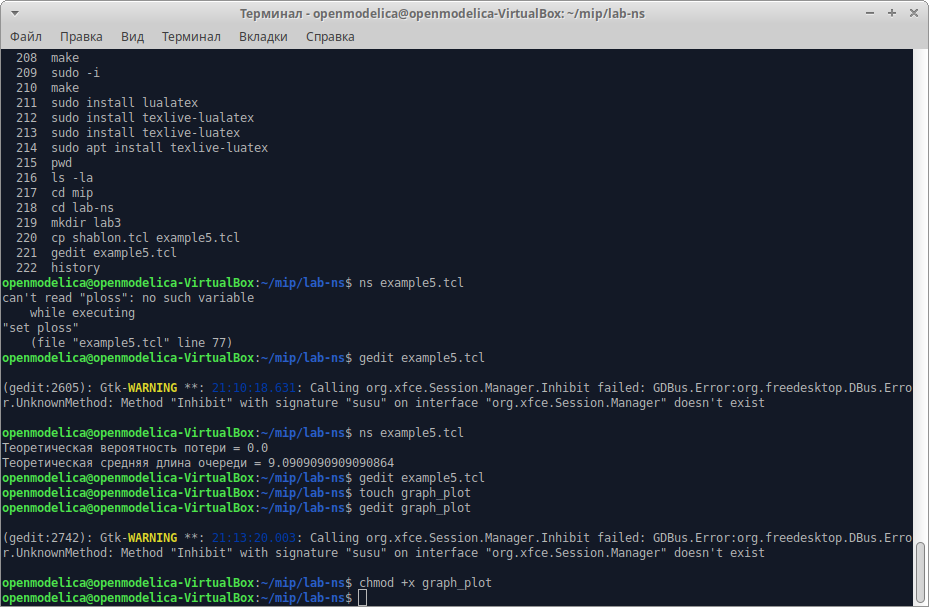
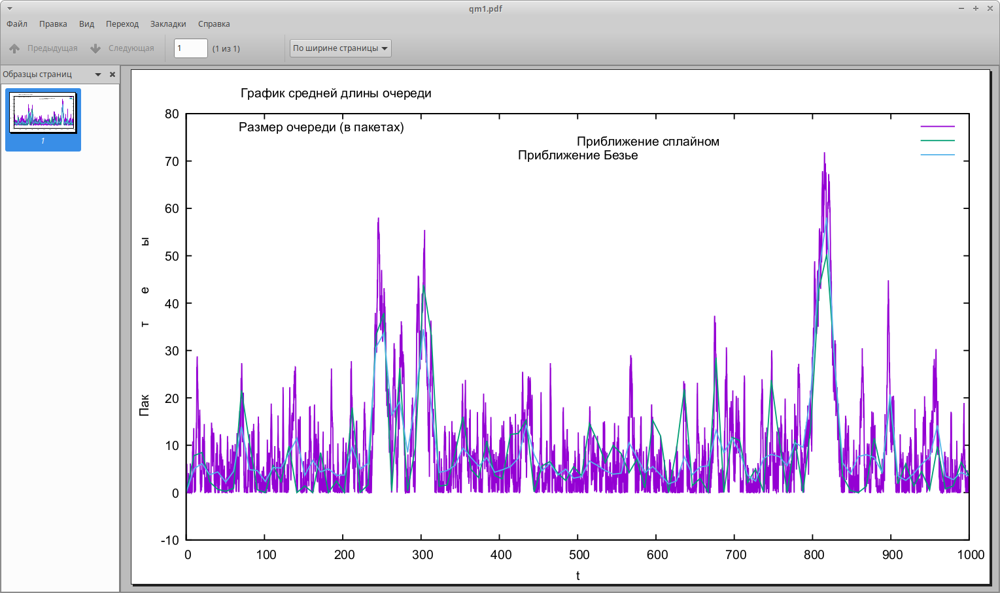
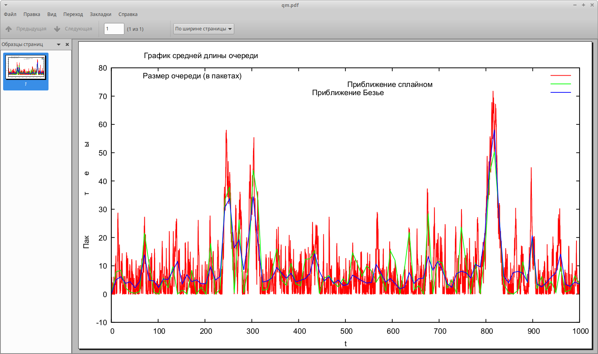
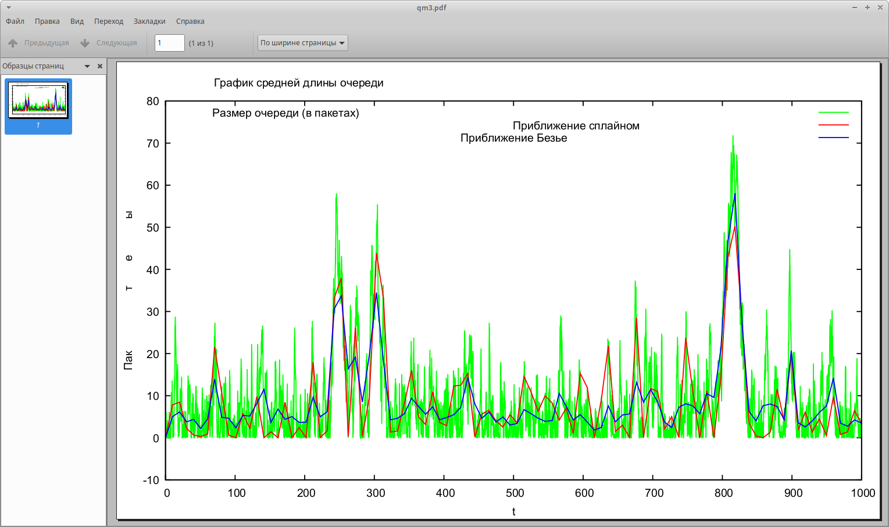

---
## Front matter
lang: ru-RU
title: Моделирование стохастических процессов
subtitle: Лабораторная работа №3.
author:
  - Рогожина Н.А.
institute:
  - Российский университет дружбы народов, Москва, Россия
date: 20 февраля 2025

## i18n babel
babel-lang: russian
babel-otherlangs: english

## Formatting pdf
toc: false
toc-title: Содержание
slide_level: 2
aspectratio: 169
section-titles: true
theme: metropolis
header-includes:
 - \metroset{progressbar=frametitle,sectionpage=progressbar,numbering=fraction}
---

# Информация

## Докладчик

:::::::::::::: {.columns align=center}
::: {.column width="70%"}

  * Рогожина Надежда Александровна
  * студентка 3 курса НФИбд-02-22
  * Российский университет дружбы народов
  * <https://mikogreen.github.io/>

:::
::::::::::::::

# Цель работы

## Цель работы

Смоделировать и визуализировать результаты моделирования СМО М/М/1 с бесконечной очередью.

# Задание

## Задание

Создать и смоделировать однолинейную СМО с накопителем бесконечной ёмкости. Визуализировать результат моделирования с помощью GNUplot.

# Теоретическое введение

## Теоретическое введение

M|M|1 — однолинейная СМО с накопителем бесконечной ёмкости. Поступающий поток заявок — пуассоновский с интенсивностью λ. Времена обслуживания заявок — независимые в совокупности случайные величины, распределённые по экспоненциальному закону с параметром μ.

# Выполнение лабораторной работы

## Шаблон

Первым делом создадим еще одну копию шаблона и откроем на редактирование.

{#fig:001 width=50%}

## Код

Введем код, которыq описывает поведение однолинейной СМО с накопителем бесконечной ёмкости.

{#fig:002 width=35%}

## Код

{#fig:003 width=40%}

## Запуск

Запустим моделирование процесса.

{#fig:004 width=50%}

## Результат моделирования

У нас получился следующий результат:

- Теоретическая вероятность потери = 0.0
- Теоретическая средняя длина очереди = 9.0909090909090864

## Визуализация

Далее, мы создали файл graph_plot.gpi и ввели код, указанный в лабораторной работе.

{#fig:005 width=50%}

## Визуализация

Далее, нам необходимо было сделать файл исполняемым и запустить его.

{#fig:006 width=50%}

## График №1

По результатам работы программы, у нас создался файл `qm.pdf` на котором были отражены размер очереди (в пакетах), приближение сплайном и приближение Безье.

{#fig:007 width=50%}

## График №2

Цветовая гамма отличалась от примера (a-k-a желаемого результата), соответственно, я внесла изменения в код.

{#fig:009 width=50%}

## График №2

Но и сейчас, визуально, тяжело проанализировать из-за достаточно тусклого зеленого цвета приближения сплайном. Было принято решение для более удобного анализа проведенной работы поменять цвета отрисовки.

## График №3

{#fig:011 width=60%}

## Анализ полученных результатов

Мы видим, что приближение Безье "сглаживает" кривую сильнее, чем приближение сплайном. В данном случае, приближение сплайном мне кажется более точным, однако надо смотреть не только на график (потому что график бывает обманчив), но и на численные показатели точности апроксимации.

# Выводы

## Выводы

В ходе лабораторной работы мы смоделировали поведение однолинейной СМО М|M|1 с накопителем бесконечной ёмкости, а также апроксимировали результаты с помощью сплайнов и кривых Безье, приобрели навыки работы с GNUplot.
