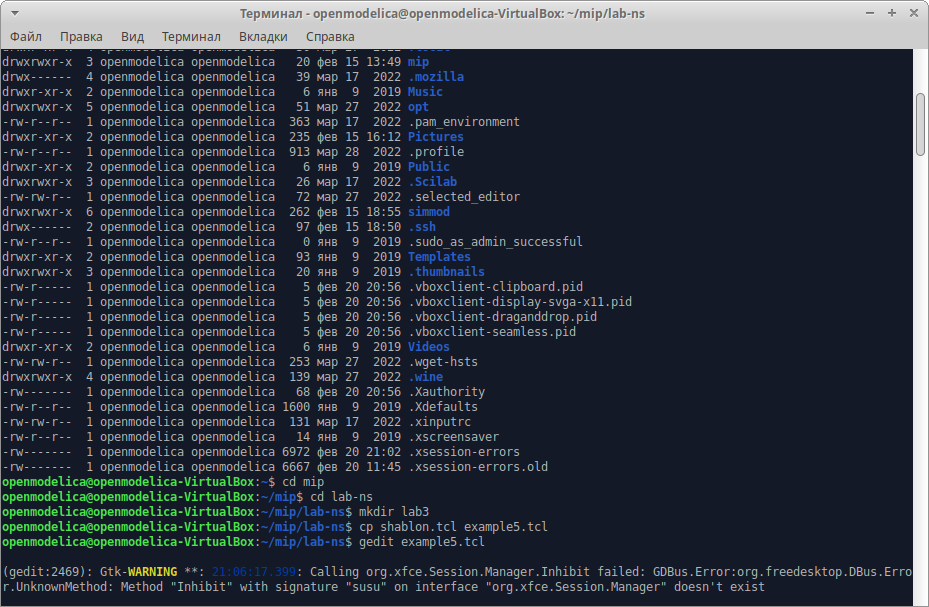
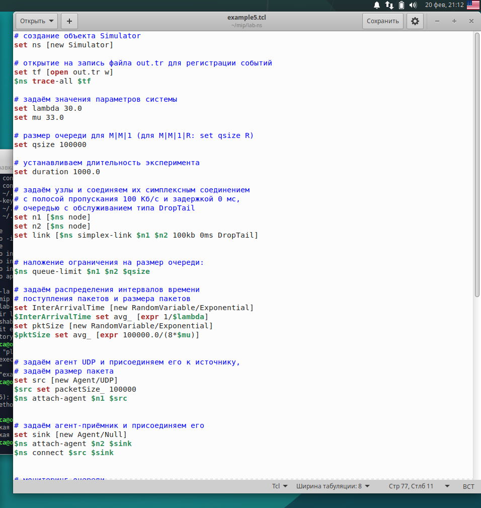
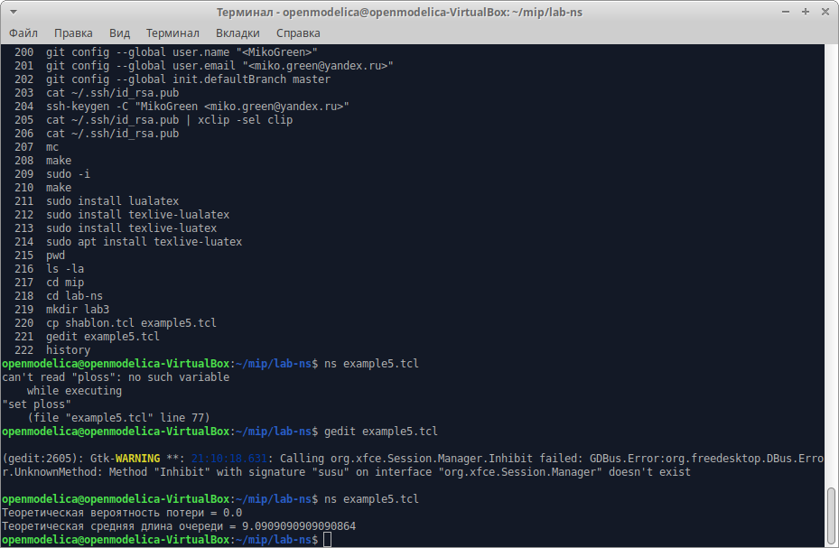
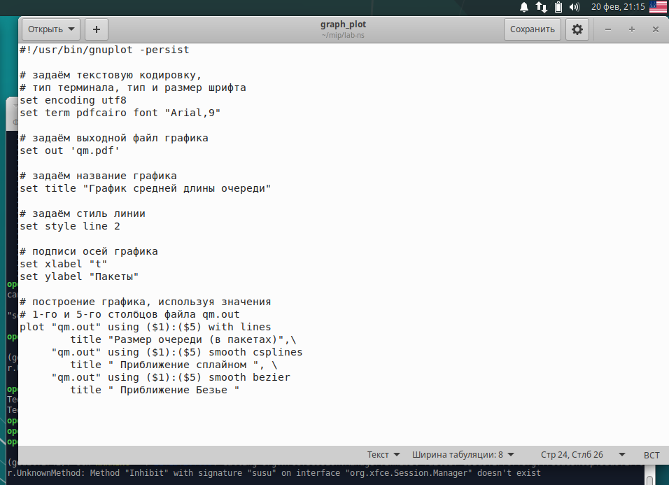
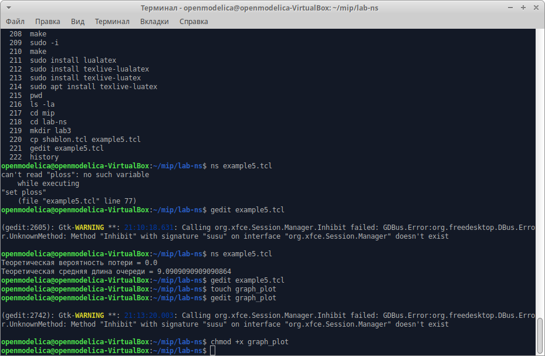
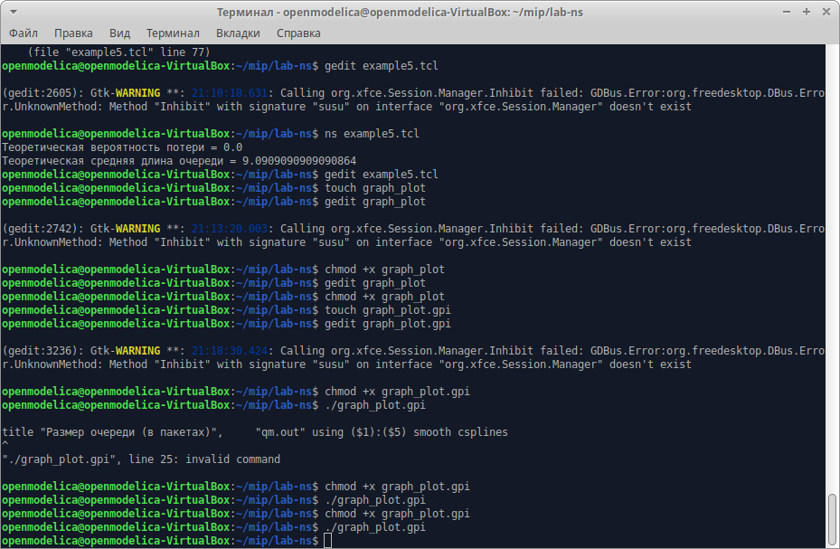
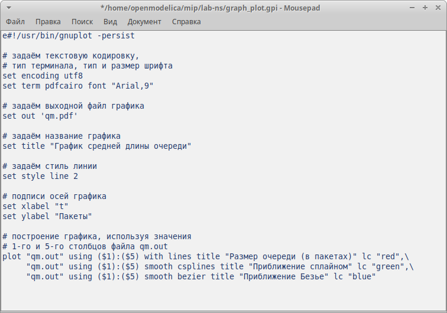
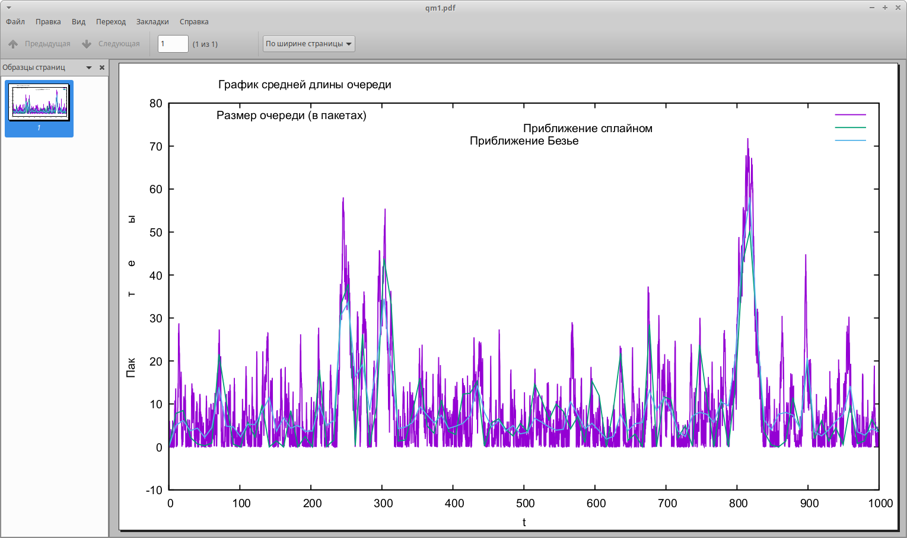
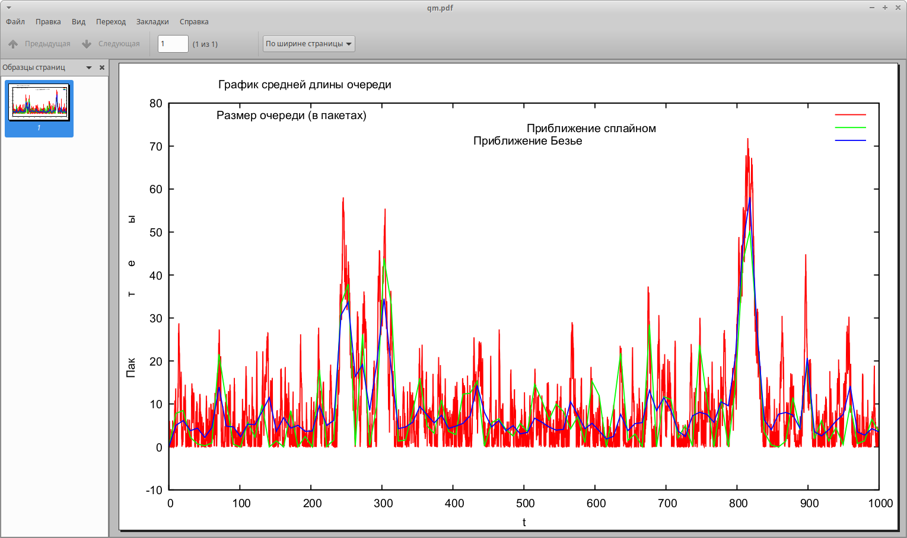
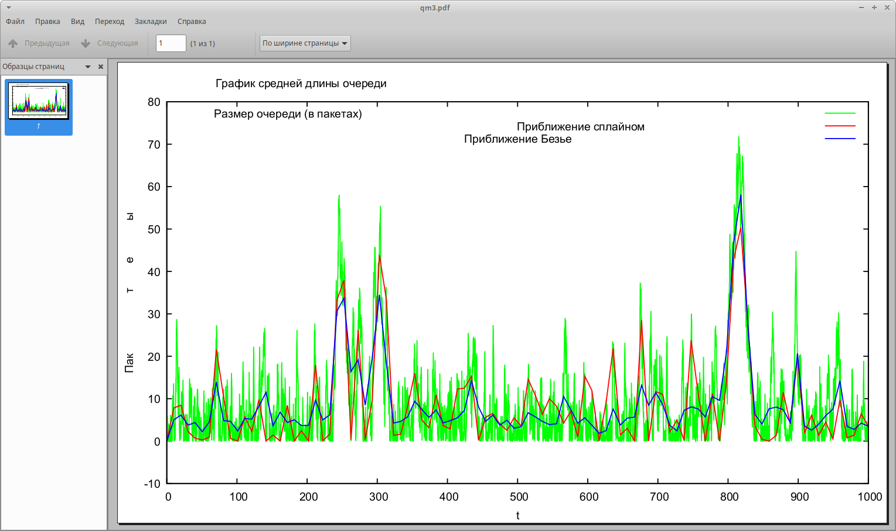

---
## Front matter
title: "Отчёт по лабораторной работе №3"
subtitle: "Моделирование стохастических процессов"
author: "Надежда Александровна Рогожина"

## Generic otions
lang: ru-RU
toc-title: "Содержание"

## Bibliography
bibliography: bib/cite.bib
csl: pandoc/csl/gost-r-7-0-5-2008-numeric.csl

## Pdf output format
toc: true # Table of contents
toc-depth: 2
lof: true # List of figures
lot: true # List of tables
fontsize: 12pt
linestretch: 1.5
papersize: a4
documentclass: scrreprt
## I18n polyglossia
polyglossia-lang:
  name: russian
  options:
	- spelling=modern
	- babelshorthands=true
polyglossia-otherlangs:
  name: english
## I18n babel
babel-lang: russian
babel-otherlangs: english
## Fonts
mainfont: IBM Plex Serif
romanfont: IBM Plex Serif
sansfont: IBM Plex Sans
monofont: IBM Plex Mono
mathfont: STIX Two Math
mainfontoptions: Ligatures=Common,Ligatures=TeX,Scale=0.94
romanfontoptions: Ligatures=Common,Ligatures=TeX,Scale=0.94
sansfontoptions: Ligatures=Common,Ligatures=TeX,Scale=MatchLowercase,Scale=0.94
monofontoptions: Scale=MatchLowercase,Scale=0.94,FakeStretch=0.9
mathfontoptions:
## Biblatex
biblatex: true
biblio-style: "gost-numeric"
biblatexoptions:
  - parentracker=true
  - backend=biber
  - hyperref=auto
  - language=auto
  - autolang=other*
  - citestyle=gost-numeric
## Pandoc-crossref LaTeX customization
figureTitle: "Рис."
tableTitle: "Таблица"
listingTitle: "Листинг"
lofTitle: "Список иллюстраций"
lotTitle: "Список таблиц"
lolTitle: "Листинги"
## Misc options
indent: true
header-includes:
  - \usepackage{indentfirst}
  - \usepackage{float} # keep figures where there are in the text
  - \floatplacement{figure}{H} # keep figures where there are in the text
---

# Цель работы

Смоделировать и визуализировать результаты моделирования СМО М/М/1 с бесконечной очередью.

# Задание

Создать и смоделировать однолинейную СМО с накопителем бесконечной ёмкости. Визуализировать результат моделирования с помощью GNUplot.

# Теоретическое введение

M|M|1 — однолинейная СМО с накопителем бесконечной ёмкости. Поступающий поток заявок — пуассоновский с интенсивностью λ. Времена обслуживания заявок — независимые в совокупности случайные величины, распределённые по экспоненциальному закону с параметром μ.

# Выполнение лабораторной работы

Первым делом создадим еще одну копию шаблона и откроем на редактирование (рис. [-@fig:001]).

{#fig:001 width=70%}

Введем код, данный нам в лабораторной работе, которые описывает поведение однолинейной СМО с накопителем бесконечной ёмкости (рис. [-@fig:002], рис. [-@fig:003]).

{#fig:002 width=70%}

{#fig:003 width=70%}

Запустим моделирование процесса (рис. [-@fig:004]).

{#fig:004 width=70%}

У нас получился следующий результат:

- Теоретическая вероятность потери = 0.0
- Теоретическая средняя длина очереди = 9.0909090909090864

Далее, мы создали файл graph_plot.gpi и ввели код, указанный в лабораторной работе (рис. [-@fig:005]).

{#fig:005 width=70%}

Далее, нам необходимо было сделать файл исполняемым и запустить его (рис. [-@fig:006]).

{#fig:006 width=70%}

По результатам работы программы, у нас создался файл `qm.pdf` на котором были отражены размер очереди (в пакетах), приближение сплайном и приближение Безье (рис. [-@fig:007]).

{#fig:007 width=70%}

Цветовая гамма отличалась от примера (a-k-a желаемого результата), соответственно, я внесла изменения в код (рис. [-@fig:008]).

{#fig:008 width=70%}

Далее, при повторном запуске программы, цвета совпали с цветами графика на примере, данном в лабораторной работе (рис. [-@fig:009]).

{#fig:009 width=70%}

Но и сейчас, визуально, тяжело проанализировать из-за достаточно тусклого зеленого цвета приближения сплайном. Было принято решение для более удобного анализа проведенной работы поменять цвета отрисовки (рис. [-@fig:010]).

{#fig:010 width=70%}

После этого, приближения стали видны сильно чётче на фоне быстро изменяющихся и вечно скачущих данных. (рис. [-@fig:011]).

{#fig:011 width=70%}

Мы видим, что приближение Безье "сглаживает" кривую сильнее, чем приближение сплайном. В данном случае, приближение сплайном мне кажется более точным, однако надо смотреть не только на график (потому что график бывает обманчив), но и на численные показатели точности апроксимации.

# Выводы

В ходе лабораторной работы мы смоделировали поведение однолинейной СМО М|M|1 с накопителем бесконечной ёмкости, а также апроксимировали результаты с помощью сплайнов и кривых Безье, приобрели навыки работы с GNUplot.

# Список литературы{.unnumbered}

::: {#refs}
:::
