---
## Front matter
lang: ru-RU
title: Задание для самостоятельного выполнения
subtitle: Лабораторная работа №4.
author:
  - Рогожина Н.А.
institute:
  - Российский университет дружбы народов, Москва, Россия
date: 01 марта 2025

## i18n babel
babel-lang: russian
babel-otherlangs: english

## Formatting pdf
toc: false
toc-title: Содержание
slide_level: 2
aspectratio: 169
section-titles: true
theme: metropolis
header-includes:
 - \metroset{progressbar=frametitle,sectionpage=progressbar,numbering=fraction}
---

# Информация

## Докладчик

:::::::::::::: {.columns align=center}
::: {.column width="70%"}

  * Рогожина Надежда Александровна
  * студентка 3 курса НФИбд-02-22
  * Российский университет дружбы народов
  * <https://mikogreen.github.io/>

:::
::::::::::::::

# Задание

## Задание

Описание моделируемой сети:
- сеть состоит из N TCP-источников, N TCP-приёмников, двух маршрутизаторов R1 и R2 между источниками и приёмниками (N — не менее 20);

- между TCP-источниками и первым маршрутизатором установлены дуплексные соединения с пропускной способностью 100 Мбит/с и задержкой 20 мс очередью типа DropTail;

- между TCP-приёмниками и вторым маршрутизатором установлены дуплексные соединения с пропускной способностью 100 Мбит/с и задержкой 20 мс очередью типа DropTail;

## Задание

- между маршрутизаторами установлено симплексное соединение (R1–R2) с пропускной способностью 20 Мбит/с и задержкой 15 мс очередью типа RED, размером буфера 300 пакетов; в обратную сторону — симплексное соединение (R2–R1) с пропускной способностью 15 Мбит/с и задержкой 20 мс очередью типа DropTail;

- данные передаются по протоколу FTP поверх TCPReno;

## Задание

- параметры алгоритма RED: qmin = 75, qmax = 150, qw = 0, 002, pmax = 0.1;

- максимальный размер TCP-окна 32; размер передаваемого пакета 500 байт; время моделирования — не менее 20 единиц модельного времени.

## Задание

1. Для приведённой схемы разработать имитационную модель в пакете NS-2.

2. Построить график изменения размера окна TCP (в Xgraph и в GNUPlot).

3. Построить график изменения длины очереди и средней длины очереди на первом маршрутизаторе.

4. Оформить отчёт о выполненной работе.

# Теоретическое введение

## Теоретическое введение

Network Simulator (NS-2) — один из программных симуляторов моделирования процессов в компьютерных сетях. NS-2 позволяет описать топологию сети, конфигурацию источников и приёмников трафика, параметры соединений (полосу пропускания, задержку, вероятность потерь пакетов и т.д.) и множество других параметров моделируемой системы. Данные о динамике трафика, состоянии соединений и объектов сети, а также информация о работе протоколов фиксируются в генерируемом trace-файле.

## Теоретическое введение

Процесс создания модели сети для NS-2 состоит из нескольких этапов:

1. Создание нового объекта класса Simulator, в котором содержатся методы, необходимые для дальнейшего описания модели (например, методы new и delete используются для создания и уничтожения объектов соответственно);

2. Описание топологии моделируемой сети с помощью трёх основных функциональных блоков: узлов (nodes), соединений (links) и агентов (agents);

3. Задание различных действий, характеризующих работу сети.

# Выполнение лабораторной работы

## Первые действия
Используя данные и код из предыдущих лабораторных работ, создадим новую копию шаблона - `example7.tcl` и оформим задание в виде программы, оставляя комментарии.

## Код задания

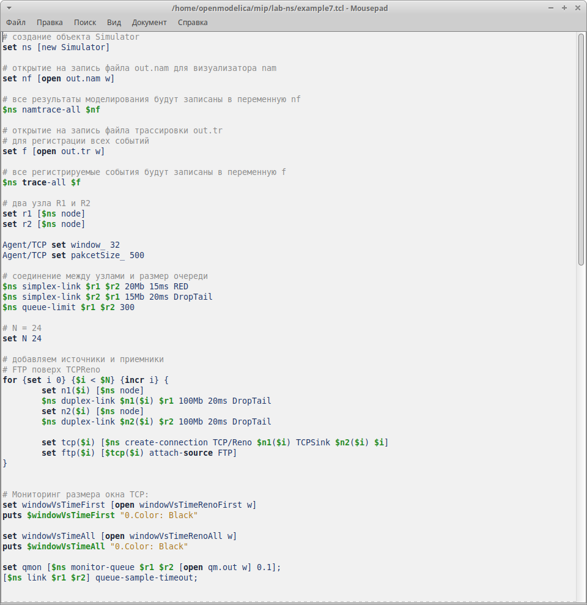{#fig:001 width=40%}

## Код задания

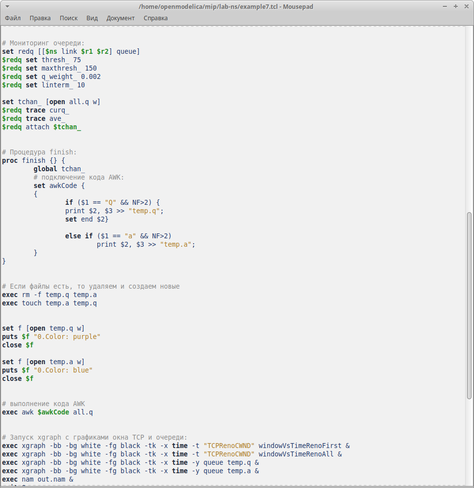{#fig:002 width=40%}

## Код задания

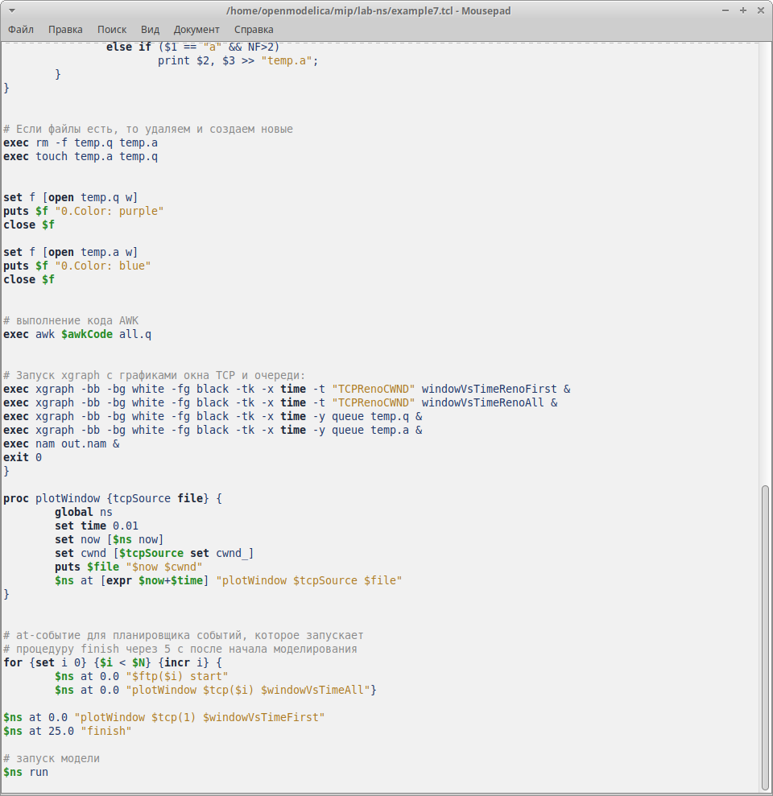{#fig:003 width=40%}

## Моделирование

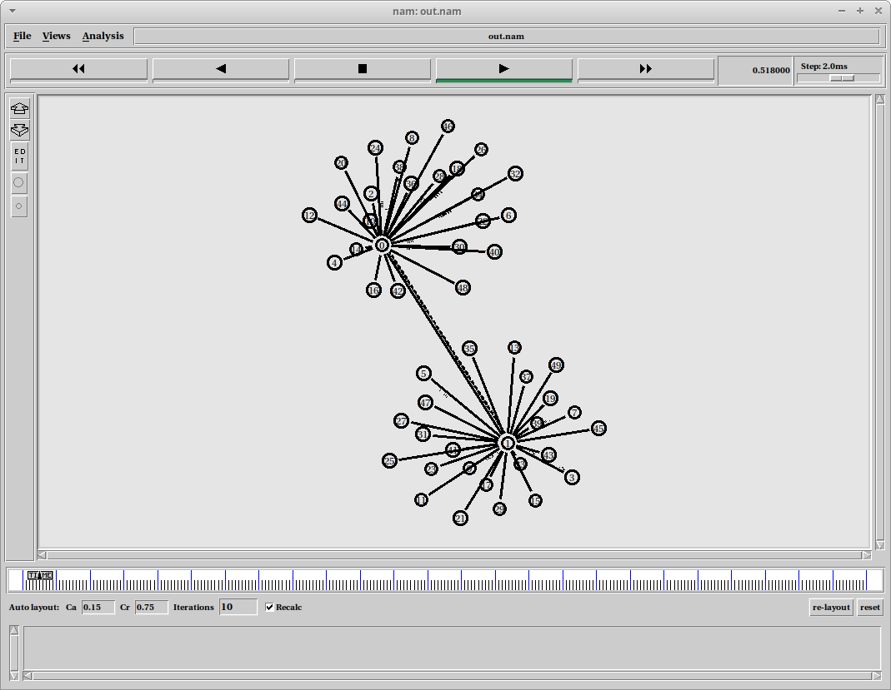{#fig:004 width=50%}

## xgraph

Код, который нужен для визуализации через GNUPlot мы ввели в самом файле `example7.tcl`.

## xgraph

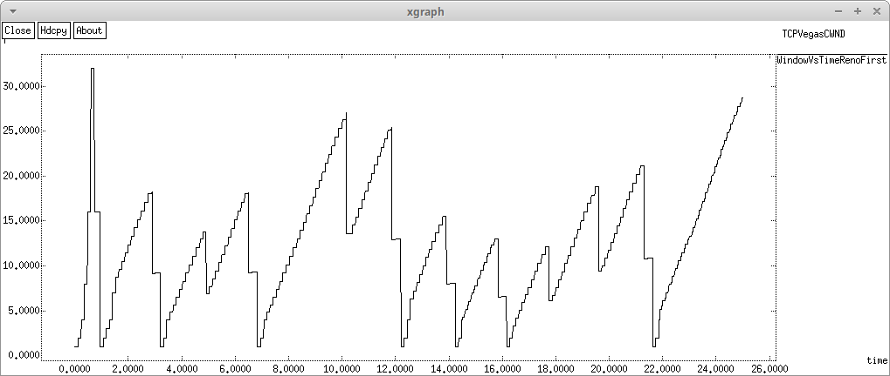{#fig:005 width=60%}

## xgraph

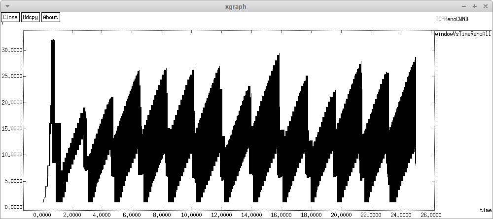{#fig:006 width=60%}

## xgraph

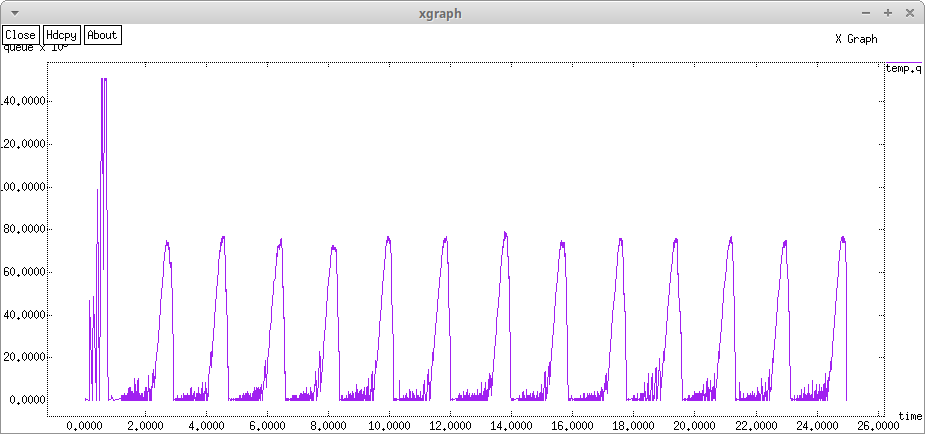{#fig:007 width=60%}

## xgraph

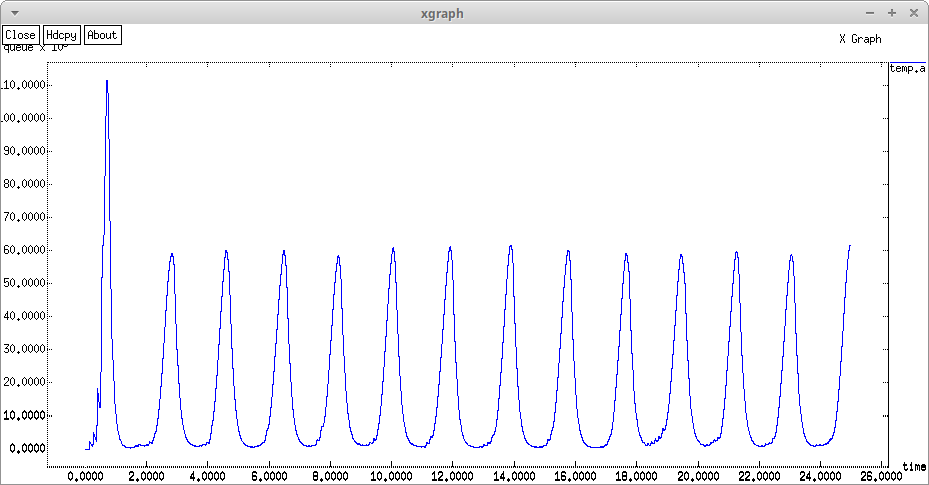{#fig:008 width=60%}

## Второй тип визуализации

Также, нам было необходимо реализовать эти же графики в GNUPlot. Структура всех файлов визуализации одинакова, изменяется только файл, из которого мы берем данные и то, какие колонки участвуют в отрисовке графиков, а также цвет.

## Код

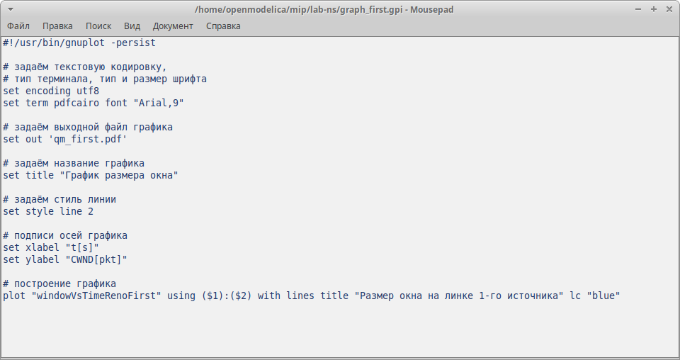{#fig:009 width=60%}

## GNUPlot

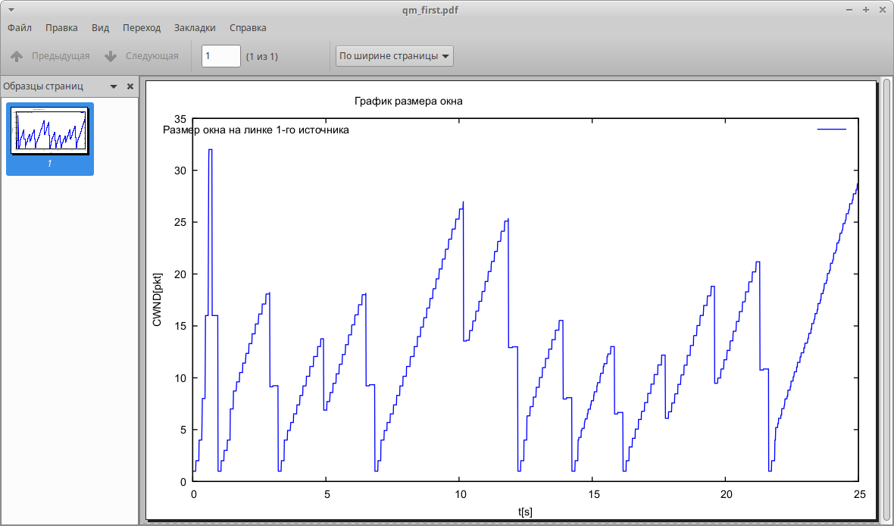{#fig:010 width=60%}

## GNUPlot

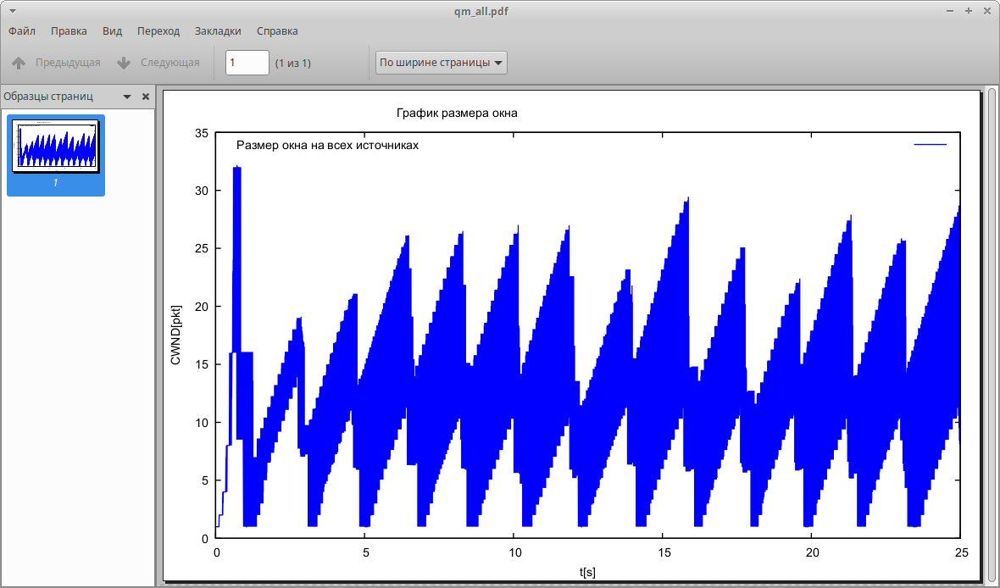{#fig:011 width=60%}

## GNUPlot

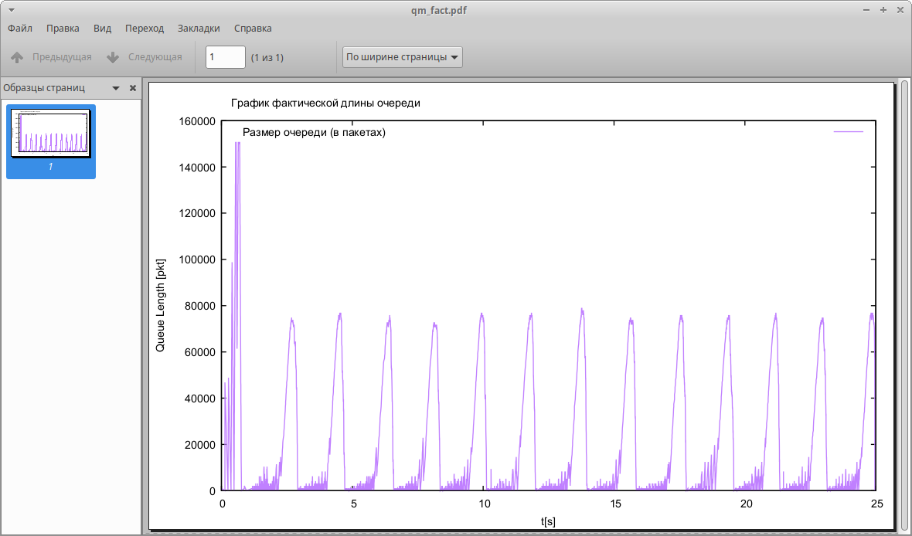{#fig:012 width=60%}

## GNUPlot

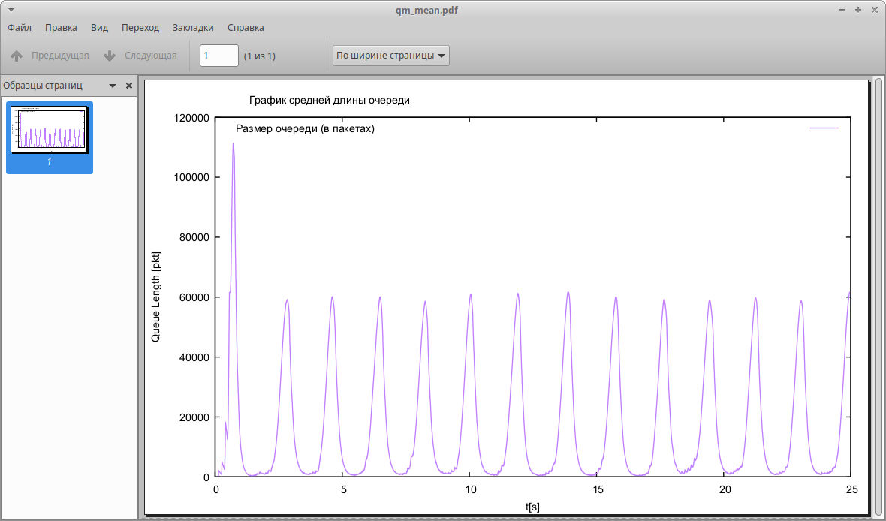{#fig:013 width=60%}

# Выводы

## Выводы

В ходе лабораторной работы мы реализовали схему, указанную в задании, а также визуализировали основные характеристики очереди с помощью 2-х инструментов визуализации.
