---
## Front matter
title: "Отчёт по лабораторной работе №4"
subtitle: "Задание для самостоятельного выполнения"
author: "Надежда Александровна Рогожина"

## Generic otions
lang: ru-RU
toc-title: "Содержание"

## Bibliography
bibliography: bib/cite.bib
csl: pandoc/csl/gost-r-7-0-5-2008-numeric.csl

## Pdf output format
toc: true # Table of contents
toc-depth: 2
lof: true # List of figures
lot: true # List of tables
fontsize: 12pt
linestretch: 1.5
papersize: a4
documentclass: scrreprt
## I18n polyglossia
polyglossia-lang:
  name: russian
  options:
	- spelling=modern
	- babelshorthands=true
polyglossia-otherlangs:
  name: english
## I18n babel
babel-lang: russian
babel-otherlangs: english
## Fonts
mainfont: IBM Plex Serif
romanfont: IBM Plex Serif
sansfont: IBM Plex Sans
monofont: IBM Plex Mono
mathfont: STIX Two Math
mainfontoptions: Ligatures=Common,Ligatures=TeX,Scale=0.94
romanfontoptions: Ligatures=Common,Ligatures=TeX,Scale=0.94
sansfontoptions: Ligatures=Common,Ligatures=TeX,Scale=MatchLowercase,Scale=0.94
monofontoptions: Scale=MatchLowercase,Scale=0.94,FakeStretch=0.9
mathfontoptions:
## Biblatex
biblatex: true
biblio-style: "gost-numeric"
biblatexoptions:
  - parentracker=true
  - backend=biber
  - hyperref=auto
  - language=auto
  - autolang=other*
  - citestyle=gost-numeric
## Pandoc-crossref LaTeX customization
figureTitle: "Рис."
tableTitle: "Таблица"
listingTitle: "Листинг"
lofTitle: "Список иллюстраций"
lotTitle: "Список таблиц"
lolTitle: "Листинги"
## Misc options
indent: true
header-includes:
  - \usepackage{indentfirst}
  - \usepackage{float} # keep figures where there are in the text
  - \floatplacement{figure}{H} # keep figures where there are in the text
---

# Задание

Описание моделируемой сети:
- сеть состоит из N TCP-источников, N TCP-приёмников, двух маршрутизаторов R1 и R2 между источниками и приёмниками (N — не менее 20);
- между TCP-источниками и первым маршрутизатором установлены дуплексные соединения с пропускной способностью 100 Мбит/с и задержкой 20 мс очередью типа DropTail;
- между TCP-приёмниками и вторым маршрутизатором установлены дуплексные соединения с пропускной способностью 100 Мбит/с и задержкой 20 мс очередью типа DropTail;
- между маршрутизаторами установлено симплексное соединение (R1–R2) с пропускной способностью 20 Мбит/с и задержкой 15 мс очередью типа RED, размером буфера 300 пакетов; в обратную сторону — симплексное соединение (R2–R1) с пропускной способностью 15 Мбит/с и задержкой 20 мс очередью типа DropTail;
- данные передаются по протоколу FTP поверх TCPReno;
- параметры алгоритма RED: qmin = 75, qmax = 150, qw = 0, 002, pmax = 0.1;
- максимальный размер TCP-окна 32; размер передаваемого пакета 500 байт; время моделирования — не менее 20 единиц модельного времени.

**Задание**:
1. Для приведённой схемы разработать имитационную модель в пакете NS-2.
2. Построить график изменения размера окна TCP (в Xgraph и в GNUPlot);
3. Построить график изменения длины очереди и средней длины очереди на первом маршрутизаторе.
4. Оформить отчёт о выполненной работе.

# Теоретическое введение

Network Simulator (NS-2) — один из программных симуляторов моделирования процессов в компьютерных сетях. NS-2 позволяет описать топологию сети, конфигурацию источников и приёмников трафика, параметры соединений (полосу пропускания, задержку, вероятность потерь пакетов и т.д.) и множество других параметров моделируемой системы. Данные о динамике трафика, состоянии соединений и объектов сети, а также информация о работе протоколов фиксируются в генерируемом trace-файле.

Процесс создания модели сети для NS-2 состоит из нескольких этапов:
1. Создание нового объекта класса Simulator, в котором содержатся методы, необходимые для дальнейшего описания модели (например, методы new и delete используются для создания и уничтожения объектов соответственно);
2. Описание топологии моделируемой сети с помощью трёх основных функциональных блоков: узлов (nodes), соединений (links) и агентов (agents);
3. Задание различных действий, характеризующих работу сети.

Более подробно про NS-2 см. в [@simmod].

# Выполнение лабораторной работы

Используя данные и код из предыдущих лабораторных работ, создадим новую копию шаблона - `example7.tcl` и оформим задание в виде программы, оставляя комментарии (рис. [-@fig:001], рис. [-@fig:002], рис. [-@fig:003]).

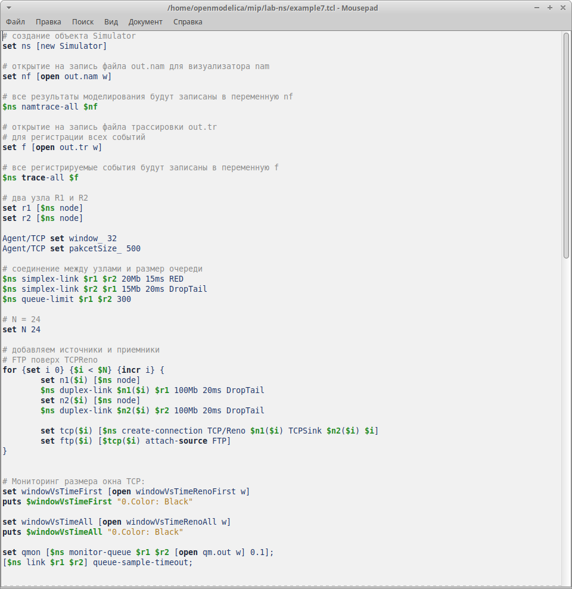{#fig:001 width=70%}

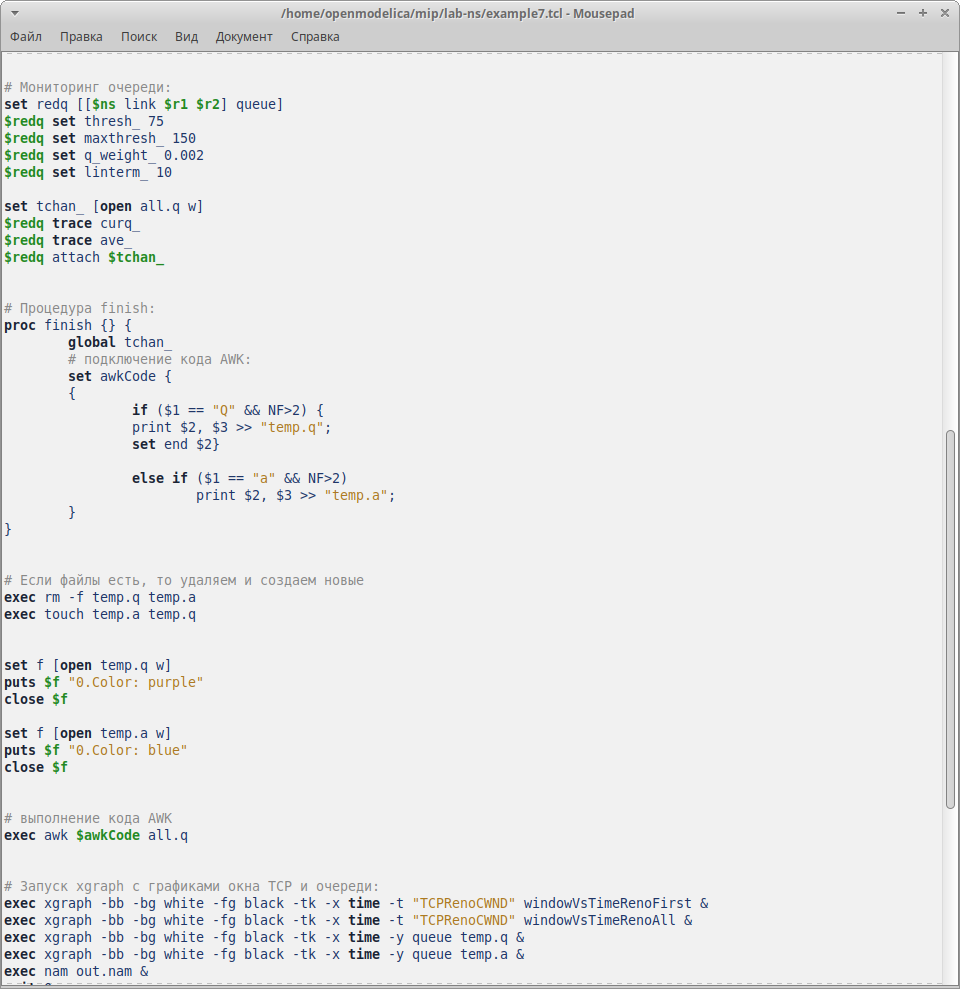{#fig:002 width=70%}

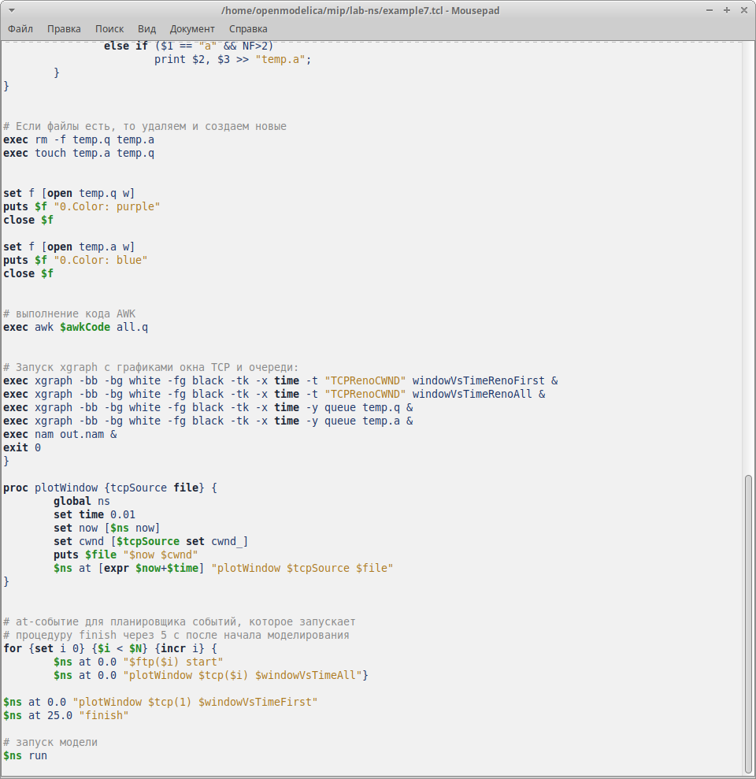{#fig:003 width=70%}

Запустим моделирование процесса (рис. [-@fig:004]).

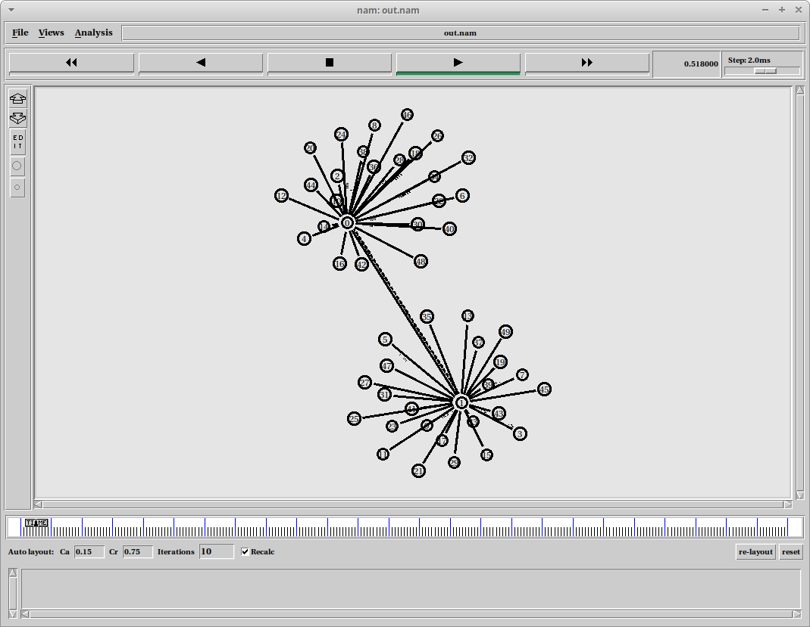{#fig:004 width=70%}

Код, который нужен для визуализации через GNUPlot мы ввели в самом файле `example7.tcl`. Результаты (рис. [-@fig:005], рис. [-@fig:006], рис. [-@fig:007], рис. [-@fig:008]):

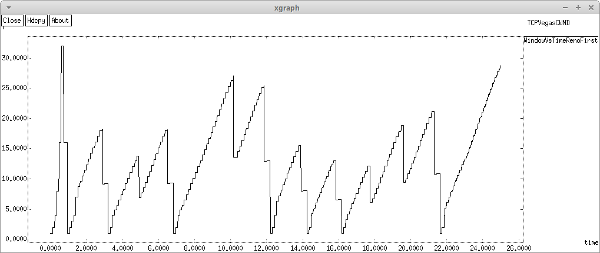{#fig:005 width=70%}

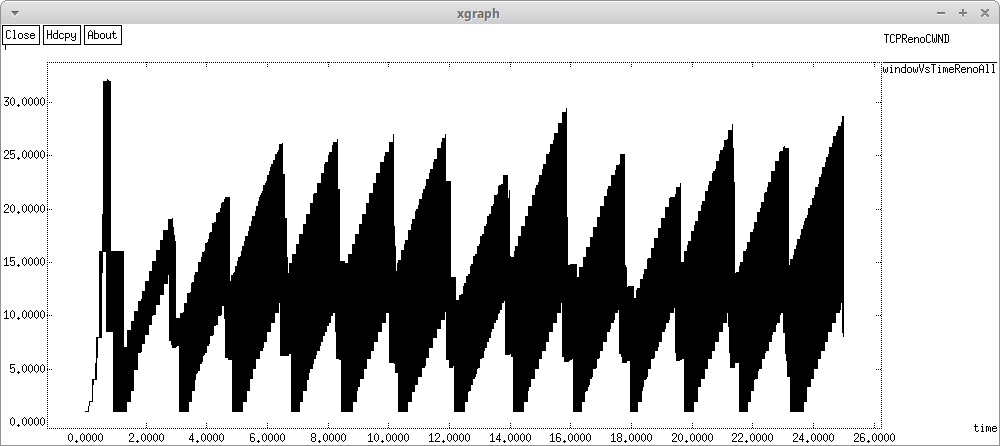{#fig:006 width=70%}

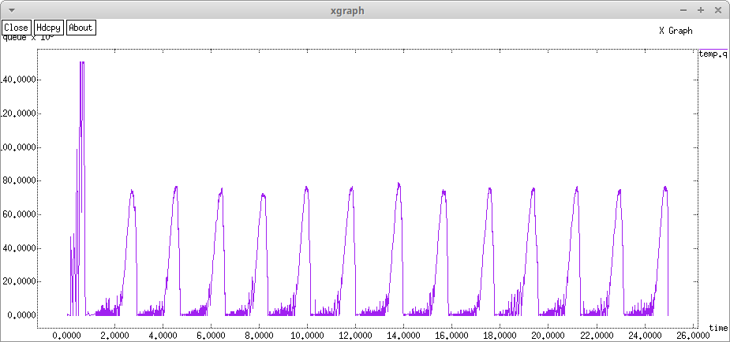{#fig:007 width=70%}

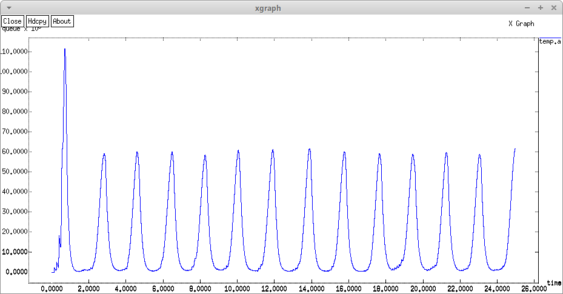{#fig:008 width=70%}

Также, нам было необходимо реализовать эти же графики в xgraph. Структура всех файлов визуализации одинакова, изменяется только файл, из которого мы берем данные и то, какие колонки участвуют в отрисовке графиков, а также цвет (рис. [-@fig:009]).

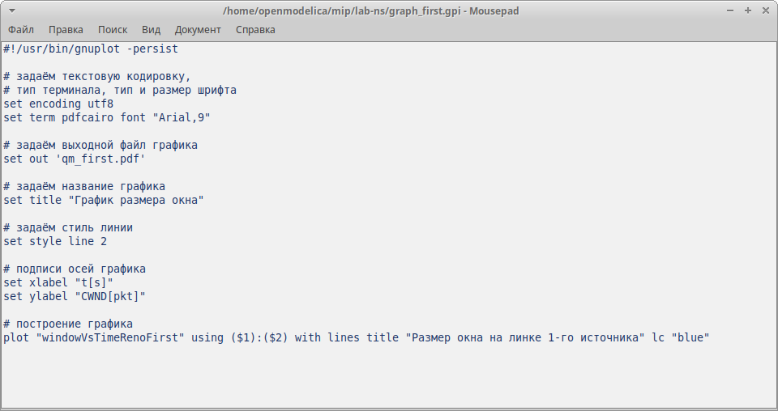{#fig:009 width=70%}

Таким образом, мы получили отображение тех же данных другим способом визуализации (рис. [-@fig:010], рис. [-@fig:011], рис. [-@fig:012], рис. [-@fig:013]).

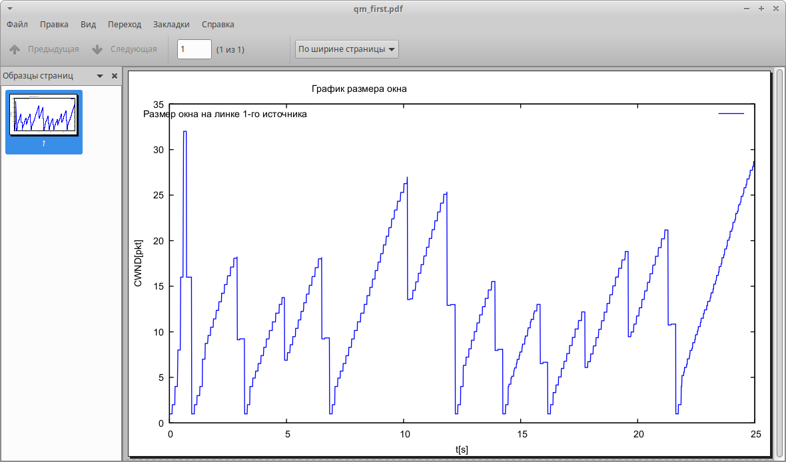{#fig:010 width=70%}

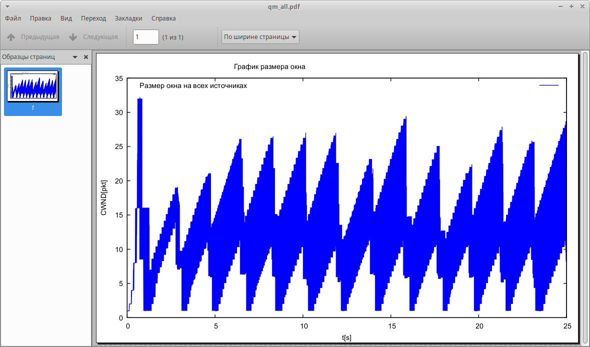{#fig:011 width=70%}

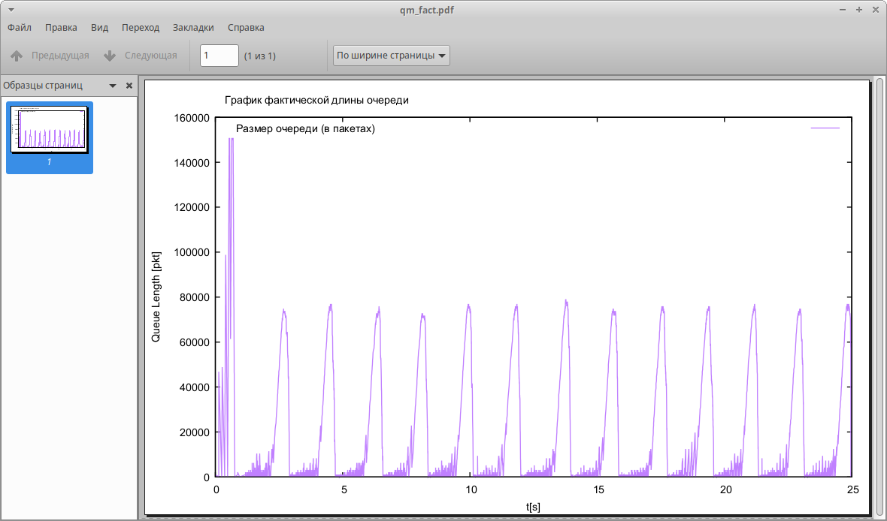{#fig:012 width=70%}

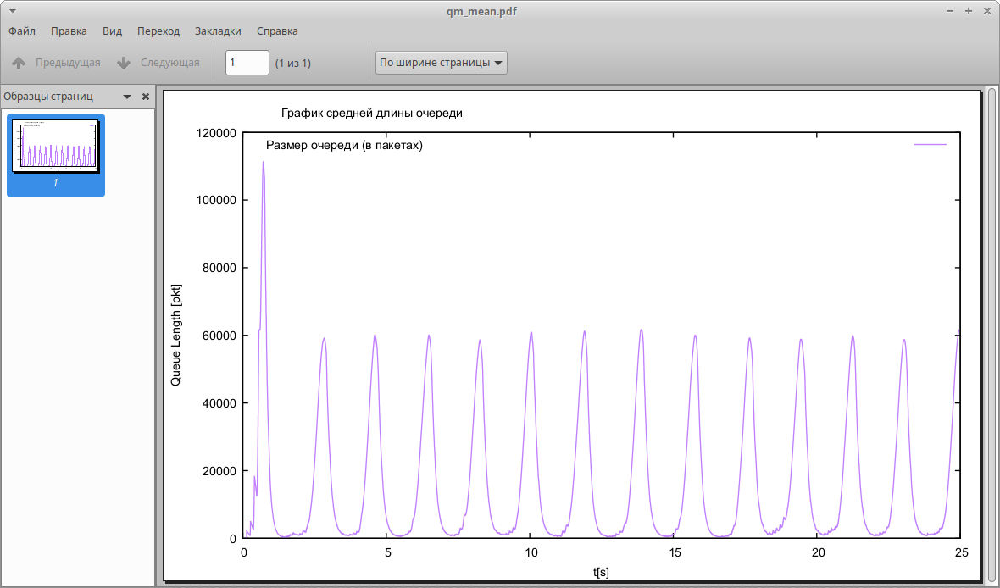{#fig:013 width=70%}

# Выводы

В ходе лабораторной работы мы реализовали схему, указанную в задании, а также визуализировали основные характеристики очереди с помощью 2-х инструментов визуализации.

# Список литературы{.unnumbered}

::: {#refs}
:::

