---
## Front matter
lang: ru-RU
title: Модель эпидемии SIR.
subtitle: Лабораторная работа №5.
author:
  - Рогожина Н.А.
institute:
  - Российский университет дружбы народов, Москва, Россия
date: 08 марта 2025

## i18n babel
babel-lang: russian
babel-otherlangs: english

## Formatting pdf
toc: false
toc-title: Содержание
slide_level: 2
aspectratio: 169
section-titles: true
theme: metropolis
header-includes:
 - \metroset{progressbar=frametitle,sectionpage=progressbar,numbering=fraction}
---

# Информация

## Докладчик

:::::::::::::: {.columns align=center}
::: {.column width="70%"}

  * Рогожина Надежда Александровна
  * студентка 3 курса НФИбд-02-22
  * Российский университет дружбы народов
  * <https://mikogreen.github.io/>

:::
::::::::::::::

# Задание

## Задание

В дополнение к предположениям, которые были сделаны для модели SIR, предположим, что учитываются демографические процессы, в частности, что смертность в популяции полностью уравновешивает рождаемость, а все рожденные индивидуумы появляются на свет абсолютно здоровыми. Тогда получим следующую систему уравнений:

1. *s = −$\beta$ s(t)i(t) + $\mu$ (N − s(t))*;
2. *i = $\beta$ s(t)i(t) − $\nu$ i(t) − $\mu$ i(t);*
3. *r = $\nu$ i(t) − $\mu$ r(t),*

где $\mu$ — константа, которая равна коэффициенту смертности и рождаемости.

## Задание

Требуется:
- реализовать модель SIR с учётом процесса рождения / гибели особей в xcos (в том числе и с использованием блока Modelica), а также в OpenModelica;

- построить графики эпидемического порога при различных значениях параметров модели (в частности изменяя параметр $\mu$);

- сделать анализ полученных графиков в зависимости от выбранных значений параметров модели.

# Теоретическое введение

## Теоретическое введение

Предполагается, что особи популяции размера N могут находиться в трёх различных состояниях:

- S (susceptible, уязвимые) — здоровые особи, которые находятся в группе риска и могут подхватить инфекцию;

- I (infective, заражённые, распространяющие заболевание) — заразившиеся переносчики болезни;

- R (recovered/removed, вылечившиеся) — те, кто выздоровел и перестал распространять болезнь (в эту категорию относят, например, приобретших иммунитет или умерших).

## Теоретическое введение

Внутри каждой из выделенных групп особи считаются неразличимыми по свойствам. Типичная эволюция особи популяции описывается следующей диаграммой:

$$
S → I → R.
$$

Считаем, что система замкнута, т.е.

$$
N = S + I + R.
$$

# Выполнение лабораторной работы

## Выполнение

Открыв окно визуального моделирования, первое что было установлено - контекст.

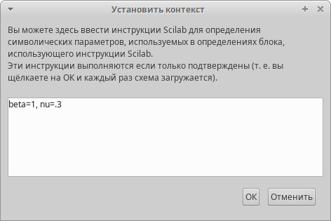{#fig:001 width=45%}

## xcos

Для первого интеграла было выставлено `Initial Condition = .999`.

{#fig:002 width=45%}

## xcos

Для второго интеграла было выставлено `Initial Condition = .001`.

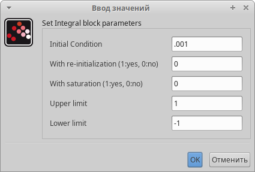{#fig:003 width=45%}

## xcos

Также, необходимо было установить максимальное время моделирования как 30 единиц модельного времени.

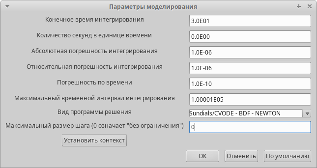{#fig:004 width=45%}

## xcos

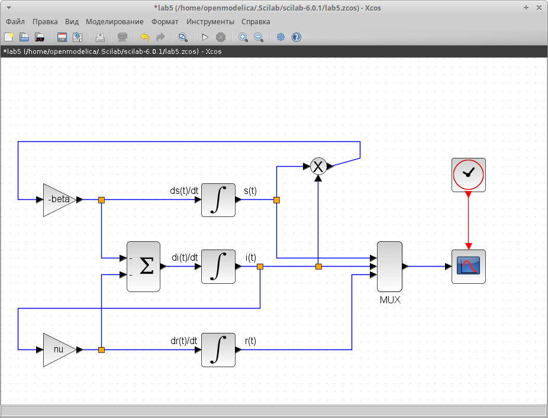{#fig:005 width=45%}

## Результаты

Смоделировав ситуацию, мы видим планомерное уменьшение здоровых граждан, планомерное увеличение вылечившихся, а также пик количества зараженных граждан, что одновременно является точкой пересечения всех 3 линий.

## Результаты

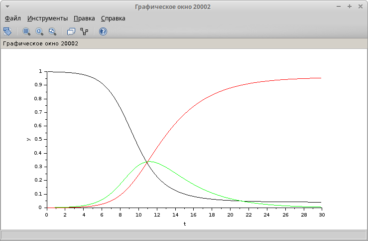{#fig:006 width=45%}

## OpenModelica

Далее, мы повторили ту же модель, но через блок OpenModelica.

## OpenModelica

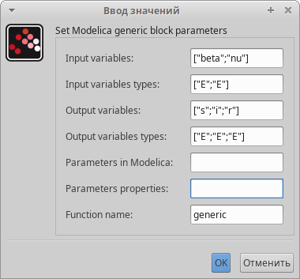{#fig:007 width=45%}

## OpenModelica

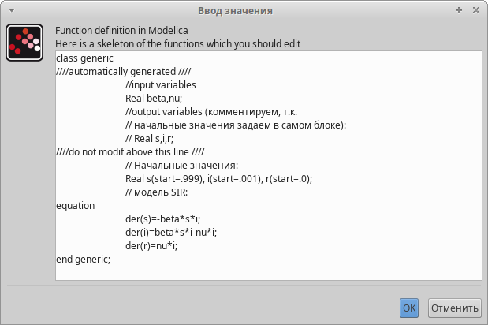{#fig:008 width=45%}

## OpenModelica

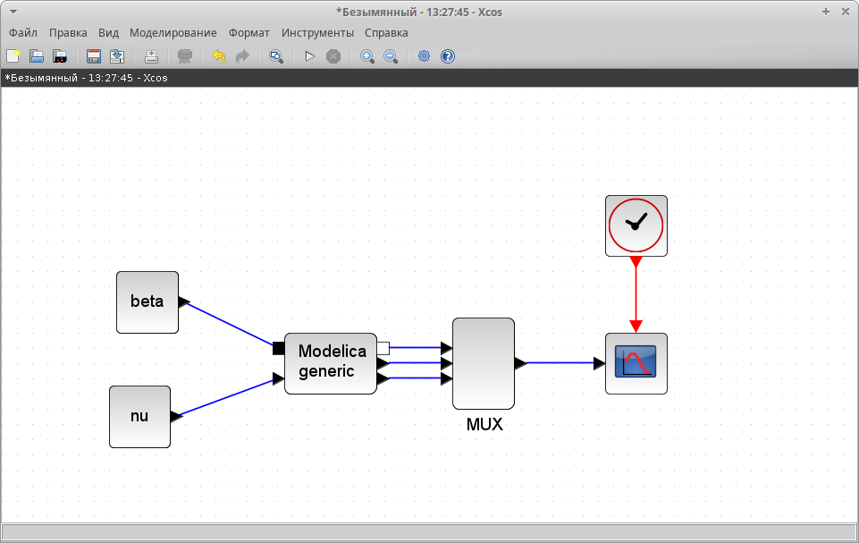{#fig:009 width=45%}

## OpenModelica

Видно, что результаты совпадают с аналитическим подсчетом.

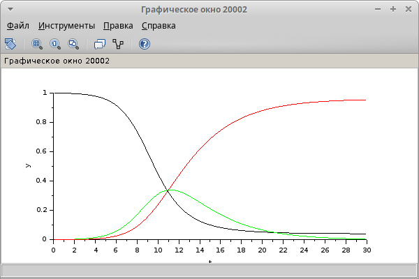{#fig:010 width=45%}

## Выполнение задания

Далее, было необходимо реализовать модель эпидемии, учитывающую смертность и рождаемость (коэффициент $\mu$).

## xcos

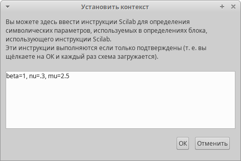{#fig:011 width=45%}

## xcos

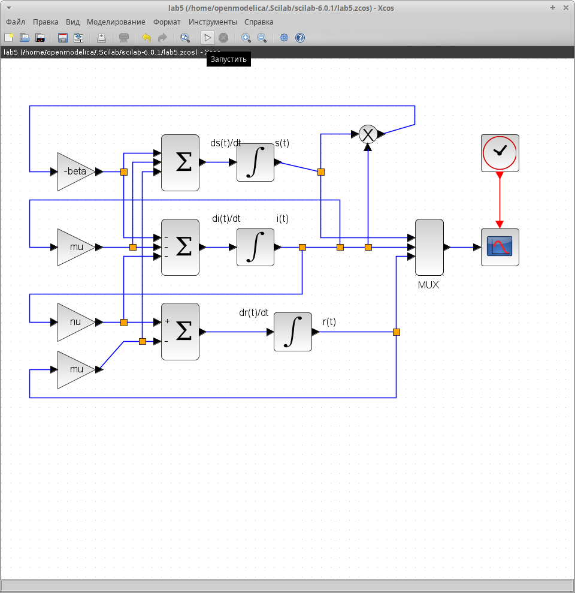{#fig:012 width=40%}

## Выполнение задания

При запуске, с $\mu = 0.01; 0.1; 1$ получились следующие результаты:

## Результаты

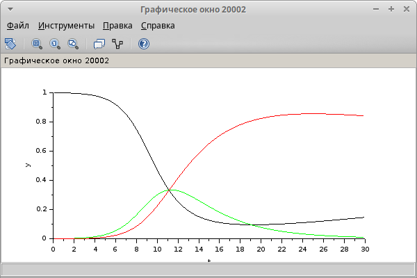{#fig:013 width=45%}

## Результаты

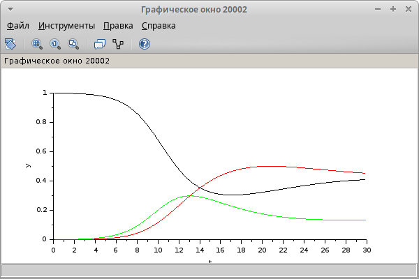{#fig:014 width=45%}

## Результаты

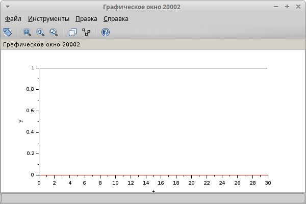{#fig:015 width=45%}

## OpenModelica

Аналогично, необходимо было доработать код OpenModelica.

## OpenModelica

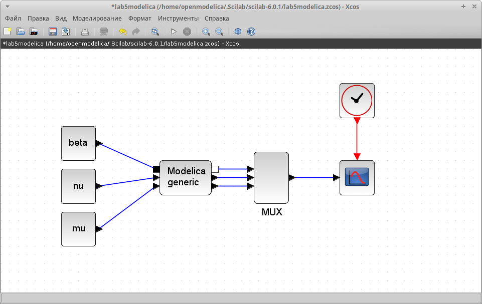{#fig:016 width=45%}

## OpenModelica

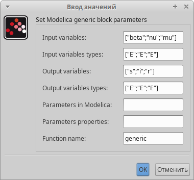{#fig:017 width=45%}

## OpenModelica

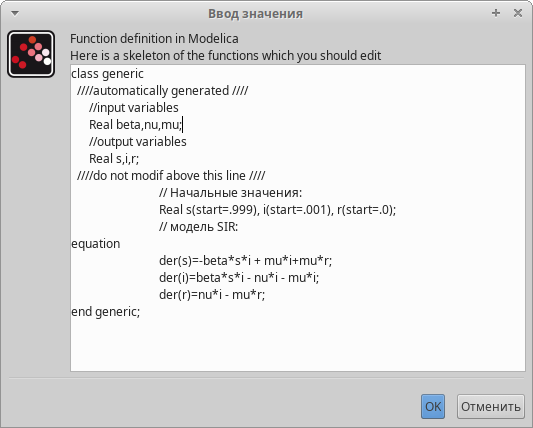{#fig:018 width=45%}

## Результаты

{#fig:019 width=45%}

## Результаты

{#fig:020 width=45%}

## Результаты

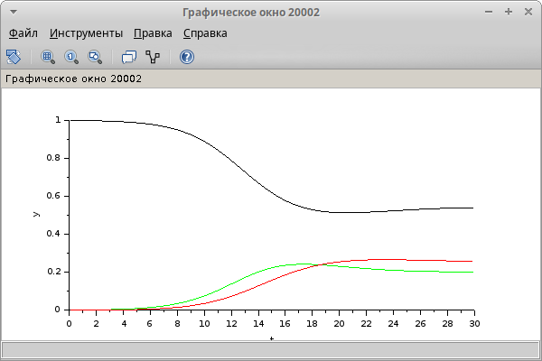{#fig:021 width=45%}

# Выводы

## Выводы

В ходе лабораторной работы мы получили базовые навыки программирования модели эпидемии с помощью `xcos` и `OpenModelica`.
