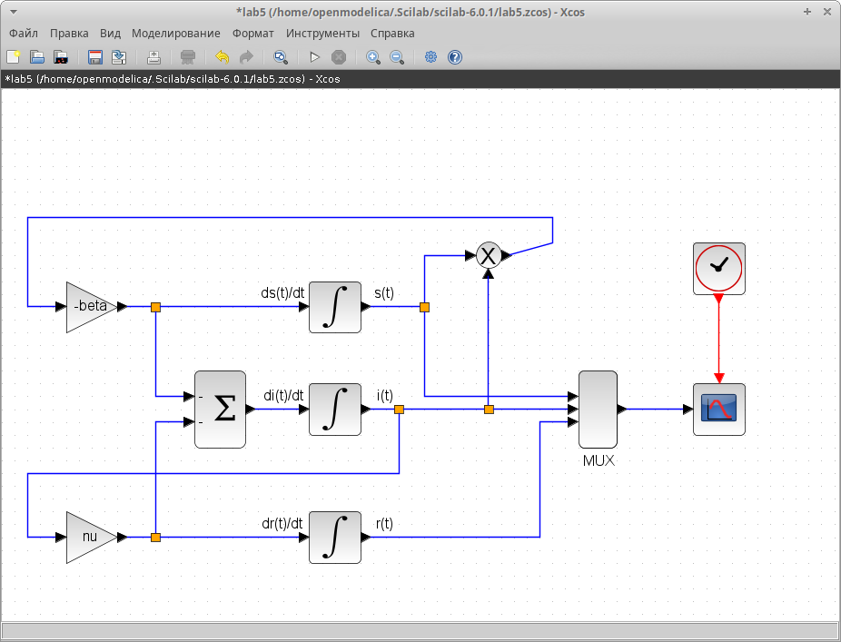

---
## Front matter
title: "Отчёт по лабораторной работе №5"
subtitle: "Модель эпидемии"
author: "Надежда Александровна Рогожина"

## Generic otions
lang: ru-RU
toc-title: "Содержание"

## Bibliography
bibliography: bib/cite.bib
csl: pandoc/csl/gost-r-7-0-5-2008-numeric.csl

## Pdf output format
toc: true # Table of contents
toc-depth: 2
lof: true # List of figures
lot: true # List of tables
fontsize: 12pt
linestretch: 1.5
papersize: a4
documentclass: scrreprt
## I18n polyglossia
polyglossia-lang:
  name: russian
  options:
	- spelling=modern
	- babelshorthands=true
polyglossia-otherlangs:
  name: english
## I18n babel
babel-lang: russian
babel-otherlangs: english
## Fonts
mainfont: IBM Plex Serif
romanfont: IBM Plex Serif
sansfont: IBM Plex Sans
monofont: IBM Plex Mono
mathfont: STIX Two Math
mainfontoptions: Ligatures=Common,Ligatures=TeX,Scale=0.94
romanfontoptions: Ligatures=Common,Ligatures=TeX,Scale=0.94
sansfontoptions: Ligatures=Common,Ligatures=TeX,Scale=MatchLowercase,Scale=0.94
monofontoptions: Scale=MatchLowercase,Scale=0.94,FakeStretch=0.9
mathfontoptions:
## Biblatex
biblatex: true
biblio-style: "gost-numeric"
biblatexoptions:
  - parentracker=true
  - backend=biber
  - hyperref=auto
  - language=auto
  - autolang=other*
  - citestyle=gost-numeric
## Pandoc-crossref LaTeX customization
figureTitle: "Рис."
tableTitle: "Таблица"
listingTitle: "Листинг"
lofTitle: "Список иллюстраций"
lotTitle: "Список таблиц"
lolTitle: "Листинги"
## Misc options
indent: true
header-includes:
  - \usepackage{indentfirst}
  - \usepackage{float} # keep figures where there are in the text
  - \floatplacement{figure}{H} # keep figures where there are in the text
---

# Задание

В дополнение к предположениям, которые были сделаны для модели SIR, предположим, что учитываются демографические процессы, в частности, что смертность в популяции полностью уравновешивает рождаемость, а все рожденные индивидуумы появляются на свет абсолютно здоровыми. Тогда получим следующую систему уравнений:

1. *s = −$\beta$ s(t)i(t) + $\mu$ (N − s(t))*;
2. *i = $\beta$ s(t)i(t) − $\nu$ i(t) − $\mu$ i(t);*
3. *r = $\nu$ i(t) − $\mu$ r(t),*

где $\mu$ — константа, которая равна коэффициенту смертности и рождаемости.

Требуется:
- реализовать модель SIR с учётом процесса рождения / гибели особей в xcos (в том числе и с использованием блока Modelica), а также в OpenModelica;
- построить графики эпидемического порога при различных значениях параметров модели (в частности изменяя параметр $\mu$);
- сделать анализ полученных графиков в зависимости от выбранных значений параметров модели.

# Теоретическое введение

Модель SIR предложена в 1927 г. (W. O. Kermack, A. G. McKendrick).

Предполагается, что особи популяции размера N могут находиться в трёх различных состояниях:
- S (susceptible, уязвимые) — здоровые особи, которые находятся в группе риска и могут подхватить инфекцию;
- I (infective, заражённые, распространяющие заболевание) — заразившиеся переносчики болезни;
- R (recovered/removed, вылечившиеся) — те, кто выздоровел и перестал распространять болезнь (в эту категорию относят, например, приобретших иммунитет или умерших).

Внутри каждой из выделенных групп особи считаются неразличимыми по свойствам. Типичная эволюция особи популяции описывается следующей диаграммой:

$$
S → I → R.
$$

Считаем, что система замкнута, т.е.

$$
N = S + I + R.
$$

Почитать подробнее про `xcos` можно в [@xcos]. Лабораторная работа выполнялась на основе [@simmod].

# Выполнение лабораторной работы

Открыв окно визуального моделирования, первое что было установлено - контекст (рис. [-@fig:001]).

{#fig:001 width=70%}

Для первого интеграла было выставлено `Initial Condition = .999` (рис. [-@fig:002]).

{#fig:002 width=70%}

Для второго интеграла было выставлено `Initial Condition = .001` (рис. [-@fig:003]).

{#fig:003 width=70%}

Также, необходимо было установить максимальное время моделирования как 30 единиц модельного времени (рис. [-@fig:004]).

{#fig:004 width=70%}

Схему, которая была изображена в тексте лабораторной работы, мы повторили (рис. [-@fig:005]).

{#fig:005 width=70%}

Смоделировав ситуацию, мы видим планомерное уменьшение здоровых граждан, планомерное увеличение вылечившихся, а также пик количества зараженных граждан, что одновременно является точкой пересечения всех 3 линий (рис. [-@fig:006]).

{#fig:006 width=70%}

Далее, мы повторили ту же модель, но через блок OpenModelica (рис. [-@fig:007], рис. [-@fig:008], рис. [-@fig:009]).

{#fig:007 width=70%}

{#fig:008 width=70%}

{#fig:009 width=70%}

Видно, что результаты совпадают с аналитическим подсчетом (рис. [-@fig:010]).

{#fig:010 width=70%}

Далее, было необходимо реализовать модель эпидемии, учитывающую смертность и рождаемость (коэффициент $\mu$) (рис. [-@fig:011], рис. [-@fig:012]).

{#fig:011 width=70%}

{#fig:012 width=70%}

При запуске, с $\mu = 0.01; 0.1; 1$ получились следующие результаты (рис. [-@fig:013], рис. [-@fig:014], рис. [-@fig:015]):

{#fig:013 width=70%}

{#fig:014 width=70%}

{#fig:015 width=70%}

Аналогично, необходимо было доработать код OpenModelica (рис. [-@fig:016], рис. [-@fig:017], рис. [-@fig:018]):

{#fig:016 width=70%}

{#fig:017 width=70%}

{#fig:018 width=70%}

Аналогично, были получены результаты для разных $\mu$ (рис. [-@fig:019], рис. [-@fig:020], рис. [-@fig:021]):

{#fig:019 width=70%}

{#fig:020 width=70%}

{#fig:021 width=70%}

# Выводы

В ходе лабораторной работы мы получили базовые навыки программирования модели эпидемии с помощью `xcos` и `OpenModelica`.

# Список литературы{.unnumbered}

::: {#refs}
:::
