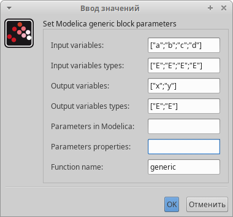

---
## Front matter
lang: ru-RU
title: Модель "Хищник-Жертва".
subtitle: Лабораторная работа №6.
author:
  - Рогожина Н.А.
institute:
  - Российский университет дружбы народов, Москва, Россия
date: 15 марта 2025

## i18n babel
babel-lang: russian
babel-otherlangs: english

## Formatting pdf
toc: false
toc-title: Содержание
slide_level: 2
aspectratio: 169
section-titles: true
theme: metropolis
header-includes:
 - \metroset{progressbar=frametitle,sectionpage=progressbar,numbering=fraction}
---

# Информация

## Докладчик

:::::::::::::: {.columns align=center}
::: {.column width="70%"}

  * Рогожина Надежда Александровна
  * студентка 3 курса НФИбд-02-22
  * Российский университет дружбы народов
  * <https://mikogreen.github.io/>

:::
::::::::::::::

# Задание

## Задание

Реализуйте модель «хищник – жертва» в OpenModelica. Постройте графики изменения численности популяций и фазовый портрет.

# Теоретическое введение

## Теоретическое введение

Модель «хищник–жертва» (модель Лотки — Вольтерры) представляет собой модель межвидовой конкуренции. В математической форме модель состоит из 2 уравнений: 

1. ̇x = ax − bxy;
2. y = cxy − dy,

где 
- x — количество жертв; 
- y — количество хищников; 
- a, b, c, d — коэффициенты, отражающие взаимодействия между видами: 
	- a — коэффициент рождаемости жертв; 
	- b — коэффициент убыли жертв; 
	- c — коэффициент рождения хищников; 
	- d — коэффициент убыли хищников.

# Выполнение лабораторной работы

## Установка окружения

В первую очередь, зададим переменные окружения.

{#fig:001 width=45%}

## Установка окружения

Также, сразу установим параметры моделирования.

{#fig:002 width=50%}

## Реализация схемы

Следующий шаг - реализация схемы модели "Хищник-жертва".

{#fig:003 width=40%}

## Визуализация результатов

Визуализировав результаты моделирования мы получили две кривые:

1. Зеленая - количество хищников (акул),

2. Черная - количество жертв (сардин).

## График

{#fig:004 width=60%}

## Фазовый портрет:

{#fig:005 width=60%}

## Вторая часть

Вторым этапом была реализация с помощью блока кода Modelica. Для этого установим у блока Modelica необходимые входные и выходные параметры.

## Установка окружения

{#fig:006 width=40%}

## Установка окружения

{#fig:007 width=45%}

## Реализация схемы

{#fig:008 width=70%}

## График

{#fig:009 width=70%}

## Фазовый портрет:

{#fig:010 width=70%}

## Визуализация результатов

Как мы видим, результаты мы получили те же.

# Выводы

## Выводы

В ходе работы мы изучили модель "Хищник-жертва" и получили результаты моделирования двумя способами - интегрирование и блок кода Modelica.

