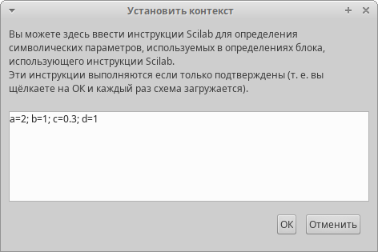
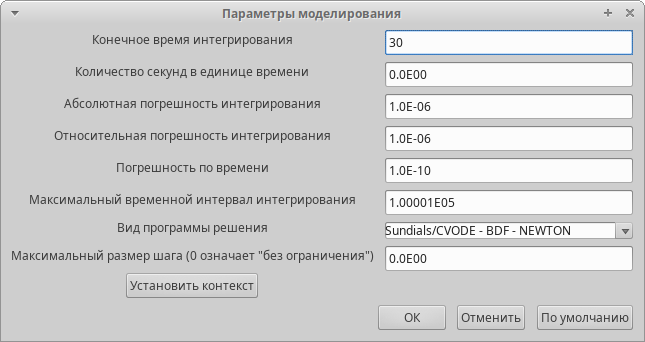
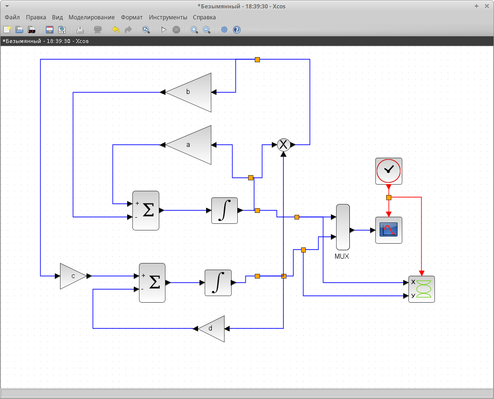
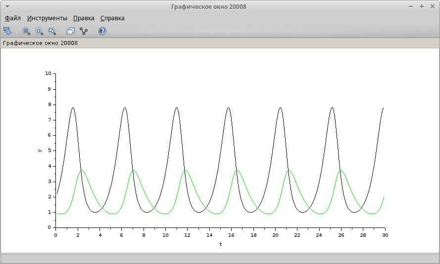
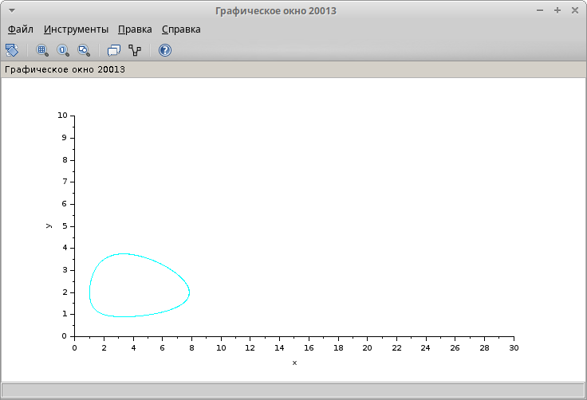
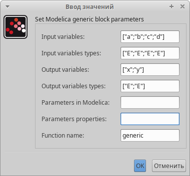
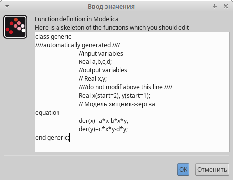
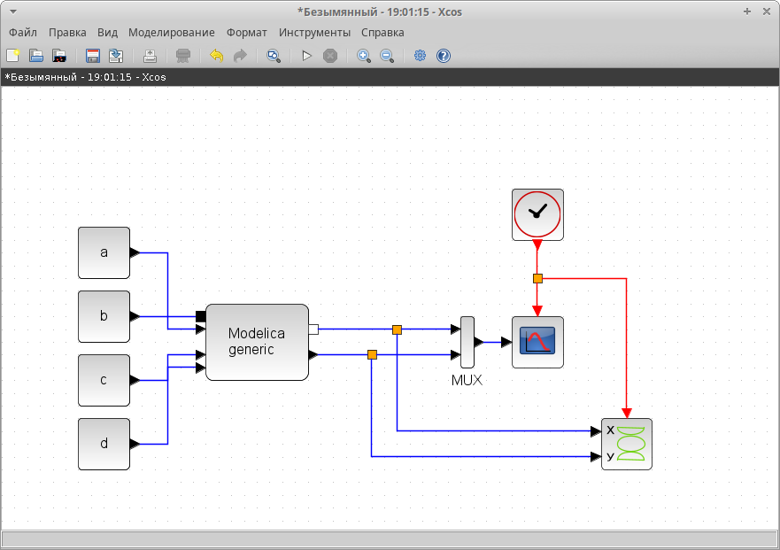
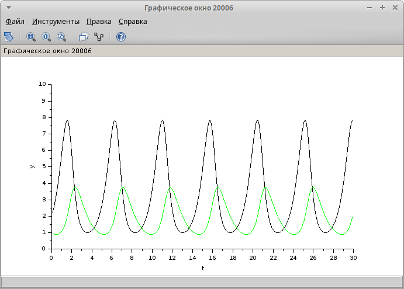

---
## Front matter
title: "Отчет по лабораторной работе№6"
subtitle: "Модель 'хищник-жертва'"
author: "Надежда Александровна Рогожина"

## Generic otions
lang: ru-RU
toc-title: "Содержание"

## Bibliography
bibliography: bib/cite.bib
csl: pandoc/csl/gost-r-7-0-5-2008-numeric.csl

## Pdf output format
toc: true # Table of contents
toc-depth: 2
lof: true # List of figures
lot: true # List of tables
fontsize: 12pt
linestretch: 1.5
papersize: a4
documentclass: scrreprt
## I18n polyglossia
polyglossia-lang:
  name: russian
  options:
	- spelling=modern
	- babelshorthands=true
polyglossia-otherlangs:
  name: english
## I18n babel
babel-lang: russian
babel-otherlangs: english
## Fonts
mainfont: IBM Plex Serif
romanfont: IBM Plex Serif
sansfont: IBM Plex Sans
monofont: IBM Plex Mono
mathfont: STIX Two Math
mainfontoptions: Ligatures=Common,Ligatures=TeX,Scale=0.94
romanfontoptions: Ligatures=Common,Ligatures=TeX,Scale=0.94
sansfontoptions: Ligatures=Common,Ligatures=TeX,Scale=MatchLowercase,Scale=0.94
monofontoptions: Scale=MatchLowercase,Scale=0.94,FakeStretch=0.9
mathfontoptions:
## Biblatex
biblatex: true
biblio-style: "gost-numeric"
biblatexoptions:
  - parentracker=true
  - backend=biber
  - hyperref=auto
  - language=auto
  - autolang=other*
  - citestyle=gost-numeric
## Pandoc-crossref LaTeX customization
figureTitle: "Рис."
tableTitle: "Таблица"
listingTitle: "Листинг"
lofTitle: "Список иллюстраций"
lotTitle: "Список таблиц"
lolTitle: "Листинги"
## Misc options
indent: true
header-includes:
  - \usepackage{indentfirst}
  - \usepackage{float} # keep figures where there are in the text
  - \floatplacement{figure}{H} # keep figures where there are in the text
---

# Задание

Реализуйте модель «хищник – жертва» в OpenModelica. Постройте графики изменения численности популяций и фазовый портрет.

# Теоретическое введение

Модель «хищник–жертва» (модель Лотки — Вольтерры) представляет собой модель межвидовой конкуренции. В математической форме модель состоит из 2 уравнений: 

1. ̇x = ax − bxy;
2. y = cxy − dy,

где 
- x — количество жертв; 
- y — количество хищников; 
- a, b, c, d — коэффициенты, отражающие взаимодействия между видами: 
	- a — коэффициент рождаемости жертв; 
	- b — коэффициент убыли жертв; 
	- c — коэффициент рождения хищников; 
	- d — коэффициент убыли хищников.

# Выполнение лабораторной работы

В первую очередь, зададим переменные окружения (рис. [-@fig:001]).

{#fig:001 width=70%}

Также, сразу установим параметры моделирования (рис. [-@fig:002]).

{#fig:002 width=70%}

Следующий шаг - реализация схемы модели "Хищник-жертва" (рис. [-@fig:003]).

{#fig:003 width=70%}

Визуализировав результаты моделирования мы получили две кривые:
1. Зеленая - количество хищников (акул)
2. Черная - количество жертв (сардин) (рис. [-@fig:004]).

{#fig:004 width=70%}

Также, фазовый портрет (рис. [-@fig:005]):

{#fig:005 width=70%}

Вторым этапом была реализация с помощью блока кода Modelica. Для этого установим у блока Modelica необходимые входные и выходные параметры (рис. [-@fig:006]).

{#fig:006 width=70%}

И укажем код, который будет описывать популяцию хищников и жертв (рис. [-@fig:007]).

{#fig:007 width=70%}

Диаграмма с блоком кода выглядит следующим образом (рис. [-@fig:008]):

{#fig:008 width=70%}

Как мы видим, результаты мы получили те же (рис. [-@fig:009], рис. [-@fig:010]).

{#fig:009 width=70%}

{#fig:010 width=70%}

# Выводы

В ходе работы мы изучили модель "Хищник-жертва" и получили результаты моделирования двумя способами - интегрирование и блок кода Modelica.

# Список литературы{.unnumbered}

::: {#refs}
:::
