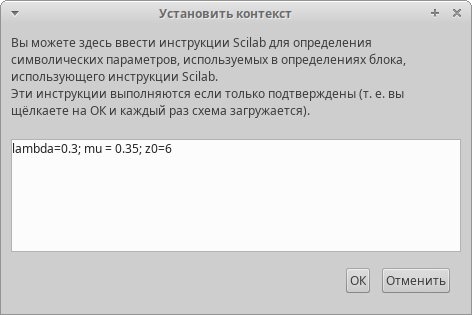
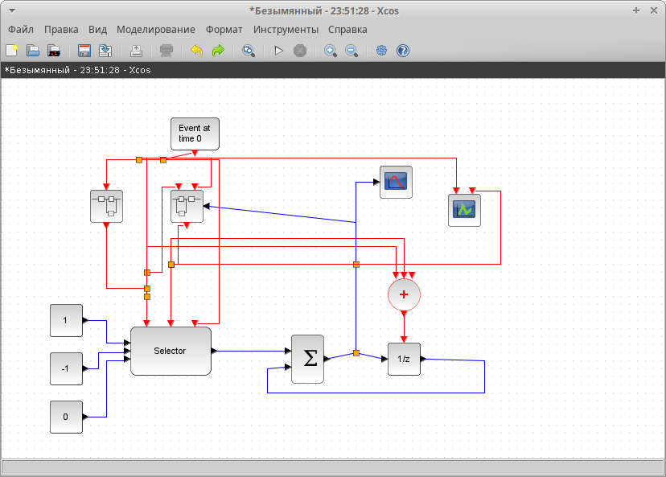
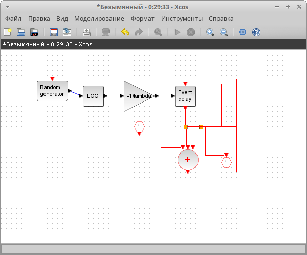
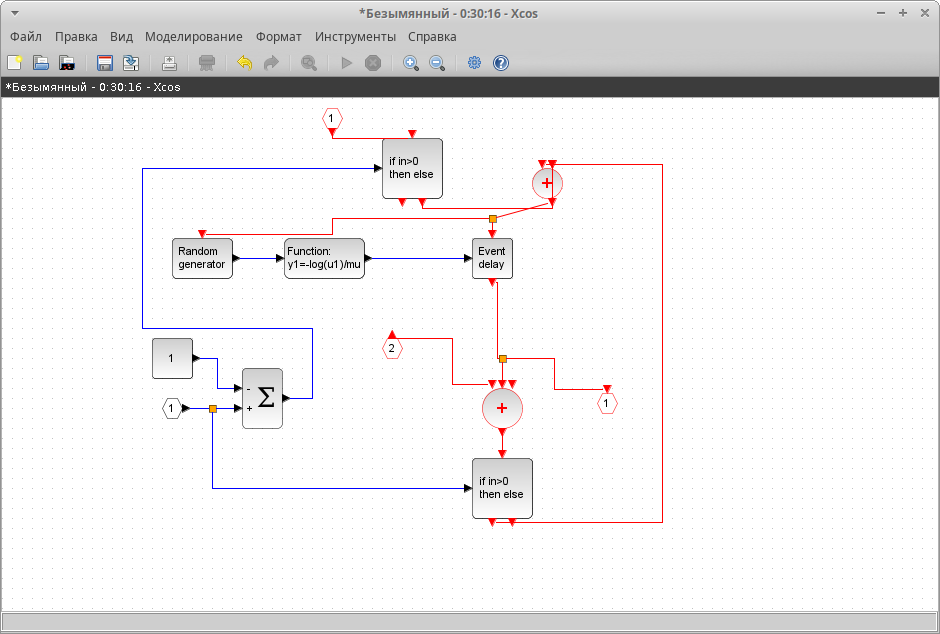
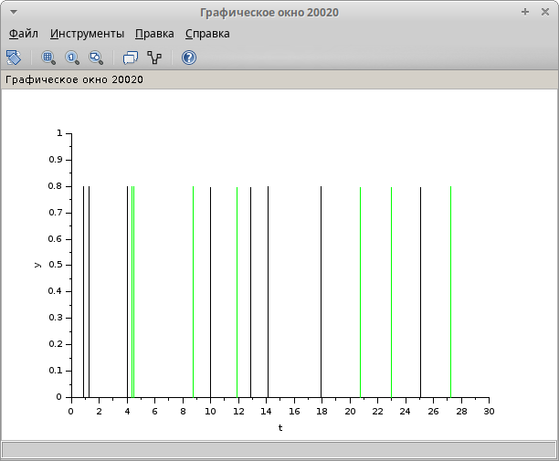

---
## Front matter
lang: ru-RU
title: Модель М|M|1|inf.
subtitle: Лабораторная работа №7.
author:
  - Рогожина Н.А.
institute:
  - Российский университет дружбы народов, Москва, Россия
date: 21 марта 2025

## i18n babel
babel-lang: russian
babel-otherlangs: english

## Formatting pdf
toc: false
toc-title: Содержание
slide_level: 2
aspectratio: 169
section-titles: true
theme: metropolis
header-includes:
 - \metroset{progressbar=frametitle,sectionpage=progressbar,numbering=fraction}
---

# Информация

## Докладчик

:::::::::::::: {.columns align=center}
::: {.column width="70%"}

  * Рогожина Надежда Александровна
  * студентка 3 курса НФИбд-02-22
  * Российский университет дружбы народов
  * <https://mikogreen.github.io/>

:::
::::::::::::::

# Задание

## Задание

Cмоделировать однолинейную СМО с накопителем бесконечной ёмкости c помощью Scilab. Визуализировать результат моделирования.

# Теоретическое введение

## Теоретическое введение

M|M|1 — однолинейная СМО с накопителем бесконечной ёмкости. Поступающий поток заявок — пуассоновский с интенсивностью λ. Времена обслуживания заявок — независимые в совокупности случайные величины, распределённые по экспоненциальному закону с параметром μ.

# Выполнение лабораторной работы

## Установка окружения

Первое, что мы сделали - задали переменные окружения.

## Установка окружения

{#fig:001 width=70%}

## Схема модели

Сама схема модели выглядит следующим образом:

1. 3 входа (+1, -1, 0) - отвечают за добавление/убирание заявок из очереди и первоначальную синхронизацию

2. Селектор событий - работа системы описывается двумя событиями - поступление заявки в очередь и обработка заявки.

3. Синхронизация входных/выходных сигналов

4. График количества заявок в очереди и график поведения системы (поступление и обработка заявок)

## Схема модели

{#fig:002 width=50%}

## Детали реализации

Поступление и обработка заявок были разбиты на 2 суперблока. Суперблок поступления выглядит как генератор равномерного распределения, от которого взят логарифм и домножен на -1/$\lambda$.

## Первый суперблок

{#fig:003 width=50%}

## Второй суперблок

{#fig:004 width=50%}

## Результаты моделирования

После того, как мы запустили моделирование, мы получили 2 графика - количество заявок в очереди и график работы системы.

## Результаты моделирования

{#fig:005 width=50%}

## Результаты моделирования

{#fig:006 width=50%}

# Выводы

## Выводы

В ходе лабораторной работы мы смоделировали поведение однолинейной СМО М|M|1 с накопителем бесконечной ёмкости, а также построили график длины очереди и график поведения системы.

