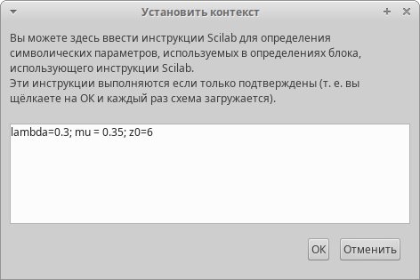
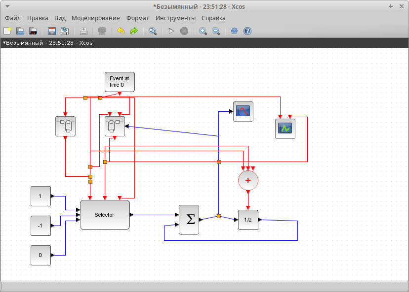
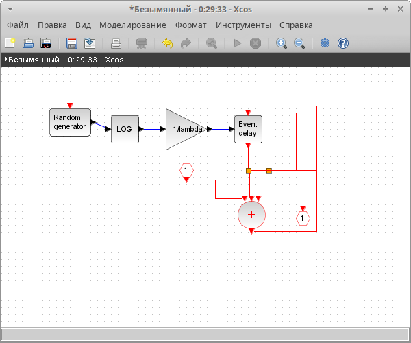
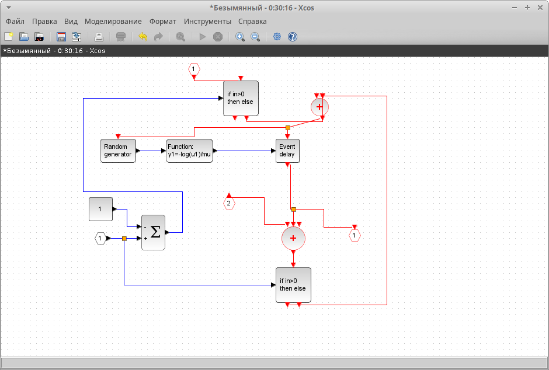
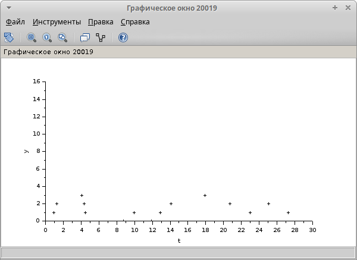
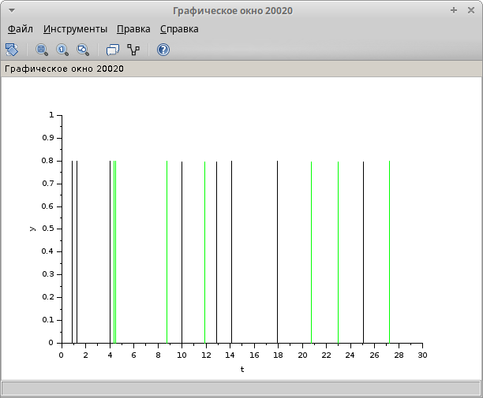

---
## Front matter
title: "Отчёт по лабораторной работе №7"
subtitle: "Модель M|M|1|inf"
author: "Надежда Александровна Рогожина"

## Generic otions
lang: ru-RU
toc-title: "Содержание"

## Bibliography
bibliography: bib/cite.bib
csl: pandoc/csl/gost-r-7-0-5-2008-numeric.csl

## Pdf output format
toc: true # Table of contents
toc-depth: 2
lof: true # List of figures
lot: true # List of tables
fontsize: 12pt
linestretch: 1.5
papersize: a4
documentclass: scrreprt
## I18n polyglossia
polyglossia-lang:
  name: russian
  options:
	- spelling=modern
	- babelshorthands=true
polyglossia-otherlangs:
  name: english
## I18n babel
babel-lang: russian
babel-otherlangs: english
## Fonts
mainfont: IBM Plex Serif
romanfont: IBM Plex Serif
sansfont: IBM Plex Sans
monofont: IBM Plex Mono
mathfont: STIX Two Math
mainfontoptions: Ligatures=Common,Ligatures=TeX,Scale=0.94
romanfontoptions: Ligatures=Common,Ligatures=TeX,Scale=0.94
sansfontoptions: Ligatures=Common,Ligatures=TeX,Scale=MatchLowercase,Scale=0.94
monofontoptions: Scale=MatchLowercase,Scale=0.94,FakeStretch=0.9
mathfontoptions:
## Biblatex
biblatex: true
biblio-style: "gost-numeric"
biblatexoptions:
  - parentracker=true
  - backend=biber
  - hyperref=auto
  - language=auto
  - autolang=other*
  - citestyle=gost-numeric
## Pandoc-crossref LaTeX customization
figureTitle: "Рис."
tableTitle: "Таблица"
listingTitle: "Листинг"
lofTitle: "Список иллюстраций"
lotTitle: "Список таблиц"
lolTitle: "Листинги"
## Misc options
indent: true
header-includes:
  - \usepackage{indentfirst}
  - \usepackage{float} # keep figures where there are in the text
  - \floatplacement{figure}{H} # keep figures where there are in the text
---

# Цель работы

Смоделировать и визуализировать результаты моделирования СМО М/М/1 с бесконечной очередью.

# Задание

Создать и смоделировать однолинейную СМО с накопителем бесконечной ёмкости. Визуализировать результат моделирования.

# Теоретическое введение

M|M|1 — однолинейная СМО с накопителем бесконечной ёмкости. Поступающий поток заявок — пуассоновский с интенсивностью λ. Времена обслуживания заявок — независимые в совокупности случайные величины, распределённые по экспоненциальному закону с параметром μ.

# Выполнение лабораторной работы

Первое, что мы сделали - задали переменные окружения (рис. [-@fig:001]).

{#fig:001 width=70%}

Сама схема модели выглядит следующим образом (рис. [-@fig:002]):

1. 3 входа (+1, -1, 0) - отвечают за добавление/убирание заявок из очереди и первоначальную синхронизацию
2. Селектор событий - работа системы описывается двумя событиями - поступление заявки в очередь и обработка заявки.
3. Синхронизация входных/выходных сигналов
4. График количества заявок в очереди и график поведения системы (поступление и обработка заявок)

{#fig:002 width=70%}

Поступление и обработка заявок были разбиты на 2 суперблока. Суперблок поступления выглядит как генератор равномерного распределения, от которого взят логарифм и домножен на -1/$\lambda$ (рис. [-@fig:003]).

{#fig:003 width=70%}

Обработка заявок также вынесена в суперблок (рис. [-@fig:004]).

{#fig:004 width=70%}

После того, как мы запустили моделирование, мы получили 2 графика - количество заявок в очереди (рис. [-@fig:005]) и график работы системы (рис. [-@fig:006]).

{#fig:005 width=70%}

{#fig:006 width=70%}

# Выводы

В ходе лабораторной работы мы смоделировали поведение однолинейной СМО М|M|1 с накопителем бесконечной ёмкости, а также построили график длины очереди и график поведения системы.

# Список литературы{.unnumbered}

::: {#refs}
:::
