---
## Front matter
lang: ru-RU
title: Модель TCP/AQM.
subtitle: Лабораторная работа №8.
author:
  - Рогожина Н.А.
institute:
  - Российский университет дружбы народов, Москва, Россия
date: 29 марта 2025

## i18n babel
babel-lang: russian
babel-otherlangs: english

## Formatting pdf
toc: false
toc-title: Содержание
slide_level: 2
aspectratio: 169
section-titles: true
theme: metropolis
header-includes:
 - \metroset{progressbar=frametitle,sectionpage=progressbar,numbering=fraction}
---

# Информация

## Докладчик

:::::::::::::: {.columns align=center}
::: {.column width="70%"}

  * Рогожина Надежда Александровна
  * студентка 3 курса НФИбд-02-22
  * Российский университет дружбы народов
  * <https://mikogreen.github.io/>

:::
::::::::::::::

# Задание

## Задание

Реализуйте упрощённую модель поведения TCP-подобного трафика с регулируемой некоторым AQM алгоритмом динамической интенсивностью потока.

# Теоретическое введение

## Теоретическое введение

Уравнения модели выглядят следующим образом:

1. `W(t) = 1/R - 1/2R * W(t)*W(t-R)*K*Q(t-R)`
2. `Q(t) = NW(t)/R - C if Q(t)>0 else max(NW(t)/R - C, 0)`


# Выполнение лабораторной работы

## Установка окружения

В первую очередь, настроим параметры моделирования.

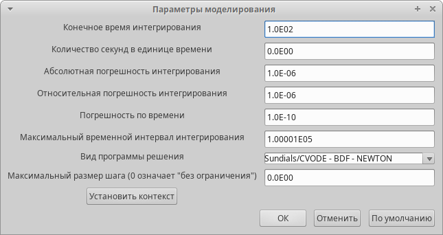{#fig:001 width=50%}

## Установка окружения

Также, сразу установим переменные окружения.

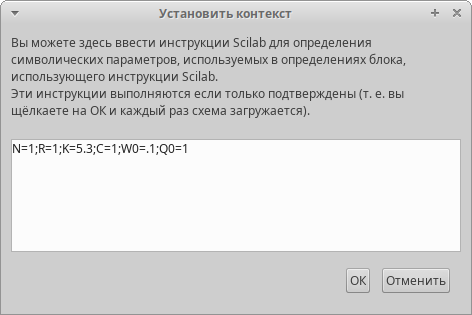{#fig:002 width=50%}

## Реализация схемы

Следующий шаг - реализация схемы модели.

## Реализация схемы

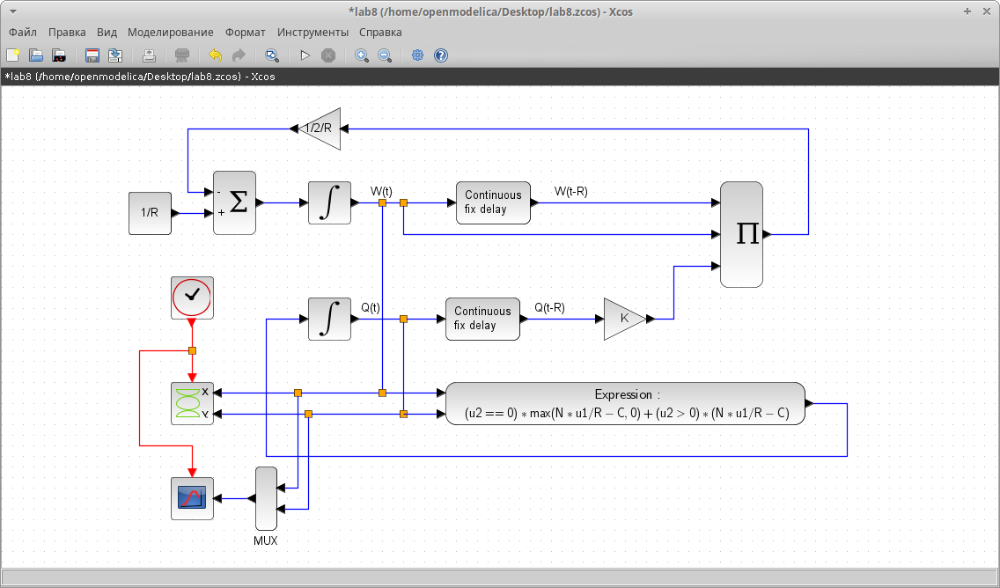{#fig:003 width=60%}

## Визуализация результатов

Визуализировав результаты моделирования мы получили два графика. На первом отображена динамика изменения размера TCP окна W (t) (зеленая линия) и размера очереди Q(t) (черная линия). На второй представлен фазовый портрет (W, Q), который показывает наличие автоколебаний параметров системы — фазовая траектория осциллирует вокруг своей стационарной точки.

## График (C=1)

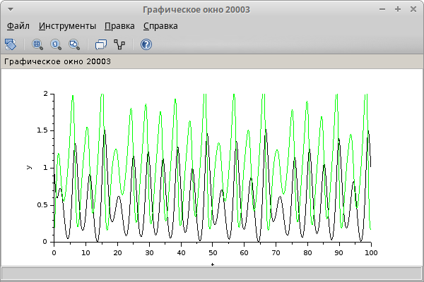{#fig:004 width=50%}

## Фазовый портрет (C=1)

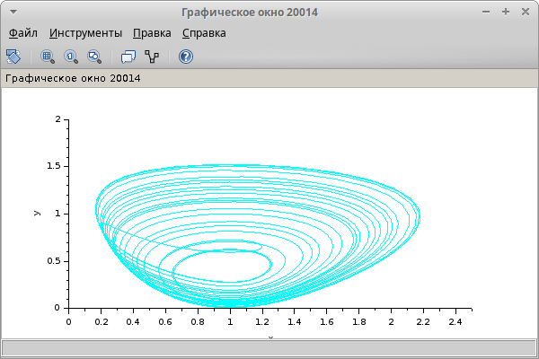{#fig:005 width=50%}

## График (C=0.9)

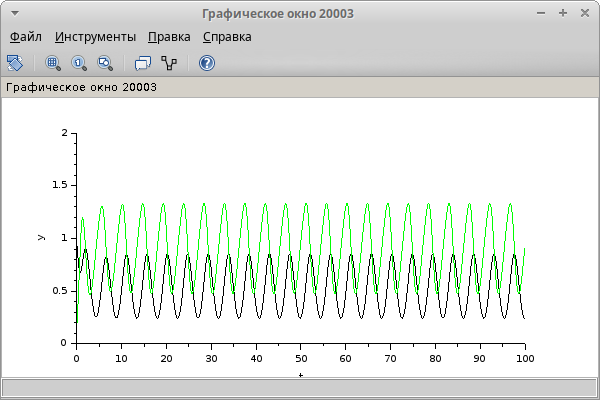{#fig:006 width=70%}

## Фазовый портрет (C=0.9)

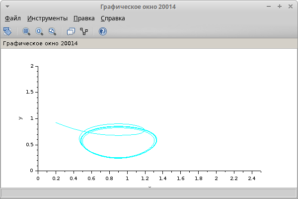{#fig:007 width=70%}

## Второй этап

Вторым этапом была реализация с помощью OpenModelica. Код, который был использован при построении модели:

## Второй этап

```
model lab8
parameter Real N=1;
parameter Real R=1;
parameter Real K=5.3;
parameter Real C=1;
parameter Real W0=0.1;
parameter Real Q0=1;
```

## Второй этап

```
Real W(start=W0);
Real Q(start=Q0);
equation
der(W) = 1/R - W*delay(W,R)*K*delay(Q,R)/(2*R);
der(Q) = if Q > 0 then N*W/R-C else max(N*W/R-C,0);
end lab8;
```

## Второй этап

Необходимо было также визуализировать результаты симуляции для С=1 и для С=0.9.

## График (C=1)

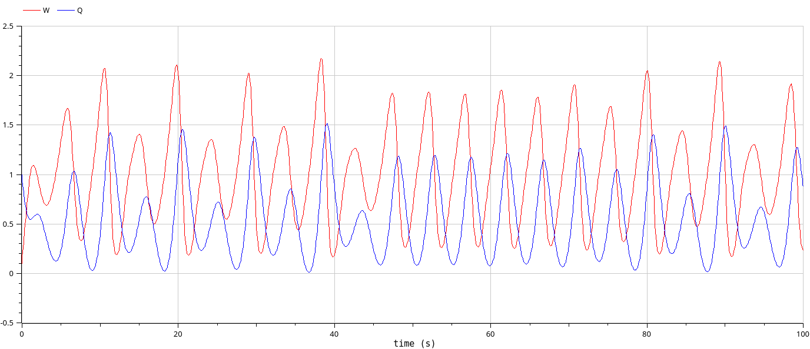{#fig:008 width=70%}

## Фазовый портрет (C=1)

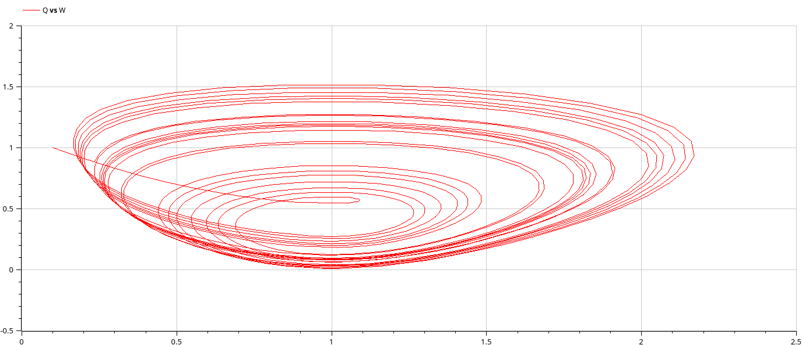{#fig:009 width=70%}

## График (C=0.9)

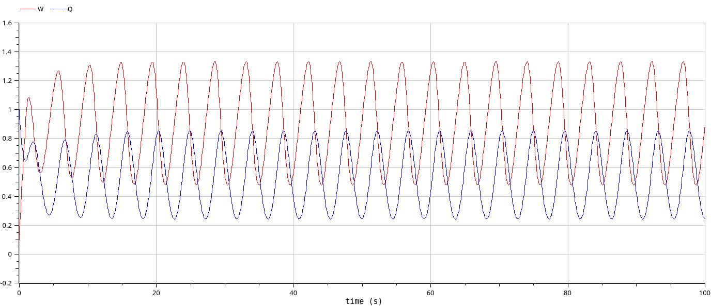{#fig:010 width=70%}

## Фазовый портрет (C=0.9)

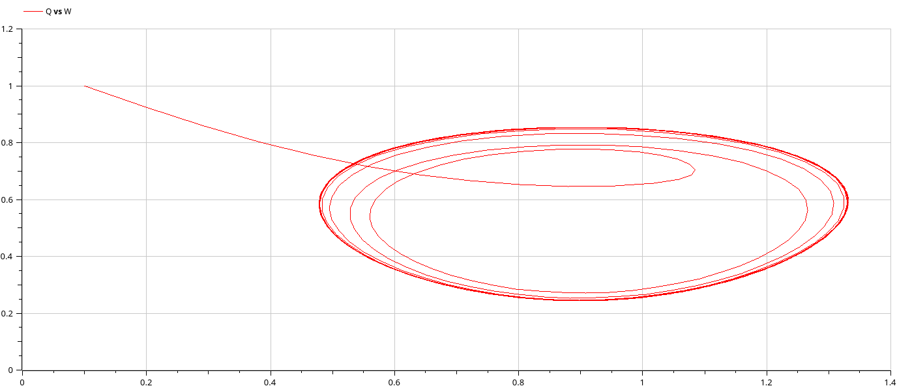{#fig:011 width=70%}

## Визуализация результатов

Как мы видим, результаты мы получили те же, что и через xcos.

# Выводы

## Выводы

В ходе работы мы изучили упрощённую модель поведения TCP-подобного трафика с регулируемой некоторым AQM алгоритмом динамической интенсивностью потока, а также визуализировали результаты симуляции поведения данной модели двумя способами - через xcos и через OpenModelica.

