---
## Front matter
title: "Отчет по лабораторной работе №8"
subtitle: "Модель TCP/AQM"
author: "Надежда Александровна Рогожина"

## Generic otions
lang: ru-RU
toc-title: "Содержание"

## Bibliography
bibliography: bib/cite.bib
csl: pandoc/csl/gost-r-7-0-5-2008-numeric.csl

## Pdf output format
toc: true # Table of contents
toc-depth: 2
lof: true # List of figures
lot: true # List of tables
fontsize: 12pt
linestretch: 1.5
papersize: a4
documentclass: scrreprt
## I18n polyglossia
polyglossia-lang:
  name: russian
  options:
	- spelling=modern
	- babelshorthands=true
polyglossia-otherlangs:
  name: english
## I18n babel
babel-lang: russian
babel-otherlangs: english
## Fonts
mainfont: IBM Plex Serif
romanfont: IBM Plex Serif
sansfont: IBM Plex Sans
monofont: IBM Plex Mono
mathfont: STIX Two Math
mainfontoptions: Ligatures=Common,Ligatures=TeX,Scale=0.94
romanfontoptions: Ligatures=Common,Ligatures=TeX,Scale=0.94
sansfontoptions: Ligatures=Common,Ligatures=TeX,Scale=MatchLowercase,Scale=0.94
monofontoptions: Scale=MatchLowercase,Scale=0.94,FakeStretch=0.9
mathfontoptions:
## Biblatex
biblatex: true
biblio-style: "gost-numeric"
biblatexoptions:
  - parentracker=true
  - backend=biber
  - hyperref=auto
  - language=auto
  - autolang=other*
  - citestyle=gost-numeric
## Pandoc-crossref LaTeX customization
figureTitle: "Рис."
tableTitle: "Таблица"
listingTitle: "Листинг"
lofTitle: "Список иллюстраций"
lotTitle: "Список таблиц"
lolTitle: "Листинги"
## Misc options
indent: true
header-includes:
  - \usepackage{indentfirst}
  - \usepackage{float} # keep figures where there are in the text
  - \floatplacement{figure}{H} # keep figures where there are in the text
---

# Задание

Реализуйте упрощённую модель поведения TCP-подобного трафика с регулируемой некоторым AQM алгоритмом динамической интенсивностью потока.

# Теоретическое введение

Уравнения модели выглядят следующим образом:

1. `W(t) = 1/R - 1/2R * W(t)*W(t-R)*K*Q(t-R)`
2. `Q(t) = NW(t)/R - C if Q(t)>0 else max(NW(t)/R - C, 0)`

# Выполнение лабораторной работы

В первую очередь, настроим параметры моделирования (рис. [-@fig:001]).

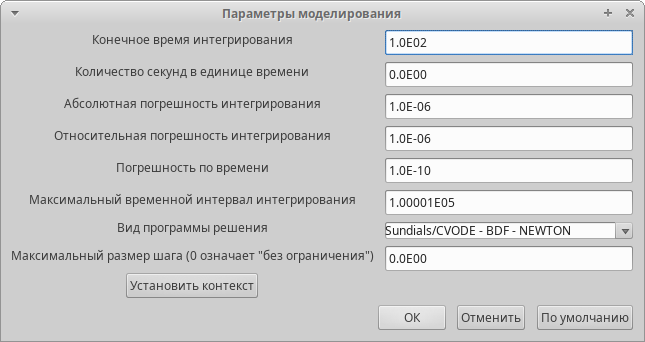{#fig:001 width=60%}

Также, сразу установим переменные окружения (рис. [-@fig:002]).

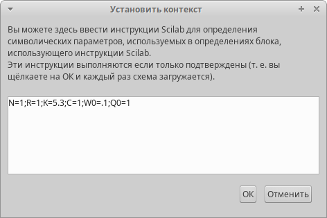{#fig:002 width=60%}

Следующий шаг - реализация схемы модели (рис. [-@fig:003]).

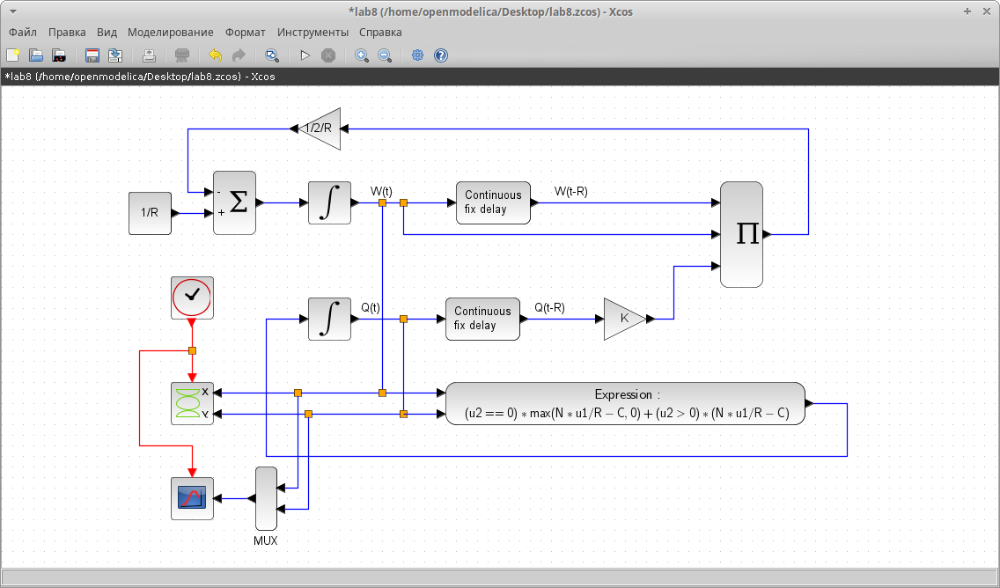{#fig:003 width=50%}

Визуализировав результаты моделирования мы получили два графика (рис. [-@fig:004], рис. [-@fig:005]). На первом отображена динамика изменения размера TCP окна W (t) (зеленая линия) и размера очереди Q(t) (черная линия). На второй представлен фазовый портрет (W, Q), который показывает наличие автоколебаний параметров системы — фазовая траектория осциллирует вокруг своей стационарной точки.

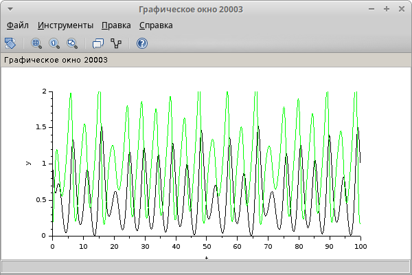{#fig:004 width=50%}

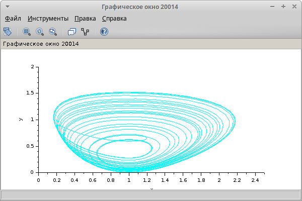{#fig:005 width=50%}

Также, посмотрим результаты для `C=0.9`(рис. [-@fig:006], рис. [-@fig:007]).

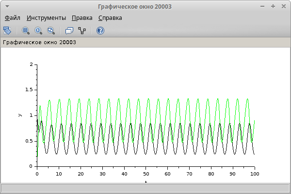{#fig:006 width=70%}

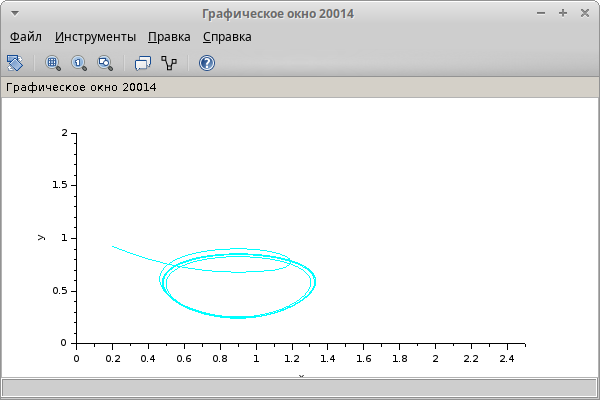{#fig:007 width=70%}

Вторым этапом была реализация с помощью OpenModelica. Код, который был использован при построении модели:

```
model lab8

parameter Real N=1;
parameter Real R=1;
parameter Real K=5.3;
parameter Real C=1;
parameter Real W0=0.1;
parameter Real Q0=1;

Real W(start=W0);
Real Q(start=Q0);

equation

der(W) = 1/R - W*delay(W,R)*K*delay(Q,R)/(2*R);
der(Q) = if Q > 0 then N*W/R-C else max(N*W/R-C,0);

end lab8;
```

Необходимо было также визуализировать результаты симуляции для С=1 (рис. [-@fig:008], рис. [-@fig:009]) и для С=0.9 (рис. [-@fig:010], рис. [-@fig:011]):

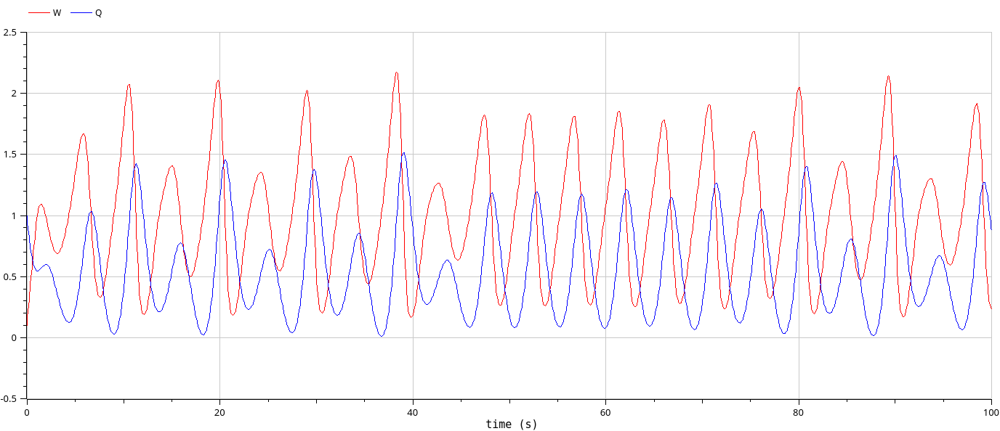{#fig:008 width=70%}

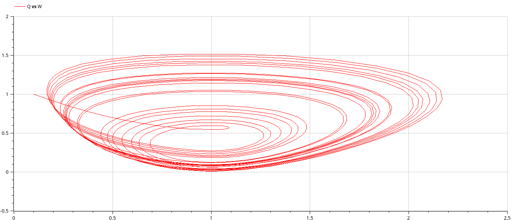{#fig:009 width=70%}

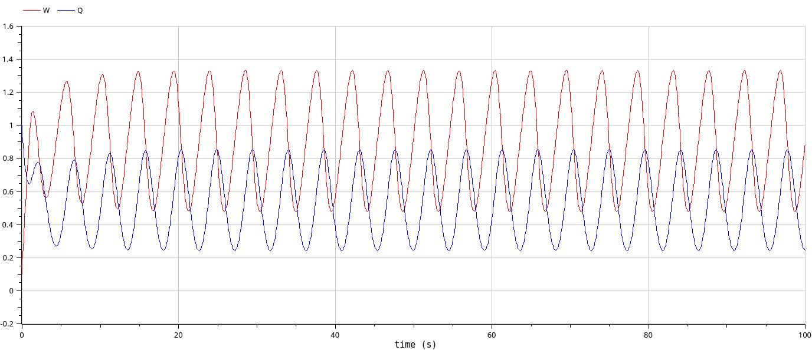{#fig:010 width=70%}

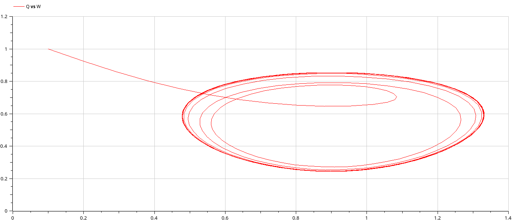{#fig:011 width=70%}

Как мы видим, результаты мы получили те же, что и через xcos.

# Выводы

В ходе работы мы изучили упрощённую модель поведения TCP-подобного трафика с регулируемой некоторым AQM алгоритмом динамической интенсивностью потока, а также визуализировали результаты симуляции поведения данной модели двумя способами - через xcos и через OpenModelica.

# Список литературы{.unnumbered}

::: {#refs}
:::
