---
## Front matter
lang: ru-RU
title: СМО М/М/1.
subtitle: Лабораторная работа №11.
author:
  - Рогожина Н.А.
institute:
  - Российский университет дружбы народов, Москва, Россия
date: 19 апреля 2025

## i18n babel
babel-lang: russian
babel-otherlangs: english

## Formatting pdf
toc: false
toc-title: Содержание
slide_level: 2
aspectratio: 169
section-titles: true
theme: metropolis
header-includes:
 - \metroset{progressbar=frametitle,sectionpage=progressbar,numbering=fraction}
---

# Информация

## Докладчик

:::::::::::::: {.columns align=center}
::: {.column width="70%"}

  * Рогожина Надежда Александровна
  * студентка 3 курса НФИбд-02-22
  * Российский университет дружбы народов
  * <https://mikogreen.github.io/>

:::
::::::::::::::

# Задание

## Задание

В систему поступает поток заявок двух типов, распределённый по пуассоновскому закону. Заявки поступают в очередь сервера на обработку. Дисциплина очереди - FIFO. Если сервер находится в режиме ожидания (нет заявок на сервере), то заявка поступает на обработку сервером.

# Выполнение лабораторной работы

## Общий граф и декларации

Первым делам опишем граф (на `Arrivals` и `Server` сделаем иерархию) системы и почти все необходимые декларации.

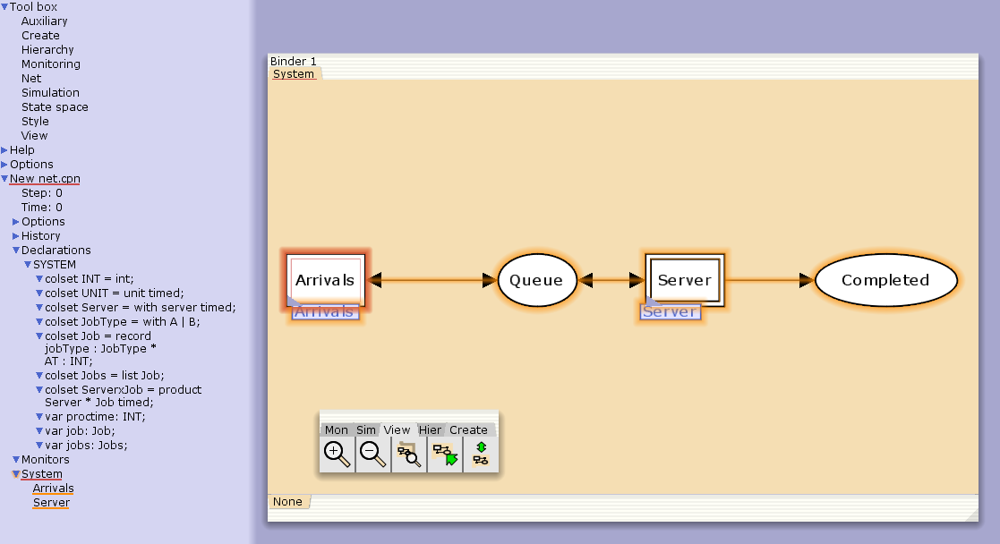{#fig:001 width=50%}

## Функции

Далее, зададим необходимые функции.

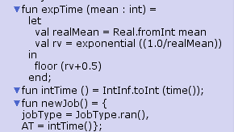{#fig:002 width=60%}

## Генерация заявок

Опишем граф генератора заявок системы (`Arrivals`).

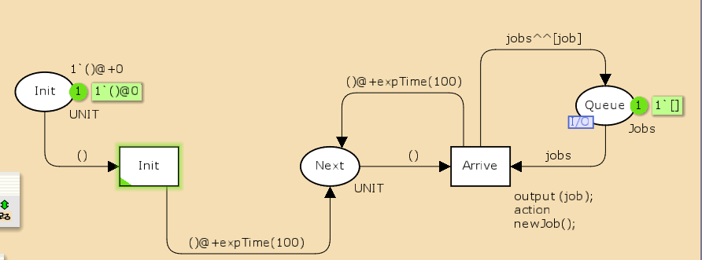{#fig:003 width=60%}

## Обработка заявок

И также опишем граф обработки заявок на сервере системы (`Server`).

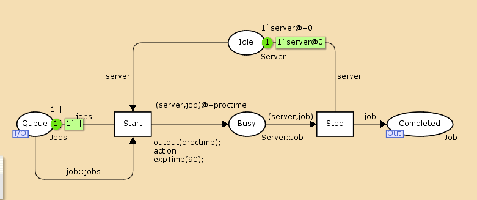{#fig:004 width=60%}

## Мониторинг

Также, нам необходимо реализовать (последовательно) 4 мониторинга системы. Первые два - `Queue_Delay` и `Ostanovka`.

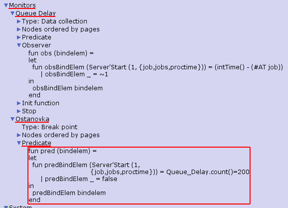{#fig:005 width=50%}

## Логи

Запустив около 100 шагов моделирования, мы получили текстовый лог `Queue_Delay.log`.

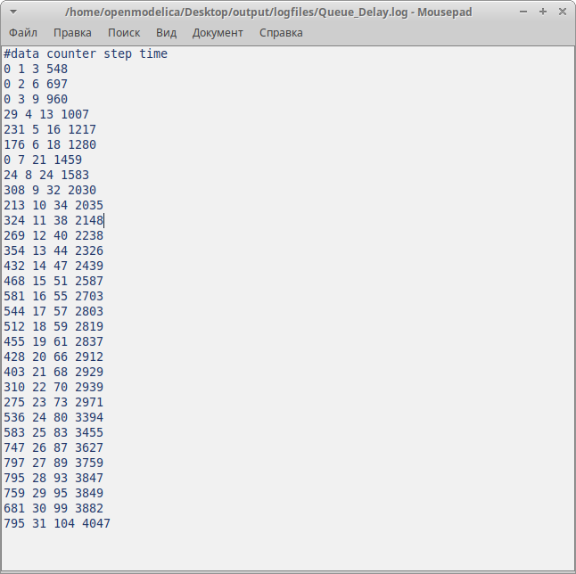{#fig:006 width=40%}

## Визуализация

С помощью GNUplot мы его визуализировали и получили следующий график.

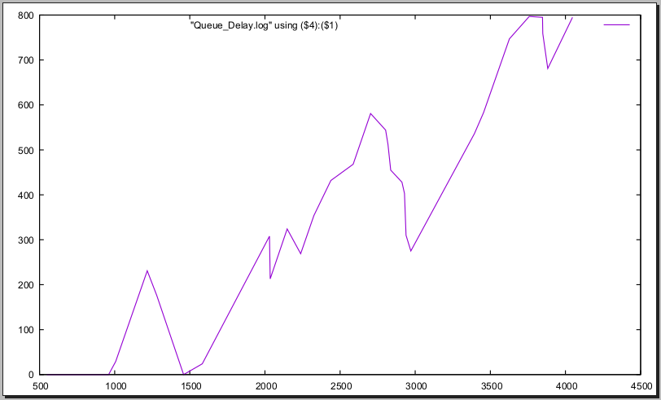{#fig:007 width=60%}

## Мониторинг

Третий мониторинг системы это `Queue_Delay_Real`. Он повторяет `Queue_Delay`, только в действительных значениях.

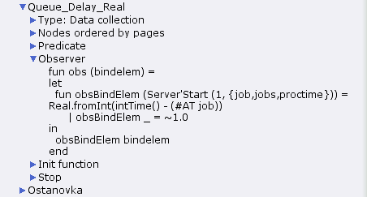{#fig:008 width=60%}

## Логи

Сбросив моделирование до начальной точки и запустив заново, получили задержку в действительных числах.

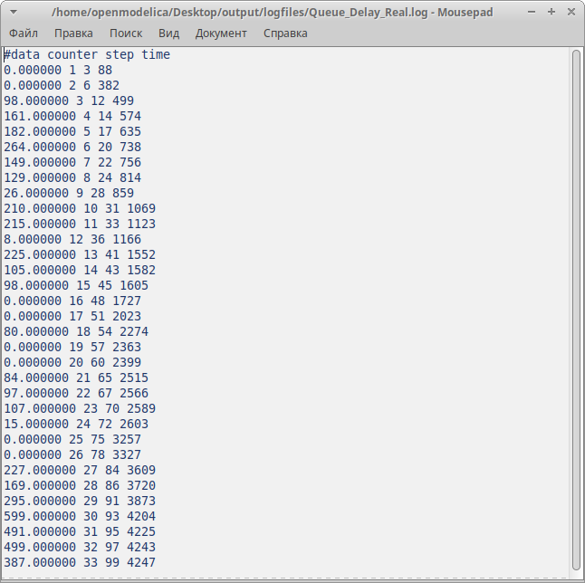{#fig:009 width=40%}

## Визуализация

С помощью GNUplot мы его визуализировали и получили следующий график.

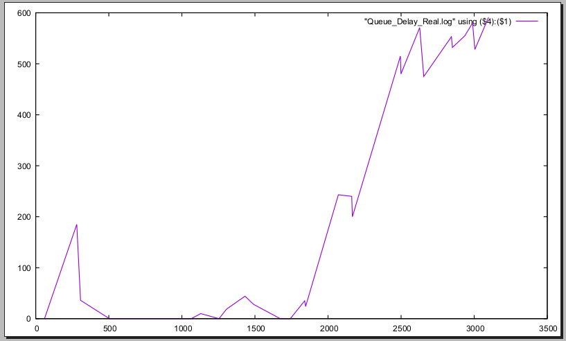{#fig:010 width=60%}

## Мониторинг

Последний мониторинг, который было необходимо реализовать - `Long_Delay_Time`. Здесь будем считать, сколько раз задержка превысила заданнное значение. Также было необходимо задать еще одну декларацию - `longdelaytime`.

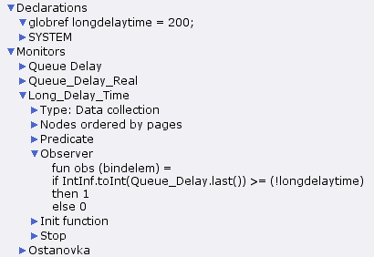{#fig:011 width=45%}

## Логи

Повторив обнуление и 100 шагов, получили результат симуляции `Long_Delay_Time.log`.

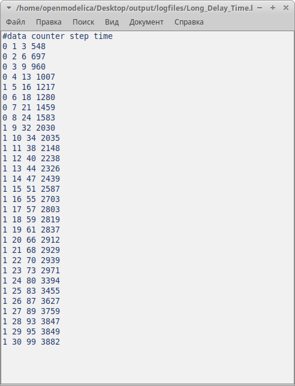{#fig:012 width=40%}

## Визуализация

Визуализируем количество превышений.

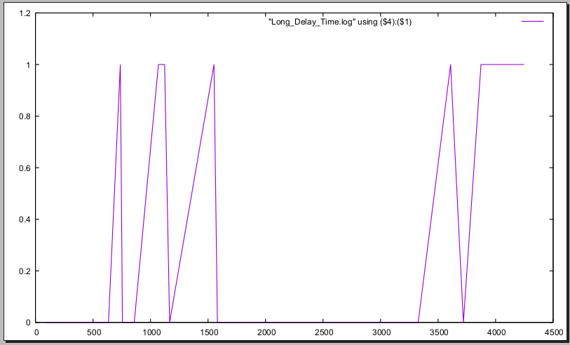{#fig:013 width=50%}

# Выводы

## Выводы

В ходе лабораторной работы мы смоделировали поведение СМО М/М/1 с помощью CpnTools.

