---
## Front matter
title: "Отчет по лабораторной работе №11"
subtitle: "СМО М/М/1"
author: "Надежда Александровна Рогожина"

## Generic otions
lang: ru-RU
toc-title: "Содержание"

## Bibliography
bibliography: bib/cite.bib
csl: pandoc/csl/gost-r-7-0-5-2008-numeric.csl

## Pdf output format
toc: true # Table of contents
toc-depth: 2
lof: true # List of figures
lot: true # List of tables
fontsize: 12pt
linestretch: 1.5
papersize: a4
documentclass: scrreprt
## I18n polyglossia
polyglossia-lang:
  name: russian
  options:
	- spelling=modern
	- babelshorthands=true
polyglossia-otherlangs:
  name: english
## I18n babel
babel-lang: russian
babel-otherlangs: english
## Fonts
mainfont: IBM Plex Serif
romanfont: IBM Plex Serif
sansfont: IBM Plex Sans
monofont: IBM Plex Mono
mathfont: STIX Two Math
mainfontoptions: Ligatures=Common,Ligatures=TeX,Scale=0.94
romanfontoptions: Ligatures=Common,Ligatures=TeX,Scale=0.94
sansfontoptions: Ligatures=Common,Ligatures=TeX,Scale=MatchLowercase,Scale=0.94
monofontoptions: Scale=MatchLowercase,Scale=0.94,FakeStretch=0.9
mathfontoptions:
## Biblatex
biblatex: true
biblio-style: "gost-numeric"
biblatexoptions:
  - parentracker=true
  - backend=biber
  - hyperref=auto
  - language=auto
  - autolang=other*
  - citestyle=gost-numeric
## Pandoc-crossref LaTeX customization
figureTitle: "Рис."
tableTitle: "Таблица"
listingTitle: "Листинг"
lofTitle: "Список иллюстраций"
lotTitle: "Список таблиц"
lolTitle: "Листинги"
## Misc options
indent: true
header-includes:
  - \usepackage{indentfirst}
  - \usepackage{float} # keep figures where there are in the text
  - \floatplacement{figure}{H} # keep figures where there are in the text
---

# Задание

В систему поступает поток заявок двух типов, распределённый по пуассоновскому закону. Заявки поступают в очередь сервера на обработку. Дисциплина очереди - FIFO. Если сервер находится в режиме ожидания (нет заявок на сервере), то заявка поступает на обработку сервером.

# Выполнение лабораторной работы

Первым делам опишем граф (на `Arrivals` и `Server` сделаем иерархию) системы и почти все необходимые декларации (рис. [-@fig:001]).

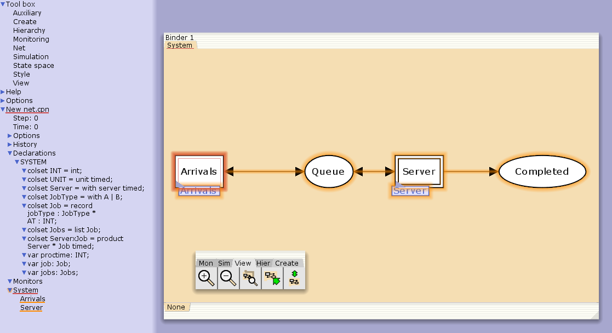{#fig:001 width=70%}

Далее, зададим необходимые функции (рис. [-@fig:002]).

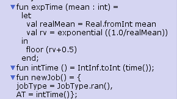{#fig:002 width=70%}

Опишем граф генератора заявок системы (`Arrivals`) (рис. [-@fig:003]).

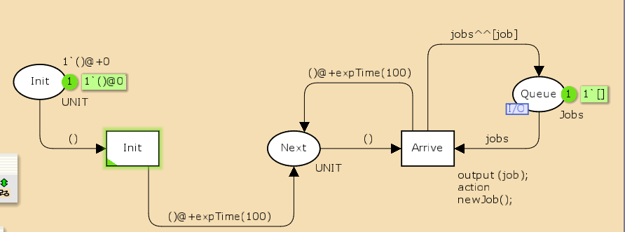{#fig:003 width=70%}

И также опишем граф обработки заявок на сервере системы (`Server`) (рис. [-@fig:004]).

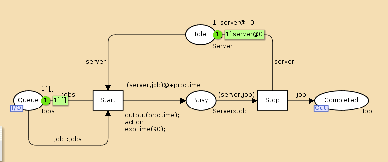{#fig:004 width=70%}

Также, нам необходимо реализовать (последовательно) 4 мониторинга системы. Первые два - `Queue_Delay` и `Ostanovka` (рис. [-@fig:005]).

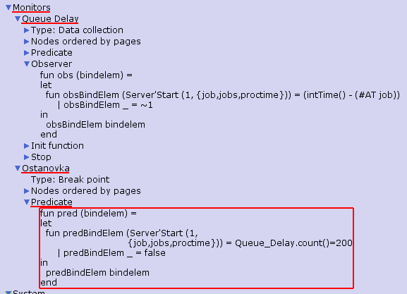{#fig:005 width=70%}

Запустив около 100 шагов моделирования, мы получили текстовый лог `Queue_Delay.log` (рис. [-@fig:006]).

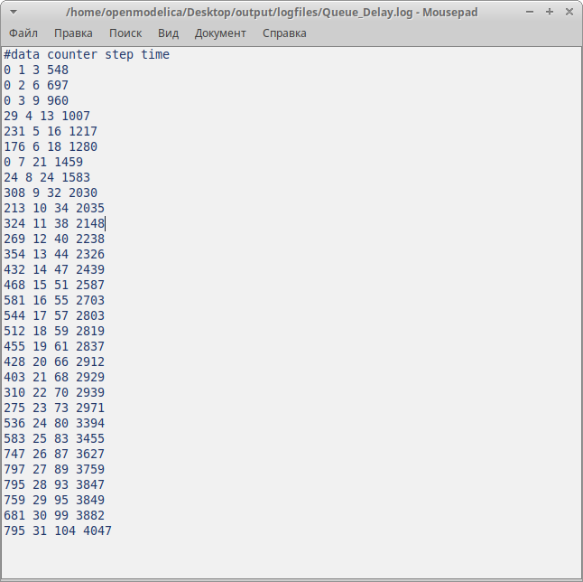{#fig:006 width=70%}

С помощью GNUplot мы его визуализировали и получили следующий график (рис. [-@fig:007]).

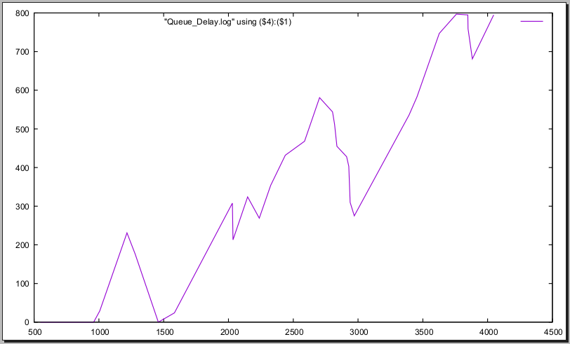{#fig:007 width=70%}

Третий мониторинг системы это `Queue_Delay_Real`. Он повторяет `Queue_Delay`, только в действительных значениях (рис. [-@fig:008]).

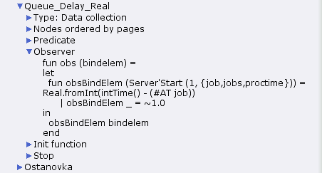{#fig:008 width=70%}

Сбросив моделирование до начальной точки и запустив заново, получили задержку в действительных числах (рис. [-@fig:009]).

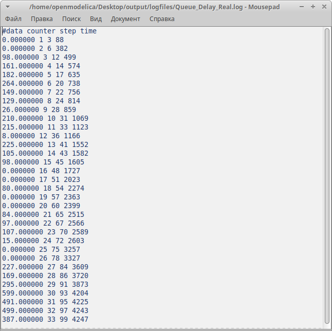{#fig:009 width=70%}

С помощью GNUplot мы его визуализировали и получили следующий график (рис. [-@fig:010]).

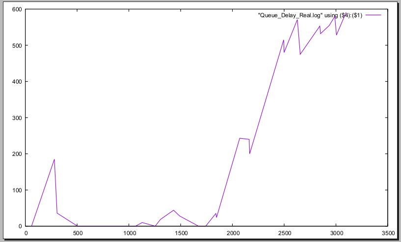{#fig:010 width=70%}

Последний мониторинг, который было необходимо реализовать - `Long_Delay_Time` (рис. [-@fig:011]). Здесь будем считать, сколько раз задержка превысила заданнное значение. Также было необходимо задать еще одну декларацию - `longdelaytime`.

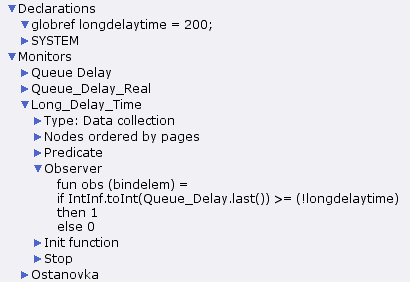{#fig:011 width=70%}

Повторив обнуление и 100 шагов, получили результат симуляции `Long_Delay_Time.log` (рис. [-@fig:012]).

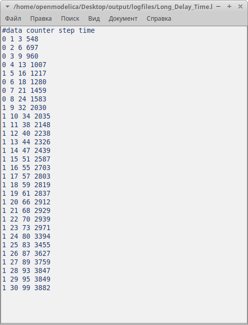{#fig:012 width=70%}

Визуализируем количество превышений (рис. [-@fig:013]).

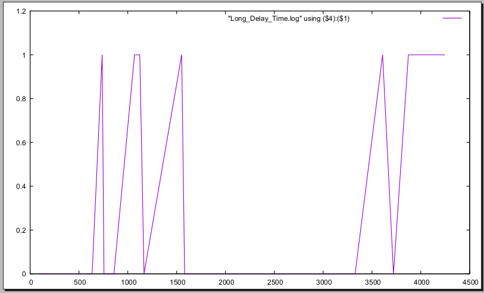{#fig:013 width=70%}

# Выводы

В ходе лабораторной работы мы смоделировали поведение СМО М/М/1 с помощью CpnTools.

# Список литературы{.unnumbered}

::: {#refs}
:::
