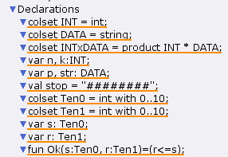
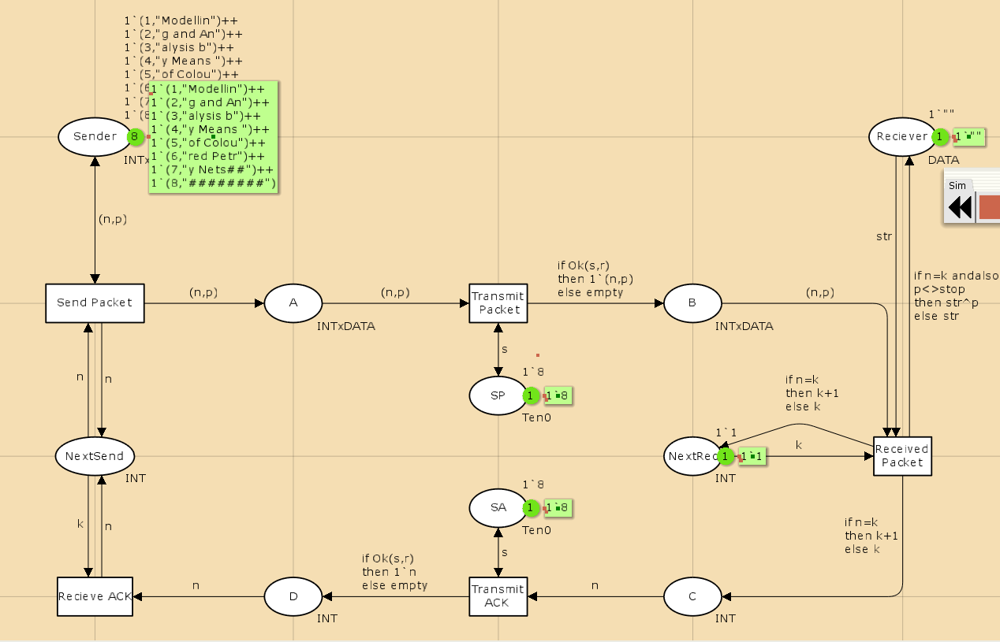
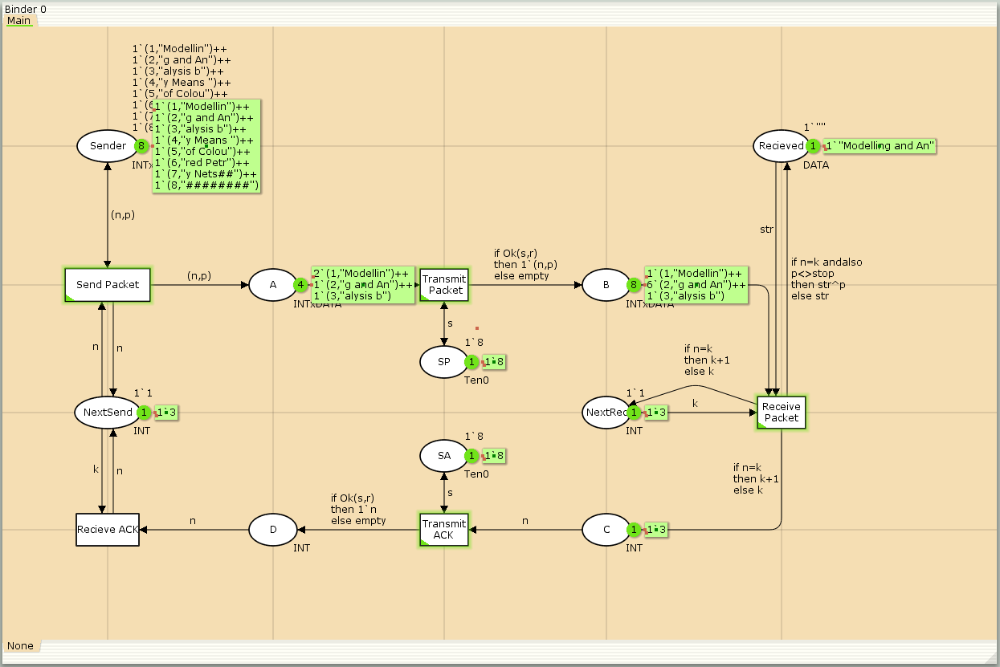
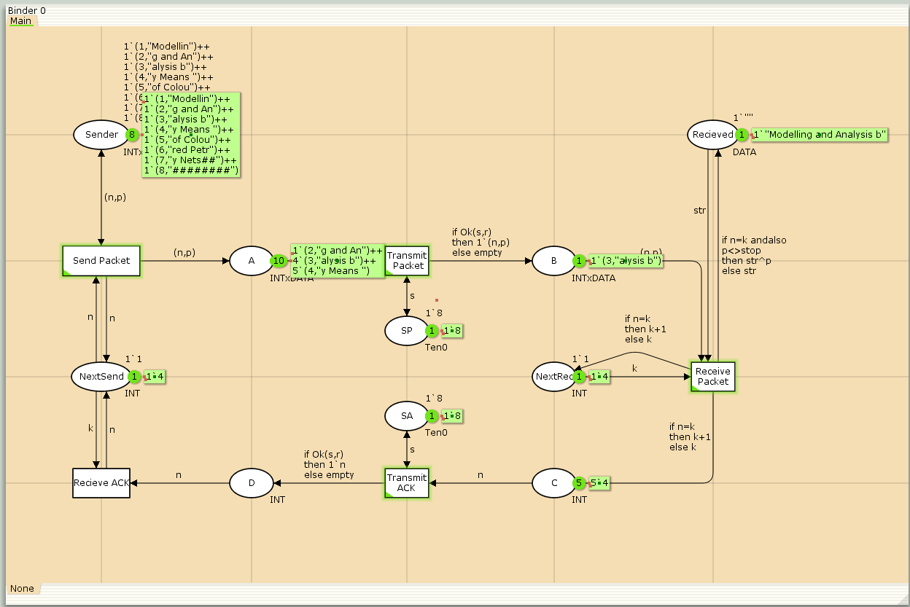
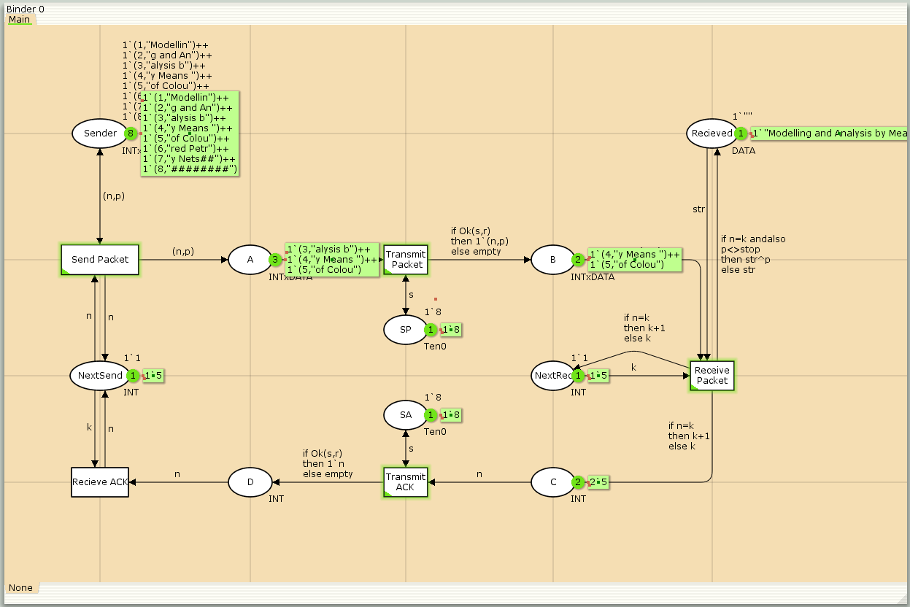
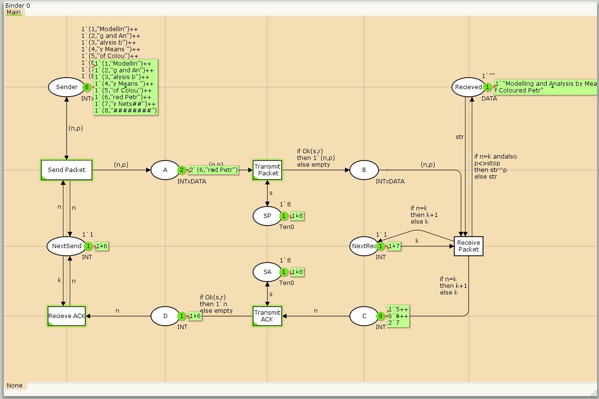
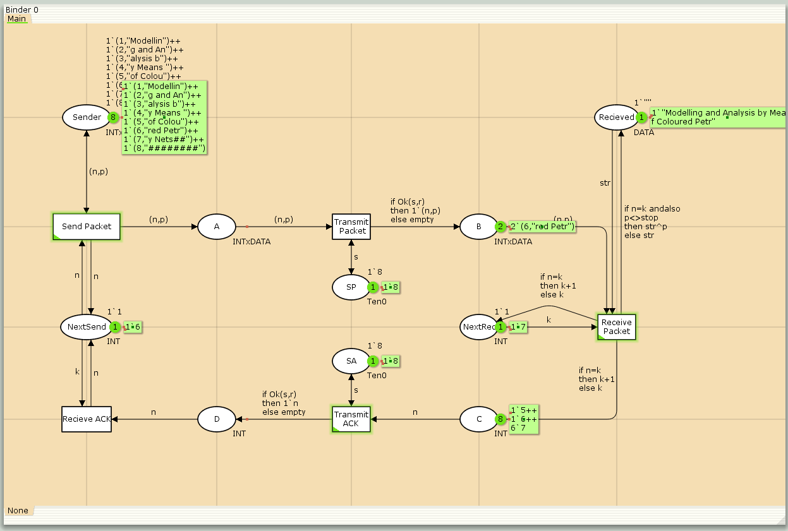
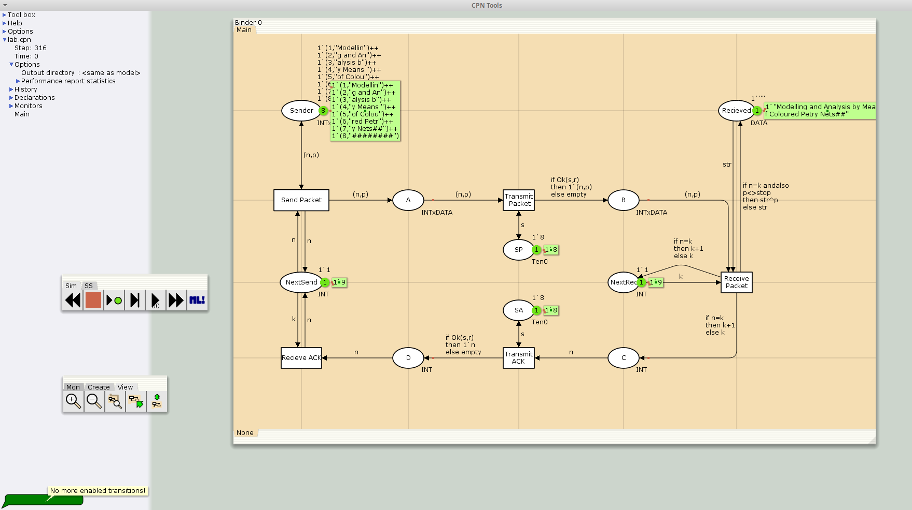

---
## Front matter
lang: ru-RU
title: Моделирование простого протокола передачи данных
subtitle: Лабораторная работа №12.
author:
  - Рогожина Н.А.
institute:
  - Российский университет дружбы народов, Москва, Россия
date: 26 апреля 2025

## i18n babel
babel-lang: russian
babel-otherlangs: english

## Formatting pdf
toc: false
toc-title: Содержание
slide_level: 2
aspectratio: 169
section-titles: true
theme: metropolis
header-includes:
 - \metroset{progressbar=frametitle,sectionpage=progressbar,numbering=fraction}
---

# Информация

## Докладчик

:::::::::::::: {.columns align=center}
::: {.column width="70%"}

  * Рогожина Надежда Александровна
  * студентка 3 курса НФИбд-02-22
  * Российский университет дружбы народов
  * <https://mikogreen.github.io/>

:::
::::::::::::::

# Задание

## Задание

Рассмотрим ненадёжную сеть передачи данных, состоящую из источника, получателя.
Перед отправкой очередной порции данных источник должен получить от получателя подтверждение о доставке предыдущей порции данных.

Считаем, что пакет состоит из номера пакета и строковых данных. Передавать будем сообщение «Modelling and Analysis by Means of Coloured Petry Nets», разбитое по 8 символов.

# Выполнение лабораторной работы

## Декларации

Первым делом объявим все необходимые декларации.

{#fig:001 width=50%}

## Модель

Далее, согласно схеме построим саму модель.

{#fig:002 width=50%}

## Работа системы

Далее будут приведены скриншоты работы системы с шагом n=50.

## Работа системы

{#fig:003 width=50%}

## Работа системы

{#fig:004 width=50%}

## Работа системы

{#fig:005 width=50%}

## Работа системы

{#fig:006 width=50%}

## Работа системы

{#fig:007 width=50%}

## Работа системы

{#fig:008 width=50%}

## Работа системы

{#fig:009 width=50%}

## Работа системы

Система прекратила работу на 316 шаге (все необходимые пакеты были получены и дальнейший переход был невозможным). Также был сформирован отчет по графам системы, в ходе анализа которого было определено, что:

1. Система "мертвая", т.е. все состояния "мертвы" - из них нельзя сделать переход.

2. Все переходы неактивны, следовательно, нет бесконечных последовательностей.

3. Состояние всего 1, без дуг, модель тривиальна, анализ завершен полностью.

# Выводы

## Выводы

В ходе работы мы смоделировали поведение протокола передачи данных и получили сообщение `«Modelling and Analysis by Means of Coloured Petry Nets»` в полном объеме c помощью CpnTools.

