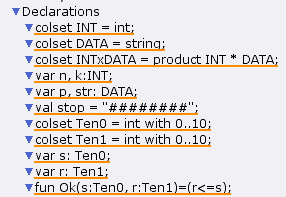
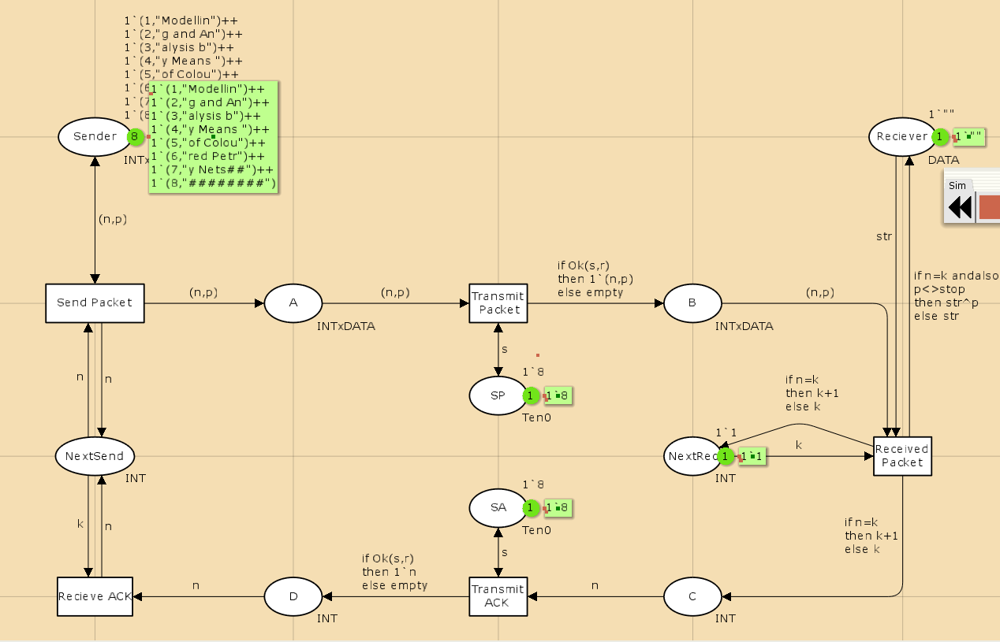
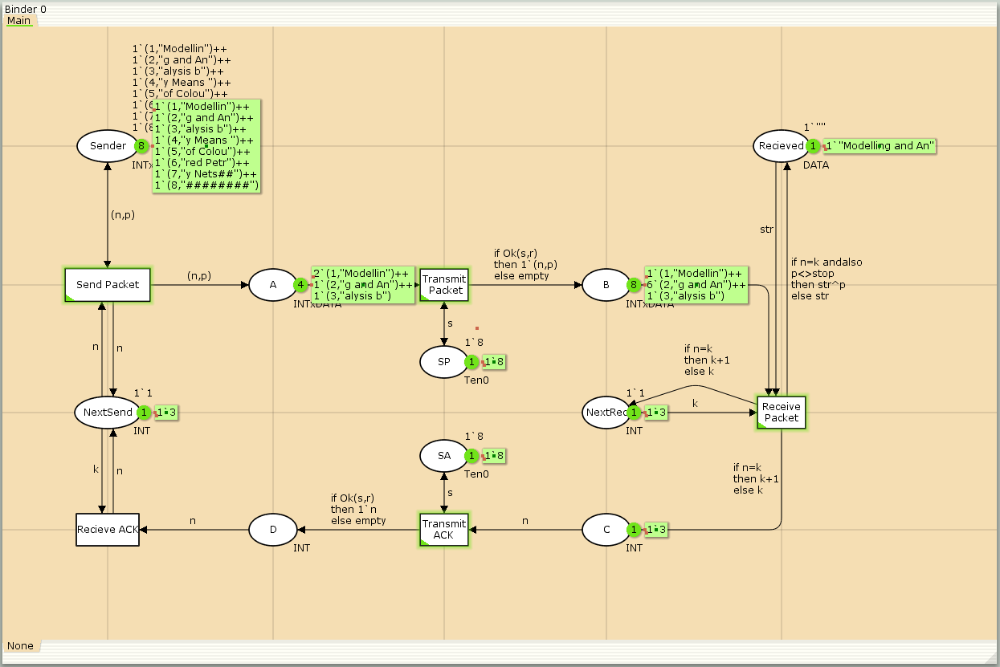
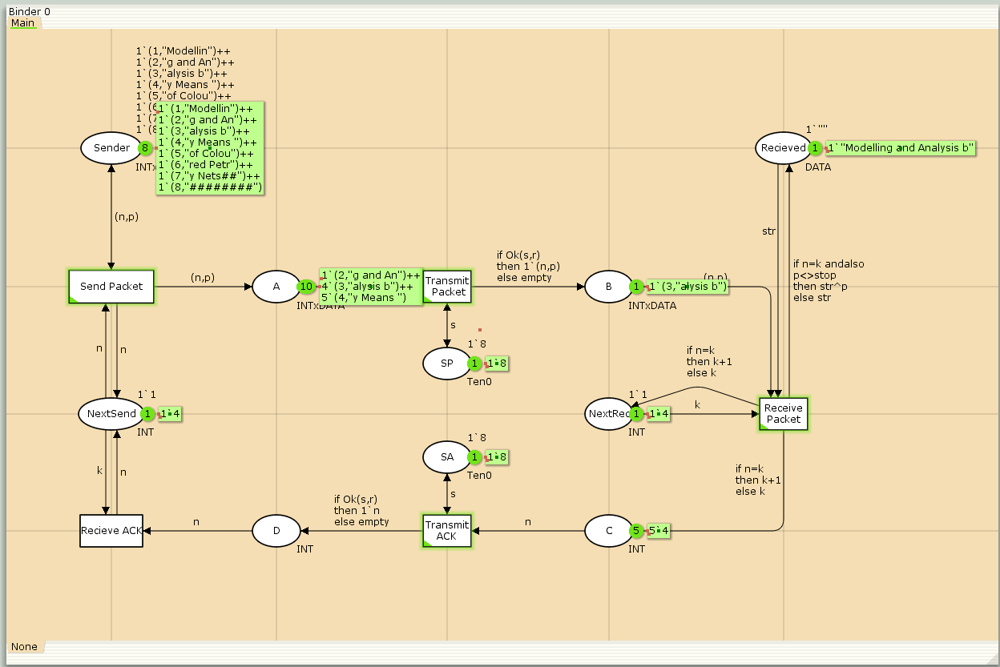
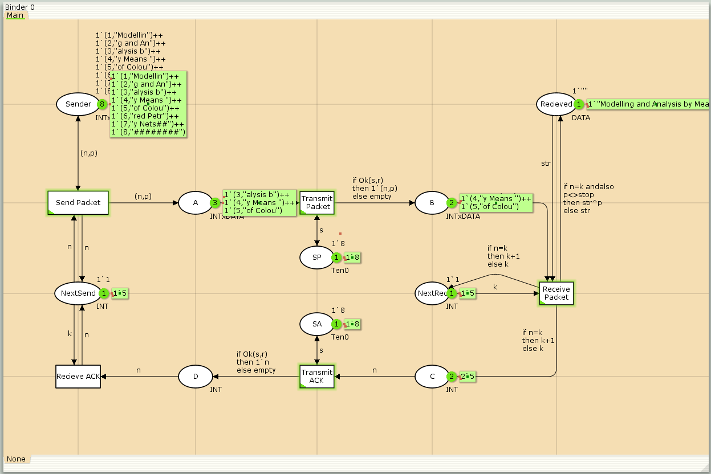
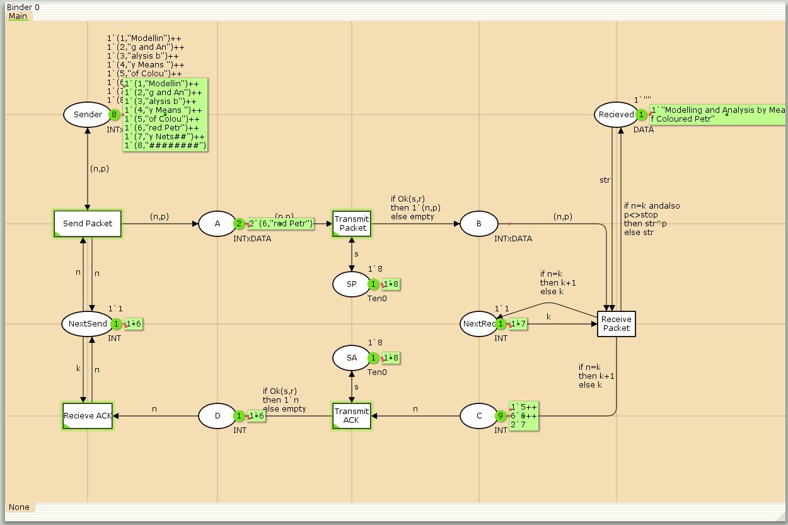
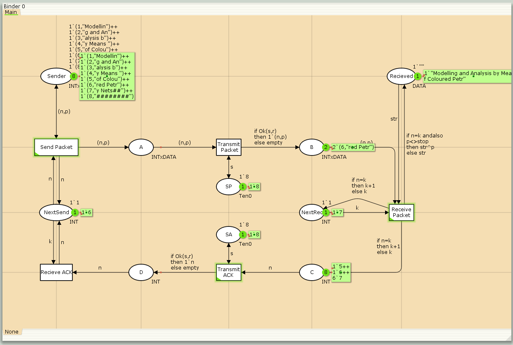
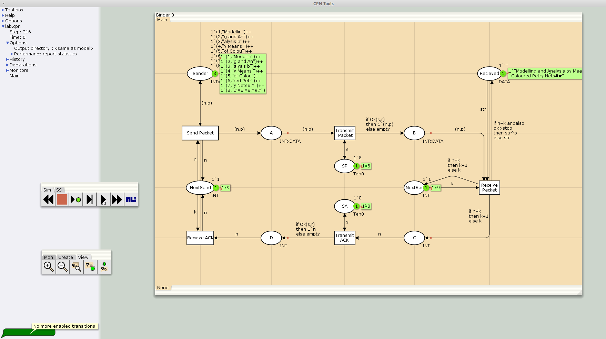

---
## Front matter
title: "Отчёта по лабораторной работе №12"
subtitle: "Моделирование простого протокола передачи данных"
author: "Надежда Александровна Рогожина"

## Generic otions
lang: ru-RU
toc-title: "Содержание"

## Bibliography
bibliography: bib/cite.bib
csl: pandoc/csl/gost-r-7-0-5-2008-numeric.csl

## Pdf output format
toc: true # Table of contents
toc-depth: 2
lof: true # List of figures
lot: true # List of tables
fontsize: 12pt
linestretch: 1.5
papersize: a4
documentclass: scrreprt
## I18n polyglossia
polyglossia-lang:
  name: russian
  options:
	- spelling=modern
	- babelshorthands=true
polyglossia-otherlangs:
  name: english
## I18n babel
babel-lang: russian
babel-otherlangs: english
## Fonts
mainfont: IBM Plex Serif
romanfont: IBM Plex Serif
sansfont: IBM Plex Sans
monofont: IBM Plex Mono
mathfont: STIX Two Math
mainfontoptions: Ligatures=Common,Ligatures=TeX,Scale=0.94
romanfontoptions: Ligatures=Common,Ligatures=TeX,Scale=0.94
sansfontoptions: Ligatures=Common,Ligatures=TeX,Scale=MatchLowercase,Scale=0.94
monofontoptions: Scale=MatchLowercase,Scale=0.94,FakeStretch=0.9
mathfontoptions:
## Biblatex
biblatex: true
biblio-style: "gost-numeric"
biblatexoptions:
  - parentracker=true
  - backend=biber
  - hyperref=auto
  - language=auto
  - autolang=other*
  - citestyle=gost-numeric
## Pandoc-crossref LaTeX customization
figureTitle: "Рис."
tableTitle: "Таблица"
listingTitle: "Листинг"
lofTitle: "Список иллюстраций"
lotTitle: "Список таблиц"
lolTitle: "Листинги"
## Misc options
indent: true
header-includes:
  - \usepackage{indentfirst}
  - \usepackage{float} # keep figures where there are in the text
  - \floatplacement{figure}{H} # keep figures where there are in the text
---

# Задание

Рассмотрим ненадёжную сеть передачи данных, состоящую из источника, получателя.
Перед отправкой очередной порции данных источник должен получить от получателя подтверждение о доставке предыдущей порции данных.

Считаем, что пакет состоит из номера пакета и строковых данных. Передавать будем сообщение «Modelling and Analysis by Means of Coloured Petry Nets», разбитое по 8 символов.

# Выполнение лабораторной работы

Первым делом объявим все необходимые декларации (рис. [-@fig:001]).

{#fig:001 width=50%}

Далее, согласно схеме построим саму модель (рис. [-@fig:002]).

{#fig:002 width=50%}

Далее будут приведены скриншоты работы системы с шагом n=50 (рис. [-@fig:003], рис. [-@fig:004], рис. [-@fig:005], рис. [-@fig:006], рис. [-@fig:007], рис. [-@fig:008], рис. [-@fig:009].

{#fig:003 width=50%}

{#fig:004 width=50%}

{#fig:005 width=50%}

{#fig:006 width=50%}

{#fig:007 width=50%}

{#fig:008 width=50%}

{#fig:009 width=50%}

Система прекратила работу на 316 шаге (все необходимые пакеты были получены и дальнейший переход был невозможным). Также был сформирован отчет по графам системы, в ходе анализа которого было определено, что:

1. Система "мертвая", т.е. все состояния "мертвы" - из них нельзя сделать переход.
2. Все переходы неактивны, следовательно, нет бесконечных последовательностей.
3. Состояние всего 1, без дуг, модель тривиальна, анализ завершен полностью.

# Выводы

В ходе работы мы смоделировали поведение протокола передачи данных и получили сообщение `«Modelling and Analysis by Means of Coloured Petry Nets»` в полном объеме c помощью CpnTools.

# Список литературы{.unnumbered}

::: {#refs}
:::
