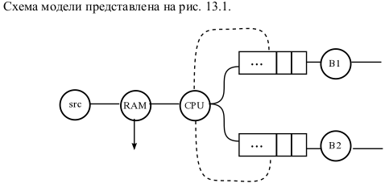
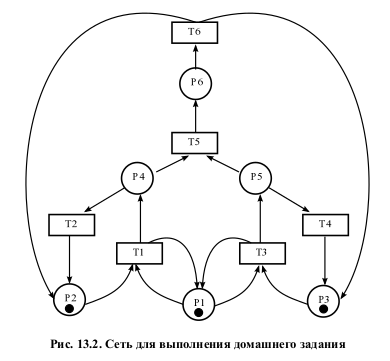
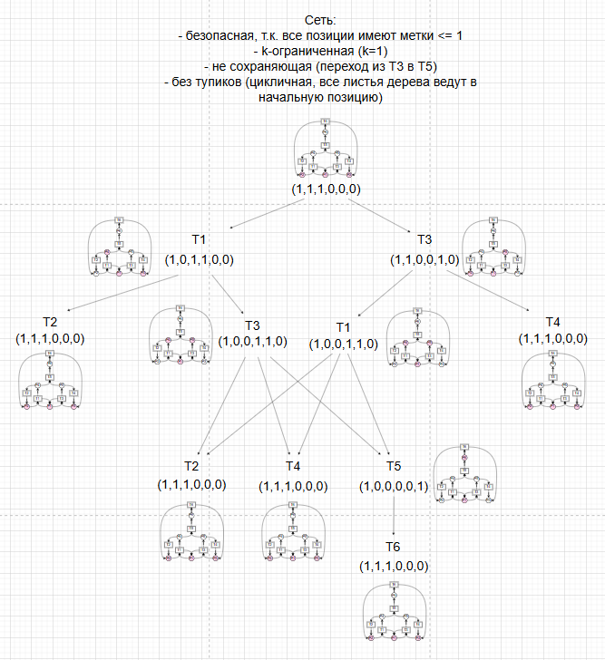
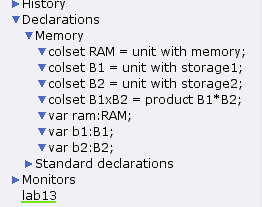
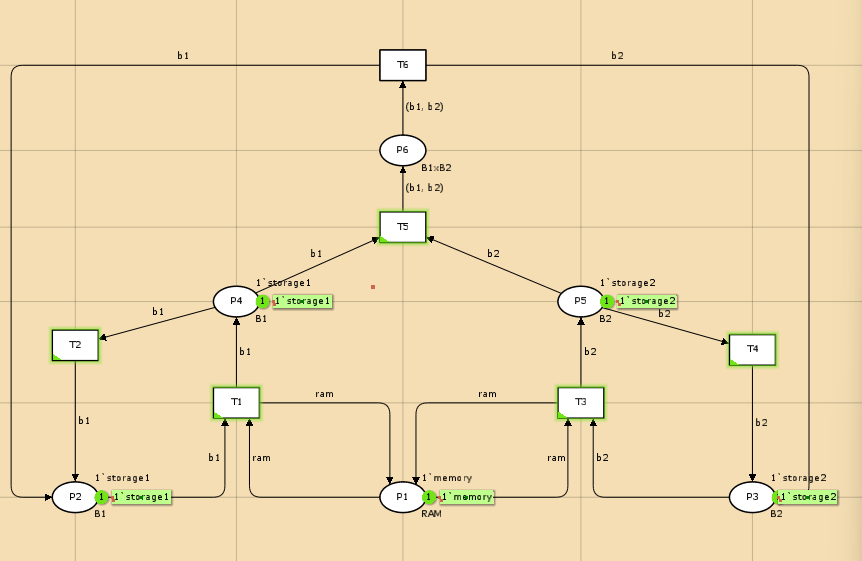
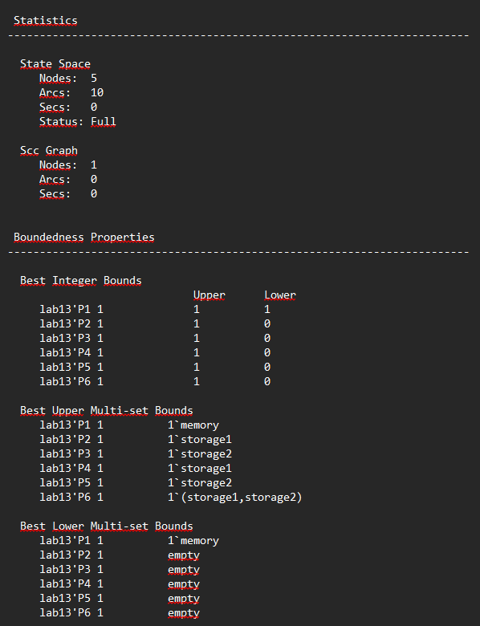
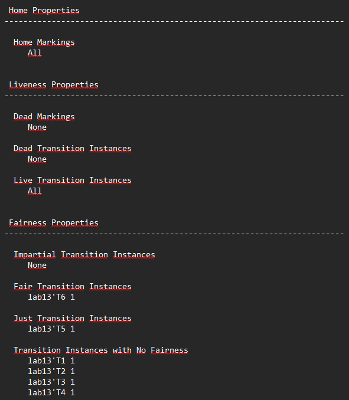

---
## Front matter
lang: ru-RU
title: Задание для самостоятельного выполнения.
subtitle: Лабораторная работа №13.
author:
  - Рогожина Н.А.
institute:
  - Российский университет дружбы народов, Москва, Россия
date: 01 мая 2025

## i18n babel
babel-lang: russian
babel-otherlangs: english

## Formatting pdf
toc: false
toc-title: Содержание
slide_level: 2
aspectratio: 169
section-titles: true
theme: metropolis
header-includes:
 - \metroset{progressbar=frametitle,sectionpage=progressbar,numbering=fraction}
---

# Информация

## Докладчик

:::::::::::::: {.columns align=center}
::: {.column width="70%"}

  * Рогожина Надежда Александровна
  * студентка 3 курса НФИбд-02-22
  * Российский университет дружбы народов
  * <https://mikogreen.github.io/>

:::
::::::::::::::

# Задание

## Задание

Заявка (команды программы, операнды) поступает в оперативную память (ОП), затем передается на прибор (центральный процессор, ЦП) для обработки. После этого заявка может равновероятно обратиться к оперативной памяти или к одному из двух внешних запоминающих устройств (B1 и B2). Прежде чем записать информацию на внешний накопитель, необходимо вторично обратиться к центральному процессору,
определяющему состояние накопителя и выдающему необходимую управляющую информацию. Накопители (B1 и B2) могут работать в 3-х режимах:

1. B1 — занят, B2 — свободен;

2. B1 — свободен, B2 — занят;

3. B1 — занят, B2 — занят.

## Задание

{#fig:001 width=60%}

# Выполнение лабораторной работы

## Схема

{#fig:002 width=50%}

## Дерево достижимости

{#fig:003 width=45%}

## Декларации

{#fig:004 width=50%}

## Сеть

{#fig:005 width=60%}

## Отчет

{#fig:006 width=35%}

## Отчет
 
{#fig:007 width=40%}

## Анализ полученных результатов

1. Система имеет 5 уникальных состояний (узлов).

2. Между состояниями существует 10 переходов (дуг).

3. `P1` содержит 1 фишку типа `memory`.

4. `P2` и `P4` могут содержать `storage1`.

## Анализ полученных результатов

5. `P3` и `P5` могут содержать `storage2`.

6. Только `P1` гарантированно содержит `memory`.

7. Остальные позиции могут быть пустыми.

8. Из любого состояния можно вернуться в любое другое (все они *домашние* -> всегда можно вернуться в начальное состояние).

## Анализ полученных результатов

9. Нет ни мертвых состояний, ни мертвых переходов, т.е. в любом состоянии рано или поздно переходы могут сработать -> модель "живая".

10. Нет переходов, требующих беспристрастного выполнения.

11. Переход `Т6` должен срабатывать бесконечно часто, если он постоянно доступен.

12. Переход `T5` не может быть вечно заблокирован, если он бесконечно часто становится доступным.

# Выводы

## Выводы

В ходе работы мы смоделировали поведение данной нам модели c помощью CpnTools.

