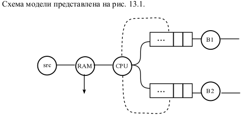
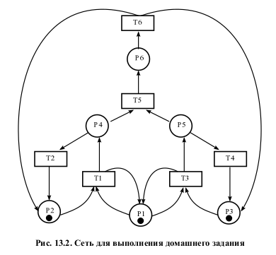
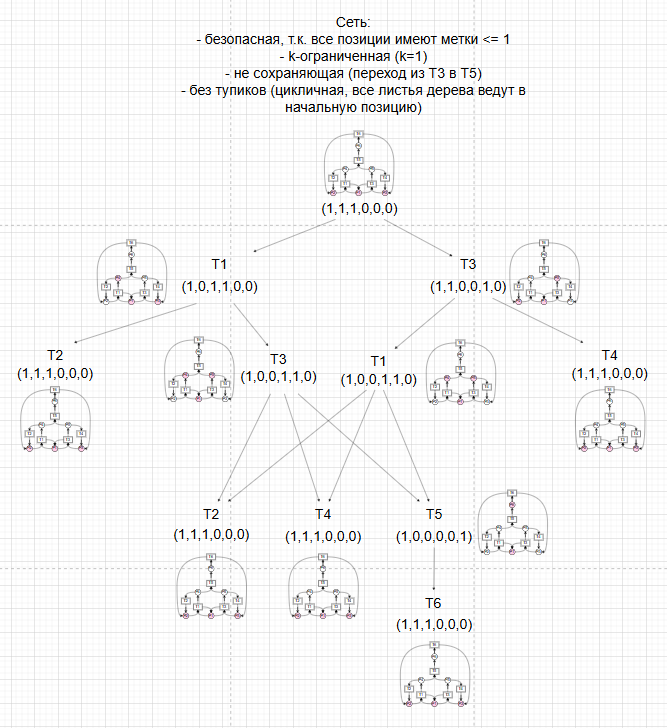
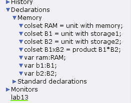
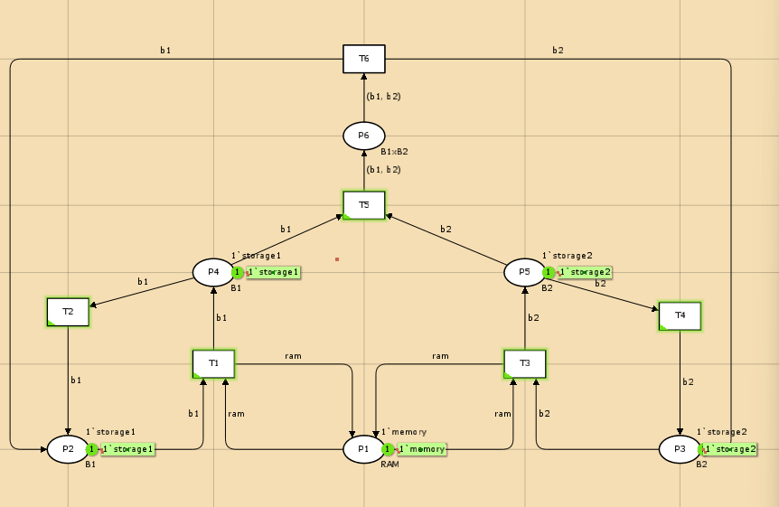
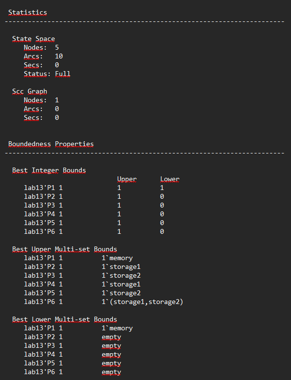
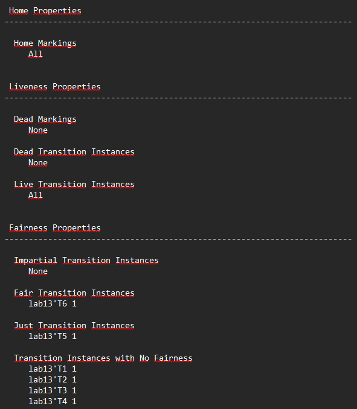

---
## Front matter
title: "Отчёта по лабораторной работе №13"
subtitle: "Задание для самостоятельного выполнения"
author: "Надежда Александровна Рогожина"

## Generic otions
lang: ru-RU
toc-title: "Содержание"

## Bibliography
bibliography: bib/cite.bib
csl: pandoc/csl/gost-r-7-0-5-2008-numeric.csl

## Pdf output format
toc: true # Table of contents
toc-depth: 2
lof: true # List of figures
lot: true # List of tables
fontsize: 12pt
linestretch: 1.5
papersize: a4
documentclass: scrreprt
## I18n polyglossia
polyglossia-lang:
  name: russian
  options:
	- spelling=modern
	- babelshorthands=true
polyglossia-otherlangs:
  name: english
## I18n babel
babel-lang: russian
babel-otherlangs: english
## Fonts
mainfont: IBM Plex Serif
romanfont: IBM Plex Serif
sansfont: IBM Plex Sans
monofont: IBM Plex Mono
mathfont: STIX Two Math
mainfontoptions: Ligatures=Common,Ligatures=TeX,Scale=0.94
romanfontoptions: Ligatures=Common,Ligatures=TeX,Scale=0.94
sansfontoptions: Ligatures=Common,Ligatures=TeX,Scale=MatchLowercase,Scale=0.94
monofontoptions: Scale=MatchLowercase,Scale=0.94,FakeStretch=0.9
mathfontoptions:
## Biblatex
biblatex: true
biblio-style: "gost-numeric"
biblatexoptions:
  - parentracker=true
  - backend=biber
  - hyperref=auto
  - language=auto
  - autolang=other*
  - citestyle=gost-numeric
## Pandoc-crossref LaTeX customization
figureTitle: "Рис."
tableTitle: "Таблица"
listingTitle: "Листинг"
lofTitle: "Список иллюстраций"
lotTitle: "Список таблиц"
lolTitle: "Листинги"
## Misc options
indent: true
header-includes:
  - \usepackage{indentfirst}
  - \usepackage{float} # keep figures where there are in the text
  - \floatplacement{figure}{H} # keep figures where there are in the text
---

# Задание

Заявка (команды программы, операнды) поступает в оперативную память (ОП), затем передается на прибор (центральный процессор, ЦП) для обработки. После этого заявка может равновероятно обратиться к оперативной памяти или к одному из двух внешних запоминающих устройств (B1 и B2). Прежде чем записать информацию на внешний накопитель, необходимо вторично обратиться к центральному процессору,
определяющему состояние накопителя и выдающему необходимую управляющую информацию. Накопители (B1 и B2) могут работать в 3-х режимах:

1. B1 — занят, B2 — свободен;

2. B2 — свободен, B1 — занят;

3. B1 — занят, B2 — занят.

Схема модели представлена на рис. [-@fig:001].

{#fig:001 width=50%}

# Выполнение лабораторной работы

Нам была дана схема сети для выполнения домашнего задания (рис. [-@fig:002]).

{#fig:002 width=50%}

Первое что необходимо было сделать - проанализировать сеть с помощью дерева достижимости (рис. [-@fig:003]). 

{#fig:003 width=50%}

Следующим этапом необходимо было реализовать эту сеть в `CpnTools`. Для начала, объявим декларации (рис. [-@fig:004]). 

{#fig:004 width=50%}

Также, построим саму сеть (рис. [-@fig:005]).

{#fig:005 width=50%}

Войдя в пространство состояний и построив граф состояний, был сформирован отчет (рис. [-@fig:006], рис. [-@fig:007]).

{#fig:006 width=50%}
 
{#fig:007 width=50%}

В ходе анализа отчета было определено, что:

1. Система имеет 5 уникальных состояний (узлов).
2. Между состояниями существует 10 переходов (дуг).
3. `P1` содержит 1 фишку типа `memory`.
4. `P2` и `P4` могут содержать `storage1`.
5. `P3` и `P5` могут содержать `storage2`.
6. Только `P1` гарантированно содержит `memory`.
7. Остальные позиции могут быть пустыми.
8. Из любого состояния можно вернуться в любое другое (все они *домашние* -> всегда можно вернуться в начальное состояние).
9. Нет ни мертвых состояний, ни мертвых переходов, т.е. в любом состоянии рано или поздно переходы могут сработать -> модель "живая".
10. Нет переходов, требующих беспристрастного выполнения.
11. Переход `Т6` должен срабатывать бесконечно часто, если он постоянно доступен.
12. Переход `T5` не может быть вечно заблокирован, если он бесконечно часто становится доступным.

# Выводы

В ходе работы мы смоделировали поведение данной нам модели c помощью CpnTools.

# Список литературы{.unnumbered}

::: {#refs}
:::
