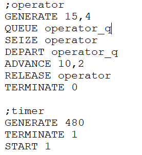
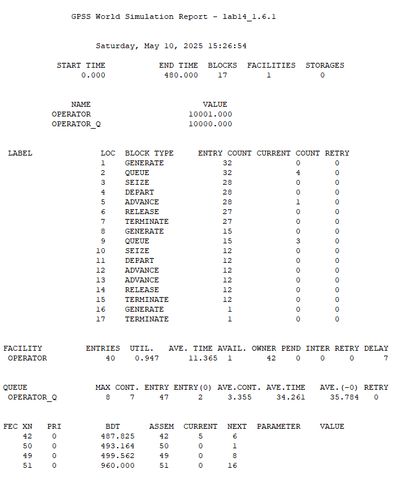

---
## Front matter
lang: ru-RU
title: Модель обработки заказов.
subtitle: Лабораторная работа №14.
author:
  - Рогожина Н.А.
institute:
  - Российский университет дружбы народов, Москва, Россия
date: 10 мая 2025

## i18n babel
babel-lang: russian
babel-otherlangs: english

## Formatting pdf
toc: false
toc-title: Содержание
slide_level: 2
aspectratio: 169
section-titles: true
theme: metropolis
header-includes:
 - \metroset{progressbar=frametitle,sectionpage=progressbar,numbering=fraction}
---

# Информация

## Докладчик

:::::::::::::: {.columns align=center}
::: {.column width="70%"}

  * Рогожина Надежда Александровна
  * студентка 3 курса НФИбд-02-22
  * Российский университет дружбы народов
  * <https://mikogreen.github.io/>

:::
::::::::::::::

# Задание

## Задание

1. Построить модель-пример и проанализировать отчет.

2. Скорректировать модель в соответствии с изменениями входных данных: интервалы поступления заказов распределены равномерно с интервалом 3.14 ± 1.7 мин; время оформления заказа также распределено равномерно на интервале 6.66 ± 1.7 мин. Проанализируйте отчёт, сравнив результаты с результатами предыдущего моделирования.

## Задание

3. Построить гистограмму по результатам моделирования.

4. Построить модель для системы с заявками двух типов и проанализовать отчет.

5. Скорректировать модель так, чтобы учитывалось условие, что число заказов с дополнительным пакетом услуг составляет 30% от общего числа заказов (используя оператор TRANSFER). Проанализировать отчет. 

## Задание

6. Построить модель для 8-часового рабочего дня для 4-х приборов.

7. Изменить модель: требуется учесть в ней возможные отказы клиентов от заказа — когда при подаче заявки на заказ клиент видит в очереди более двух других заявок, он отказывается от подачи заявки, то есть отказывается от обслуживания (используйте блок TEST и стандартный числовой атрибут Qj текущей длины очереди j) и проанализировать полученный отчет.

# Выполнение лабораторной работы

## Базовый пример

{#fig:001 width=50%}

## Базовый пример

{#fig:002 width=50%}

## Задача 1

Здесь мы видим показатели очереди, обработчика. Далее необходимо внести изменения во время генерации и обработки заявок. Для этого - были изменены цифры у параметров `GENERATE` и `ADVANCE`.

## Задача 1

{#fig:003 width=50%}

## Задача 1

{#fig:004 width=50%}

## Гистограмма

Далее, пробуем собрать эти данные в таблицу и построить гистограмму.

## Гистограмма

{#fig:005 width=50%}

## Гистограмма

{#fig:006 width=50%}

## Гистограмма

{#fig:007 width=50%}

## Два типа поступающих заявок

{#fig:008 width=50%}

## Два типа поступающих заявок

{#fig:009 width=50%}

## Два типа поступающих заявок

Далее - корректировка модели так, чтобы учитывалось условие, что число заказов с дополнительным пакетом услуг составляет 30% от общего числа заказов (через оператор TRANSFER).

## 30%

{#fig:010 width=50%}

## 30%

{#fig:011 width=50%}

## 4 оператора

И один из последних шагов - моделирование системы с 4 операторами.

## 4 оператора

{#fig:012 width=50%}

## 4 оператора

{#fig:013 width=50%}

## 4 усложненных оператора

{#fig:014 width=50%}

## 4 усложненных оператора

{#fig:015 width=50%}

# Выводы

## Выводы

В ходе работы мы приобрели базовые навыки работы с GPSS.

