---
## Front matter
title: "Отчёта по лабораторной работе №14"
subtitle: "Модель обработки заказов"
author: "Надежда Александровна Рогожина"

## Generic otions
lang: ru-RU
toc-title: "Содержание"

## Bibliography
bibliography: bib/cite.bib
csl: pandoc/csl/gost-r-7-0-5-2008-numeric.csl

## Pdf output format
toc: true # Table of contents
toc-depth: 2
lof: true # List of figures
lot: true # List of tables
fontsize: 12pt
linestretch: 1.5
papersize: a4
documentclass: scrreprt
## I18n polyglossia
polyglossia-lang:
  name: russian
  options:
	- spelling=modern
	- babelshorthands=true
polyglossia-otherlangs:
  name: english
## I18n babel
babel-lang: russian
babel-otherlangs: english
## Fonts
mainfont: IBM Plex Serif
romanfont: IBM Plex Serif
sansfont: IBM Plex Sans
monofont: IBM Plex Mono
mathfont: STIX Two Math
mainfontoptions: Ligatures=Common,Ligatures=TeX,Scale=0.94
romanfontoptions: Ligatures=Common,Ligatures=TeX,Scale=0.94
sansfontoptions: Ligatures=Common,Ligatures=TeX,Scale=MatchLowercase,Scale=0.94
monofontoptions: Scale=MatchLowercase,Scale=0.94,FakeStretch=0.9
mathfontoptions:
## Biblatex
biblatex: true
biblio-style: "gost-numeric"
biblatexoptions:
  - parentracker=true
  - backend=biber
  - hyperref=auto
  - language=auto
  - autolang=other*
  - citestyle=gost-numeric
## Pandoc-crossref LaTeX customization
figureTitle: "Рис."
tableTitle: "Таблица"
listingTitle: "Листинг"
lofTitle: "Список иллюстраций"
lotTitle: "Список таблиц"
lolTitle: "Листинги"
## Misc options
indent: true
header-includes:
  - \usepackage{indentfirst}
  - \usepackage{float} # keep figures where there are in the text
  - \floatplacement{figure}{H} # keep figures where there are in the text
---

# Задание

1. Построить модель-пример и проанализировать отчет.
2. Скорректировать модель в соответствии с изменениями входных данных: интервалы поступления заказов распределены равномерно с интервалом 3.14 ± 1.7 мин; время оформления заказа также распределено равномерно на интервале 6.66 ± 1.7 мин. Проанализируйте отчёт, сравнив результаты с результатами предыдущего моделирования.
3. Построить гистограмму по результатам моделирования.
4. Построить модель для системы с заявками двух типов и проанализовать отчет.
5. Скорректировать модель так, чтобы учитывалось условие, что число заказов с дополнительным пакетом услуг составляет 30% от общего числа заказов (используя оператор TRANSFER). Проанализировать отчет. 
6. Построить модель для 8-часового рабочего дня для 4-х приборов.
7. Изменить модель: требуется учесть в ней возможные отказы клиентов от заказа — когда при подаче заявки на заказ клиент видит в очереди более двух других заявок, он отказывается от подачи заявки, то есть отказывается от обслуживания (используйте блок TEST и стандартный числовой атрибут Qj текущей длины очереди j) и проанализировать полученный отчет.

# Выполнение лабораторной работы

Первоначально реализуем пример (рис. [-@fig:001], рис. [-@fig:002]).

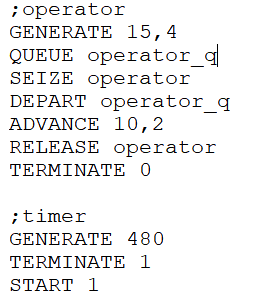{#fig:001 width=50%}

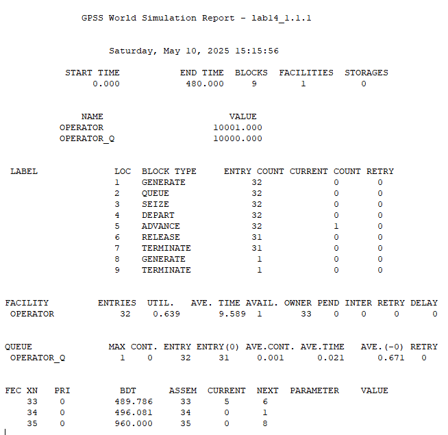{#fig:002 width=50%}

Здесь мы видим показатели очереди, обработчика. Далее необходимо внести изменения во время генерации и обработки заявок (рис. [-@fig:003], рис. [-@fig:004]). Для этого - были изменены цифры у параметров `GENERATE` и `ADVANCE`.

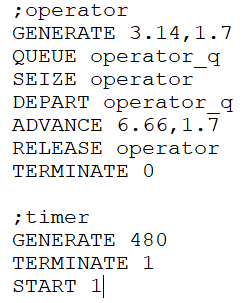{#fig:003 width=50%}

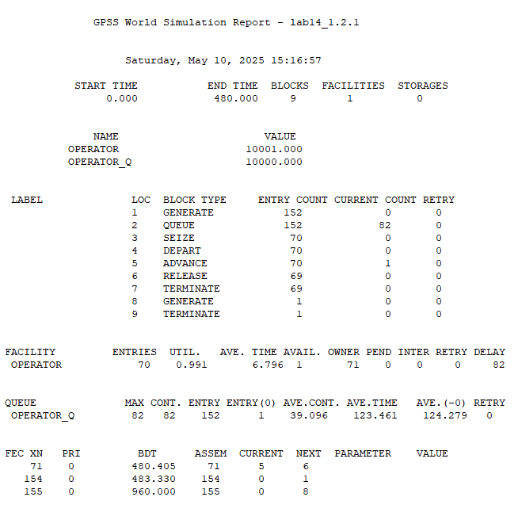{#fig:004 width=50%}

Далее, пробуем собрать эти данные в таблицу и построить гистограмму (рис. [-@fig:005], рис. [-@fig:006], рис. [-@fig:007]):

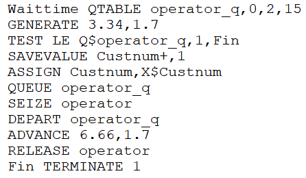{#fig:005 width=50%}

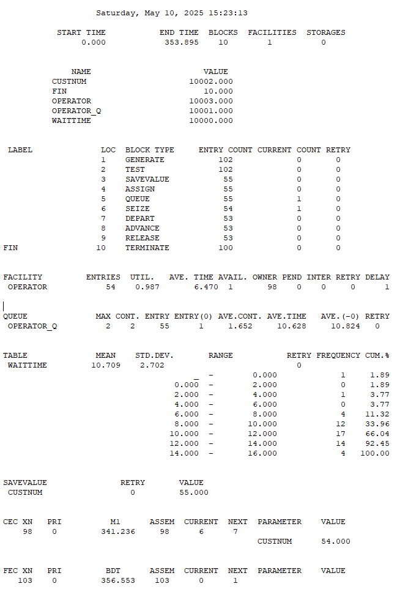{#fig:006 width=50%}

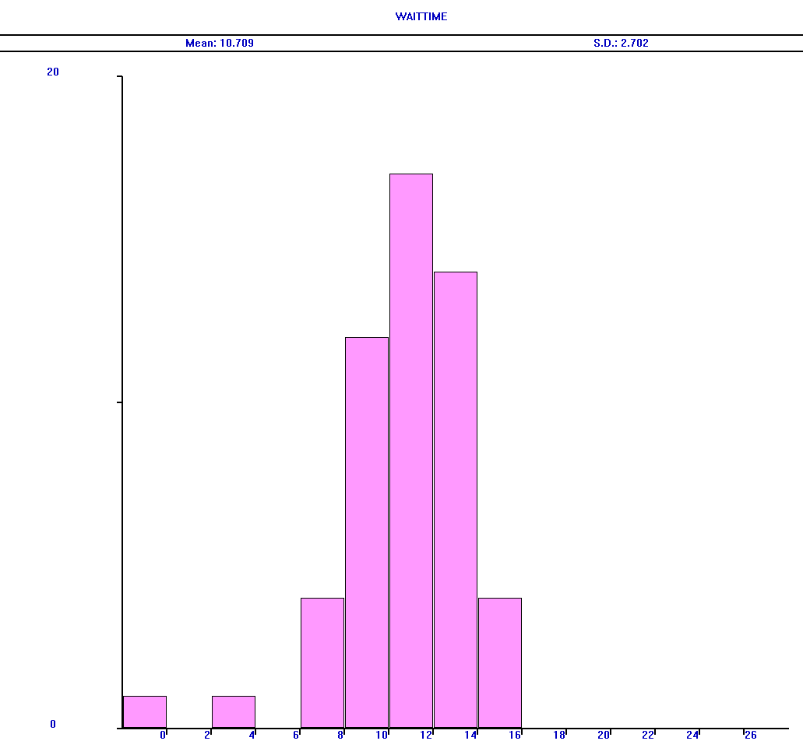{#fig:007 width=50%}

Следующий этап - система с двумя типами заявок (рис. [-@fig:008], рис. [-@fig:009]).

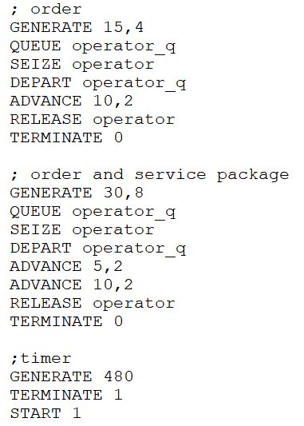{#fig:008 width=50%}

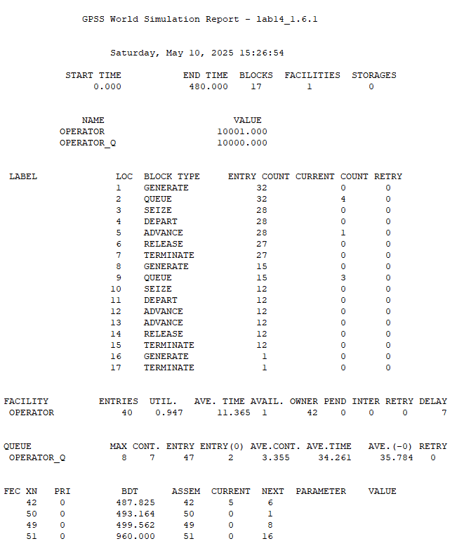{#fig:009 width=50%}

Далее - корректировка модели так, чтобы учитывалось условие, что число заказов с дополнительным пакетом услуг составляет 30% от общего числа заказов (через оператор TRANSFER) (рис. [-@fig:010], рис. [-@fig:011]).

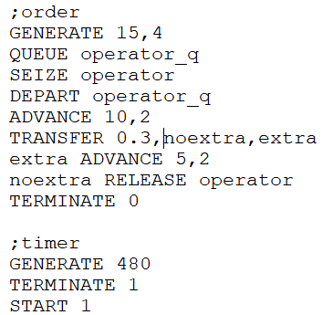{#fig:010 width=50%}

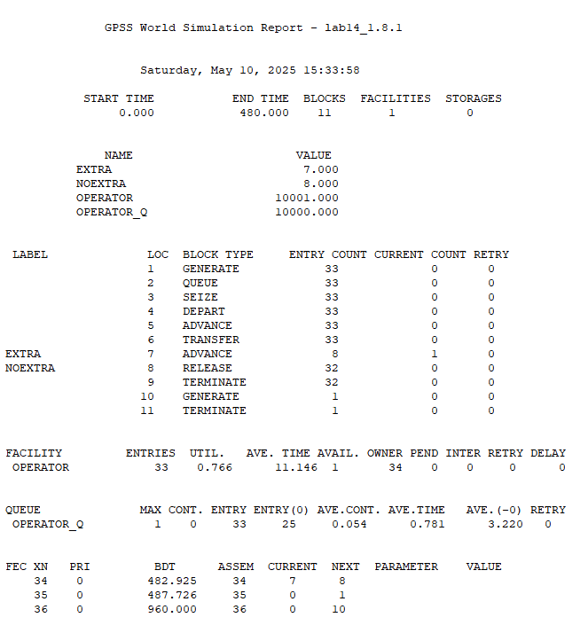{#fig:011 width=50%}

И один из последних шагов - моделирование системы с 4 операторами (рис. [-@fig:012], рис. [-@fig:013]).

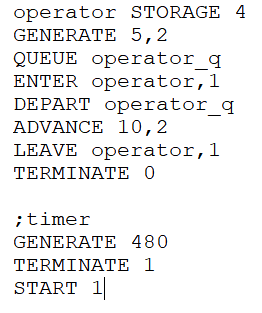{#fig:012 width=50%}

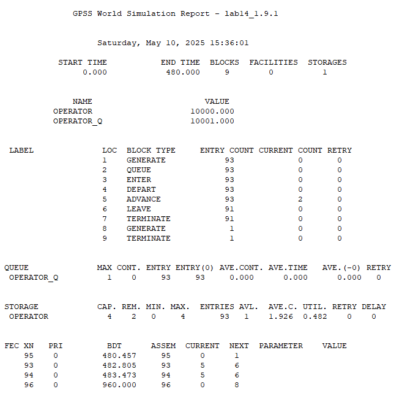{#fig:013 width=50%}

Добавим к предыдущей системе проверку длины очереди (рис. [-@fig:014], рис. [-@fig:015]).

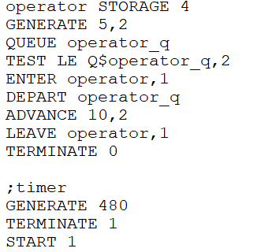{#fig:014 width=50%}

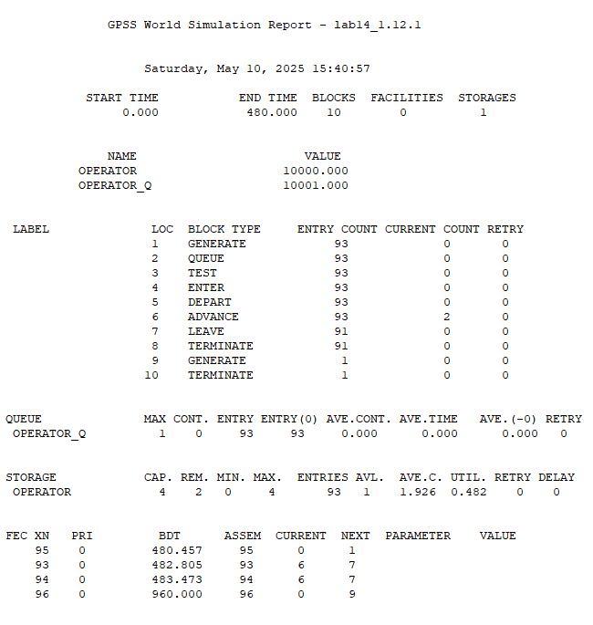{#fig:015 width=50%}

# Выводы

В ходе работы мы приобрели базовые навыки работы с GPSS.

# Список литературы{.unnumbered}

::: {#refs}
:::
