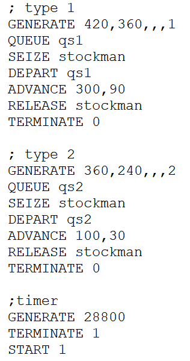
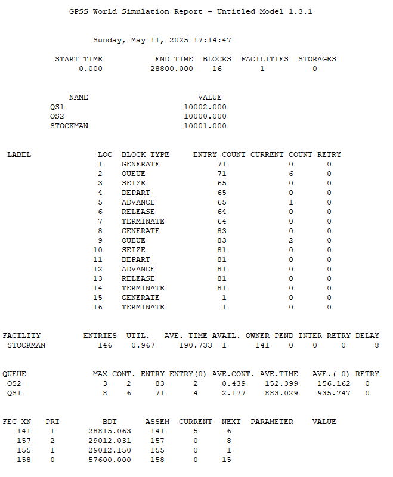
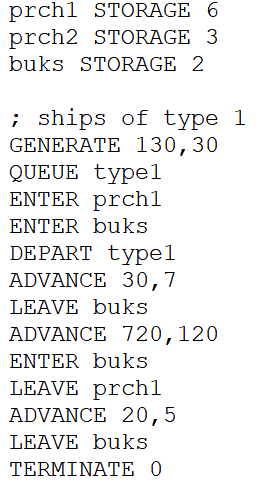
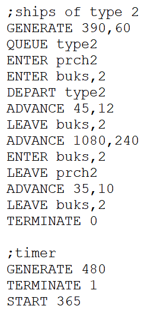
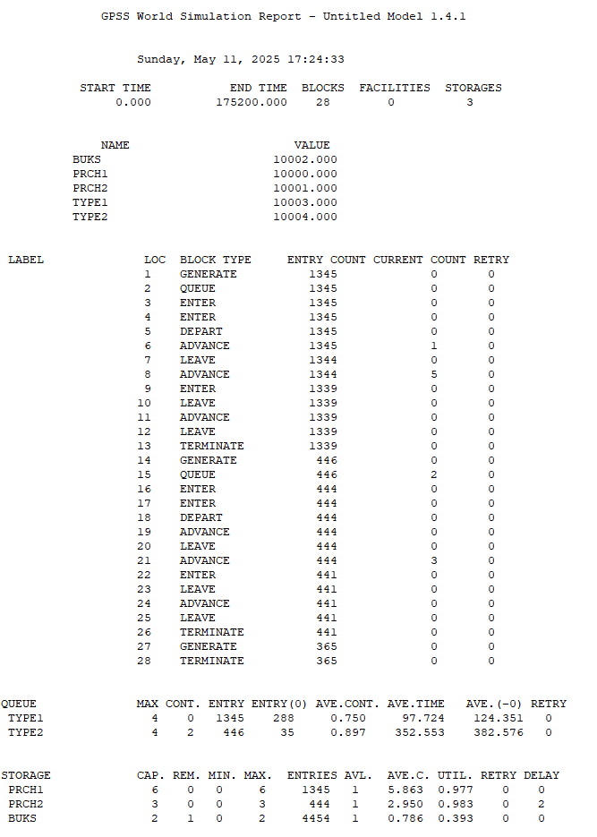

---
## Front matter
lang: ru-RU
title: Модели обслуживания с приоритетами.
subtitle: Лабораторная работа №15.
author:
  - Рогожина Н.А.
institute:
  - Российский университет дружбы народов, Москва, Россия
date: 11 мая 2025

## i18n babel
babel-lang: russian
babel-otherlangs: english

## Formatting pdf
toc: false
toc-title: Содержание
slide_level: 2
aspectratio: 169
section-titles: true
theme: metropolis
header-includes:
 - \metroset{progressbar=frametitle,sectionpage=progressbar,numbering=fraction}
---

# Информация

## Докладчик

:::::::::::::: {.columns align=center}
::: {.column width="70%"}

  * Рогожина Надежда Александровна
  * студентка 3 курса НФИбд-02-22
  * Российский университет дружбы народов
  * <https://mikogreen.github.io/>

:::
::::::::::::::

# Задание

## Задание

1. На фабрике на складе работает один кладовщик, который выдает запасные части механикам, обслуживающим станки. Время, необходимое для удовлетворения запроса, зависит от типа запасной части. Запросы бывают двух категорий. Для первой категории интервалы времени прихода механиков 420 ± 360 сек., время обслуживания — 300 ± 90 сек. Для второй категории интервалы времени прихода механиков 360 ± 240 сек., время обслуживания — 100 ± 30 сек.

## Задание

Порядок обслуживания механиков кладовщиком такой: запросы первой категории обслуживаются только в том случае, когда в очереди нет ни одного запроса второй категории. Внутри одной категории дисциплина обслуживания — «первым пришел – первым обслужился». Необходимо создать модель работы кладовой, моделирование выполнять в течение восьмичасового рабочего дня, и проанализировать отчет.

## Задание

2. Морские суда двух типов прибывают в порт, где происходит их разгрузка. В порту есть два буксира, обеспечивающих ввод и вывод кораблей из порта. К первому типу судов относятся корабли малого тоннажа, которые требуют использования одного буксира. Корабли второго типа имеют большие размеры, и для их ввода и вывода из порта требуется два буксира. Из-за различия размеров двух типов кораблей необходимы и причалы различного размера. Кроме того, корабли имеют различное время погрузки/разгрузки. Время ожидания входа в порт включает время ожидания освобождения причала и буксира. Корабль, ожидающий освобождения причала, не обслуживается буксиром до тех пор, пока не будет предоставлен нужный причал. Корабль второго типа не займёт буксир до тех пор, пока ему не будут доступны оба буксира.

## Задание

Параметры модели:

- для корабля первого типа:

  - интервал прибытия: 130 ± 30 мин;

  - время входа в порт: 30 ± 7 мин;

  - количество доступных причалов: 6;

  - время погрузки/разгрузки: 12 ± 2 час;

  - время выхода из порта: 20 ± 5 мин;

## Задание

- для корабля второго типа:

  - интервал прибытия: 390 ± 60 мин;

  - время входа в порт: 45 ± 12 мин;

  - количество доступных причалов: 3;

  - время погрузки/разгрузки: 18 ± 4 час;

  - время выхода из порта: 35 ± 10 мин.

  - время моделирования: 365 дней по 8 часов

Требуется построить модель системы, в которой можно оценить время ожидания кораблями каждого типа входа в порт и проанализировать отчет.

# Выполнение лабораторной работы

## Модель обслуживания механиков на складе

Есть два различных типа заявок, поступающих на обслуживание к одному устройству. Различаются распределения интервалов приходов и времени обслуживания для этих типов заявок. Приоритеты запросов задаются путем использования для операнда E блока GENERATE запросов второй категории большего значения, чем для запросов первой категории.

## Модель обслуживания механиков на складе

{#fig:001 width=40%}

## Модель обслуживания механиков на складе

{#fig:002 width=45%}

## Модель обслуживания в порту судов двух типов

{#fig:003 width=40%}

## Модель обслуживания в порту судов двух типов

{#fig:004 width=40%}

## Модель обслуживания в порту судов двух типов

{#fig:005 width=40%}

# Выводы

## Выводы

В ходе работы мы построили 2 модели (модель обслуживания механиков на складе и модель обслуживания в порту судов двух типов) и проанализировали отчеты по их работе, приобрели навыки работы с приоритетом заявок.

