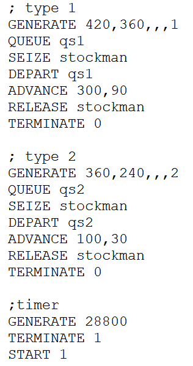
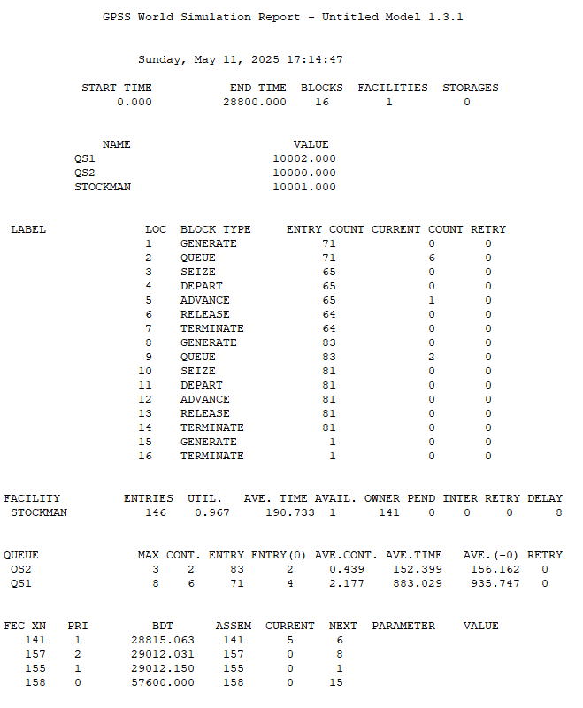
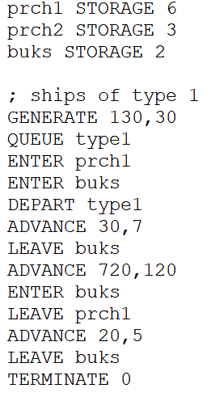
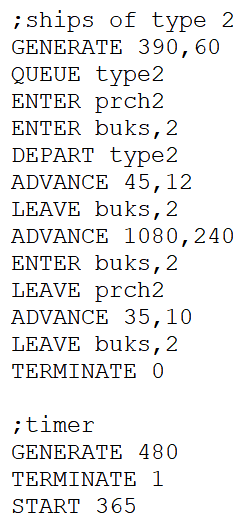
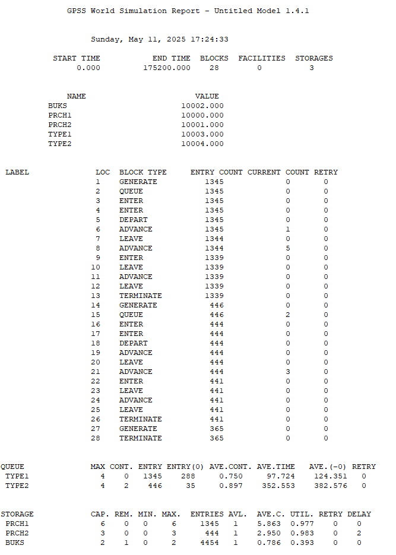

---
## Front matter
title: "Отчёт по лабораторной работе №15"
subtitle: "Модели обслуживания с приоритетами"
author: "Надежда Александровна Рогожина"

## Generic otions
lang: ru-RU
toc-title: "Содержание"

## Bibliography
bibliography: bib/cite.bib
csl: pandoc/csl/gost-r-7-0-5-2008-numeric.csl

## Pdf output format
toc: true # Table of contents
toc-depth: 2
lof: true # List of figures
lot: true # List of tables
fontsize: 12pt
linestretch: 1.5
papersize: a4
documentclass: scrreprt
## I18n polyglossia
polyglossia-lang:
  name: russian
  options:
	- spelling=modern
	- babelshorthands=true
polyglossia-otherlangs:
  name: english
## I18n babel
babel-lang: russian
babel-otherlangs: english
## Fonts
mainfont: IBM Plex Serif
romanfont: IBM Plex Serif
sansfont: IBM Plex Sans
monofont: IBM Plex Mono
mathfont: STIX Two Math
mainfontoptions: Ligatures=Common,Ligatures=TeX,Scale=0.94
romanfontoptions: Ligatures=Common,Ligatures=TeX,Scale=0.94
sansfontoptions: Ligatures=Common,Ligatures=TeX,Scale=MatchLowercase,Scale=0.94
monofontoptions: Scale=MatchLowercase,Scale=0.94,FakeStretch=0.9
mathfontoptions:
## Biblatex
biblatex: true
biblio-style: "gost-numeric"
biblatexoptions:
  - parentracker=true
  - backend=biber
  - hyperref=auto
  - language=auto
  - autolang=other*
  - citestyle=gost-numeric
## Pandoc-crossref LaTeX customization
figureTitle: "Рис."
tableTitle: "Таблица"
listingTitle: "Листинг"
lofTitle: "Список иллюстраций"
lotTitle: "Список таблиц"
lolTitle: "Листинги"
## Misc options
indent: true
header-includes:
  - \usepackage{indentfirst}
  - \usepackage{float} # keep figures where there are in the text
  - \floatplacement{figure}{H} # keep figures where there are in the text
---

# Задание

1. На фабрике на складе работает один кладовщик, который выдает запасные части механикам, обслуживающим станки. Время, необходимое для удовлетворения запроса, зависит от типа запасной части. Запросы бывают двух категорий. Для первой категории интервалы времени прихода механиков 420 ± 360 сек., время обслуживания — 300 ± 90 сек. Для второй категории интервалы времени прихода механиков 360 ± 240 сек., время обслуживания — 100 ± 30 сек.

Порядок обслуживания механиков кладовщиком такой: запросы первой категории обслуживаются только в том случае, когда в очереди нет ни одного запроса второй категории. Внутри одной категории дисциплина обслуживания — «первым пришел – первым обслужился». Необходимо создать модель работы кладовой, моделирование выполнять в течение восьмичасового рабочего дня, и проанализировать отчет.

2. Морские суда двух типов прибывают в порт, где происходит их разгрузка. В порту есть два буксира, обеспечивающих ввод и вывод кораблей из порта. К первому типу судов относятся корабли малого тоннажа, которые требуют использования одного буксира. Корабли второго типа имеют большие размеры, и для их ввода и вывода из порта требуется два буксира. Из-за различия размеров двух типов кораблей необходимы и причалы различного размера. Кроме того, корабли имеют различное время погрузки/разгрузки. Время ожидания входа в порт включает время ожидания освобождения причала и буксира. Корабль, ожидающий освобождения причала, не обслуживается буксиром до тех пор, пока не будет предоставлен нужный причал. Корабль второго типа не займёт буксир до тех пор, пока ему не будут доступны оба буксира.

Параметры модели:
- для корабля первого типа:
  - интервал прибытия: 130 ± 30 мин;
  - время входа в порт: 30 ± 7 мин;
  - количество доступных причалов: 6;
  - время погрузки/разгрузки: 12 ± 2 час;
  - время выхода из порта: 20 ± 5 мин;
- для корабля второго типа:
  - интервал прибытия: 390 ± 60 мин;
  - время входа в порт: 45 ± 12 мин;
  - количество доступных причалов: 3;
  - время погрузки/разгрузки: 18 ± 4 час;
  - время выхода из порта: 35 ± 10 мин.
  - время моделирования: 365 дней по 8 часов

Требуется построить модель системы, в которой можно оценить время ожидания кораблями каждого типа входа в порт и проанализировать отчет.[@lab] 

# Выполнение лабораторной работы

## Модель обслуживания механиков на складе

Есть два различных типа заявок, поступающих на обслуживание к одному устройству. Различаются распределения интервалов приходов и времени обслуживания для этих типов заявок. Приоритеты запросов задаются путем использования для операнда E блока GENERATE запросов второй категории большего значения, чем для запросов первой категории [@ruk] (рис. [-@fig:001], рис. [-@fig:002]).

{#fig:001 width=40%}

{#fig:002 width=45%}

Здесь мы видим что у нас было пройдено 16 блоков, был 1 обслуживающий прибор. Всего было сгенерировано 71 заявка первого типа, при этом 64 было обслужено и на момент окончания моделирования 1 находилась в обслуживании и 6 в очереди. Также, было сгенерировано 83 заявки 2 типа, 81 была обслужено, 2 из них находились в очереди (они возьмутся в работу следующими, заявки первого типа будут ждать обработки всех заявок в очереди второго типа). Кладовщик принял в обработку 146 заявок, среднее время обработки - 190 секунд, утилизация $\approx$ 96.7%.

Также, показатели очереди:
- Очередь заявок первого типа:
  - Максимально было 8 заявки
  - На момент окончания - 6 заявок
  - Среднее количество заявок в очереди: 2.177 ($\approx$ 2)
  - Среднее время нахождения в очереди: 882.029 секунд ($\approx$ 14.7 минут)
- Очередь заявок второго типа:
  - Максимально было 3 заявки
  - На момент окончания - 2 заявок
  - Среднее количество заявок в очереди: 0.439 ($\approx$ 0)
  - Среднее время нахождения в очереди: 152.399 секунд ($\approx$ 3 минут)

## Модель обслуживания в порту судов двух типов

Далее, построим модель обслуживания судов разных типов в порту. Это реализуется с помощью следующего кода (рис. [-@fig:003], рис. [-@fig:004]):

{#fig:003 width=40%}

{#fig:004 width=40%}

Далее, запустим моделирование и получим отчет (рис. [-@fig:005]):

{#fig:005 width=40%}

Здесь мы видим, что в порт за год (при 8-ми часовом рабочем дне) пришло 1345 судов 1-го типа и 446 судов 2-го типа, при этом (на конец моделирования):
- Корабли первого типа:
  - 1 корабль первого типа находился в процессе буксировки к причалу
  - 5 кораблей первого типа обслуживались на причале (процесс погрузки/разгрузки)
  - Всего было обслужено (до конца) 1339 кораблей первого типа
- Корабли второго типа:
  - В очереди ждало 2 корабля второго типа
  - На причале обслуживались 3 корабля второго типа
  - Всего было обслужено 441 корабль второго типа

Также, показатели очереди:
- Очередь кораблей первого типа:
  - Максимально было 4 корабля
  - На момент окончания - 0
  - Среднее количество кораблей в очереди: 0.750 ($\approx$ 1)
  - Среднее время нахождения в очереди: 97.724 минуты ($\approx$ 1.6 часов)
- Очередь кораблей второго типа:
  - Максимально было 4 корабля
  - На момент окончания - 2 корабля
  - Среднее количество кораблей в очереди: 0.897 ($\approx$ 1)
  - Среднее время нахождения в очереди: 352.553 минуты ($\approx$ 5.8 часов)

Также, в среднем на причалах было 5.8 ($\approx$ 6) и 2.9 ($\approx$ 3) корабля для первого и второго типов соответственно. Утилизация причалов - 97.7% и 98.3% соответственно, т.е. они не простаивали пустые. А вот с буксирами не так гладко - в среднем, использовался 1 буксир, и утилизация была 39.3%. Это можно объяснить долгим временем обслуживания, буксировки и возможными задержками и особенностями в обслуживании.

# Выводы

В ходе работы мы построили 2 модели (модель обслуживания механиков на складе и модель обслуживания в порту судов двух типов) и проанализировали отчеты по их работе, приобрели навыки работы с приоритетом заявок.

# Список литературы{.unnumbered}

::: {#refs}
:::
