---
## Front matter
lang: ru-RU
title: Задачи оптимизации. Модель двух стратегий обслуживания.
subtitle: Лабораторная работа №16.
author:
  - Рогожина Н.А.
institute:
  - Российский университет дружбы народов, Москва, Россия
date: 12 мая 2025

## i18n babel
babel-lang: russian
babel-otherlangs: english

## Formatting pdf
toc: false
toc-title: Содержание
slide_level: 2
aspectratio: 169
section-titles: true
theme: metropolis
header-includes:
 - \metroset{progressbar=frametitle,sectionpage=progressbar,numbering=fraction}
---

# Информация

## Докладчик

:::::::::::::: {.columns align=center}
::: {.column width="70%"}

  * Рогожина Надежда Александровна
  * студентка 3 курса НФИбд-02-22
  * Российский университет дружбы народов
  * <https://mikogreen.github.io/>

:::
::::::::::::::

# Задание

## Задание

На пограничном контрольно-пропускном пункте транспорта имеются 2 пункта пропуска. Интервалы времени между поступлением автомобилей имеют экспоненциальное распределение со средним значением µ. Время прохождения автомобилями
пограничного контроля имеет равномерное распределение на интервале $[a, b]$.

## Задание

Предлагается две стратегии обслуживания прибывающих автомобилей:
1. автомобили образуют две очереди и обслуживаются соответствующими пунктами пропуска;
2. автомобили образуют одну общую очередь и обслуживаются освободившимся пунктом пропуска.

Исходные данные: $\mu$ = 1.75 мин, $a$ = 1 мин, $b$ = 7 мин.

# Выполнение лабораторной работы

## Первая стратегия

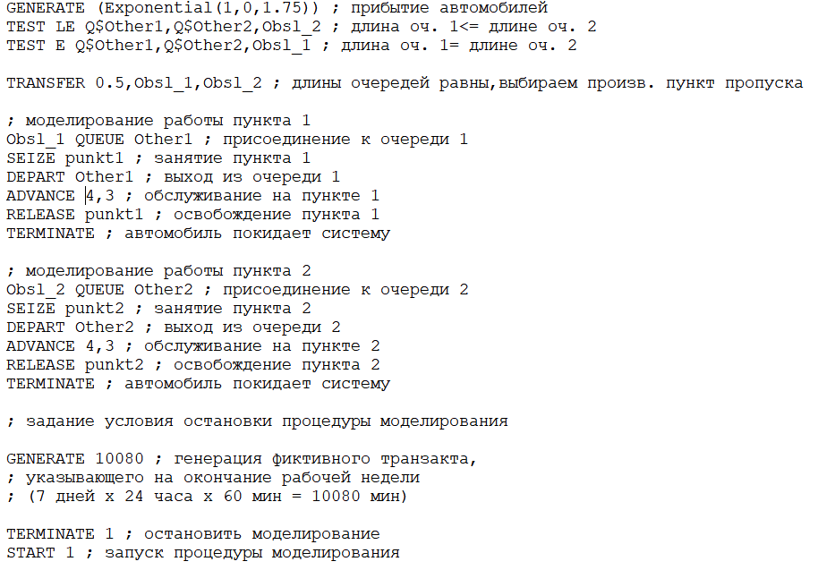{#fig:001 width=45%}

## Первая стратегия

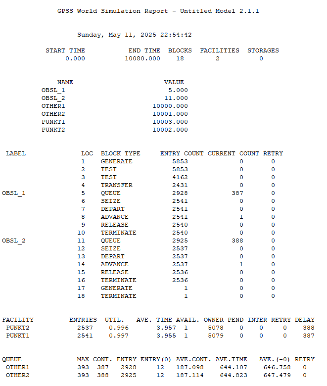{#fig:002 width=40%}

## Вторая стратегия

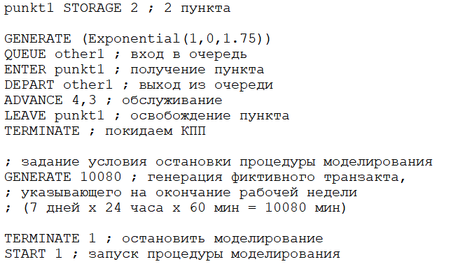{#fig:003 width=45%}

## Вторая стратегия

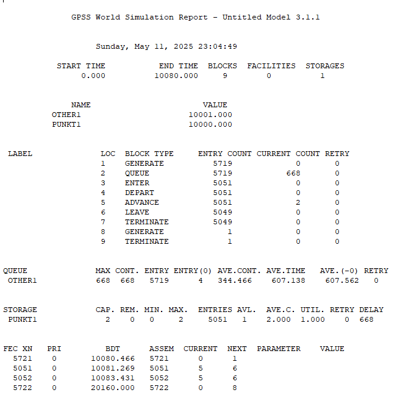{#fig:004 width=40%}

## Подведение итогов

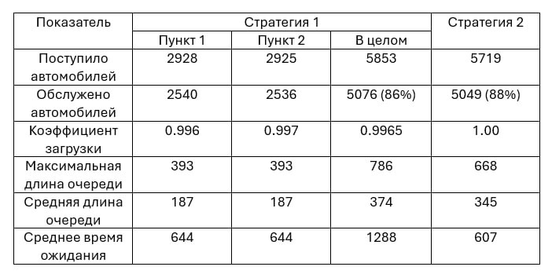{#fig:005 width=45%}

## Определение оптимального числа

Далее, определим, сколько пропускных пунктов для каждой из стратегий необходимо для выполнения следующих условий:
- коэффициент загрузки КПП принадлежит интервалу $[0.5; 0.95]$
- среднее число автомобилей, одновременно находящихся на контрольно-пропускном пункте, не должно превышать 3;
- среднее время ожидания обслуживания не должно превышать 4 мин.

## Определение оптимального числа

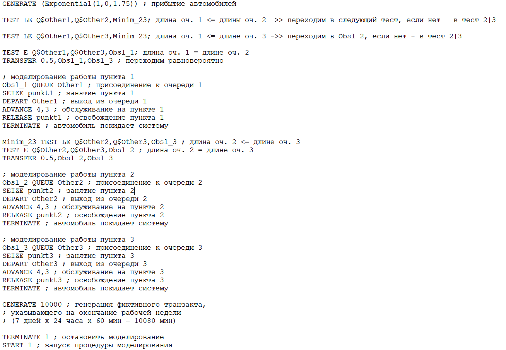{#fig:006 width=45%}

## Определение оптимального числа

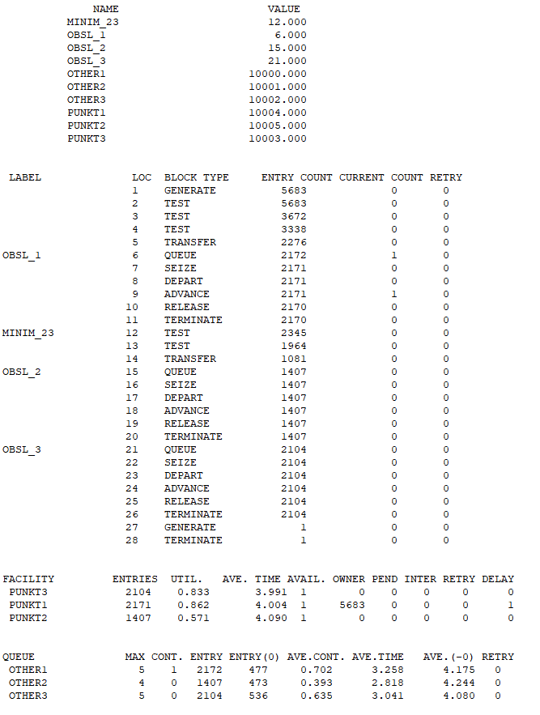{#fig:007 width=30%}

## Определение оптимального числа

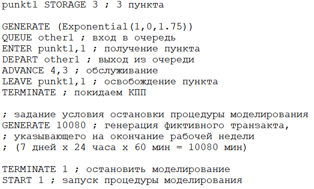{#fig:008 width=45%}

## Определение оптимального числа

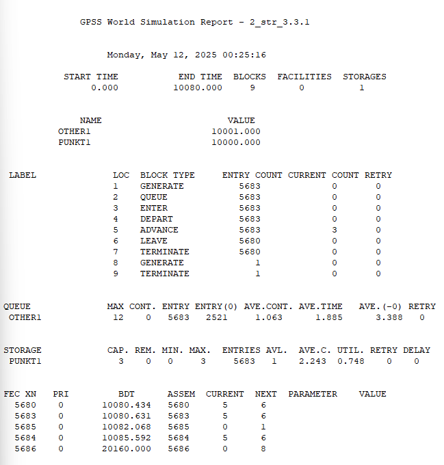{#fig:009 width=40%}

## Определение оптимального числа

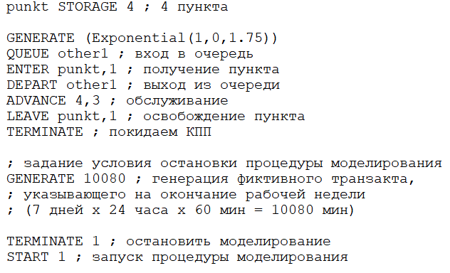{#fig:010 width=45%}

## Определение оптимального числа

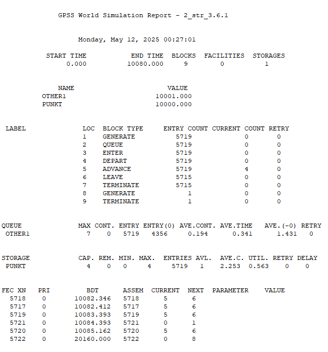{#fig:011 width=40%}

# Выводы

## Выводы

В ходе работы мы построили 2 стратегии обслуживания автомобилей на КПП (с $n$ очередями и 1 КПП на каждую очередь, и с 1 очередью и $n$ КПП), а также определили оптимальное количество пропускных пунктов для каждой из стратегий.

