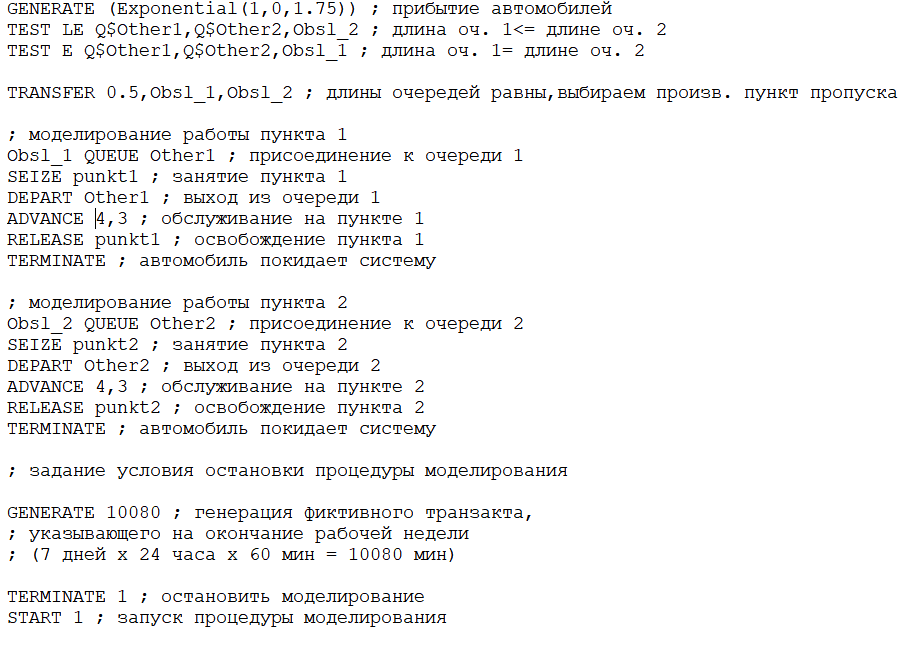
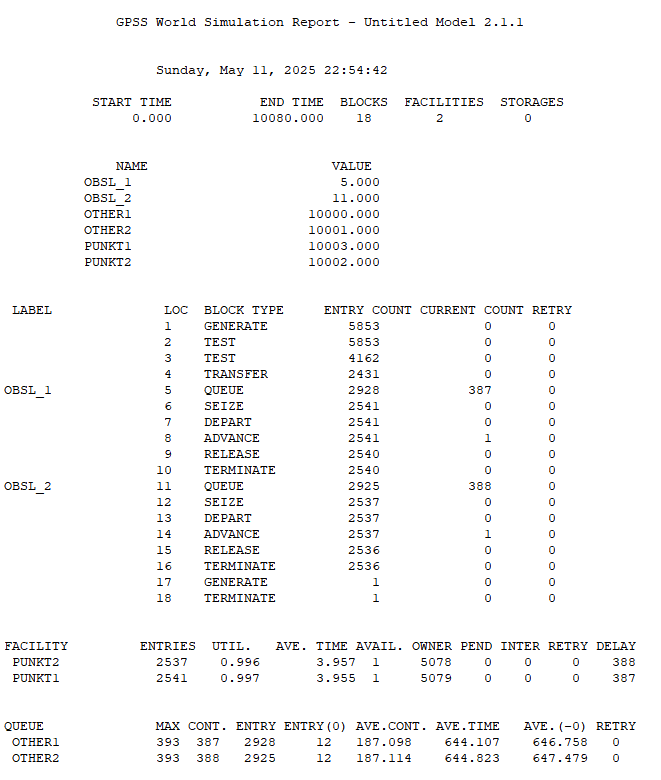
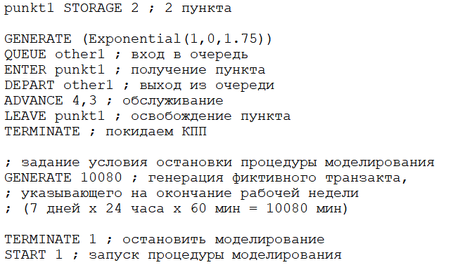
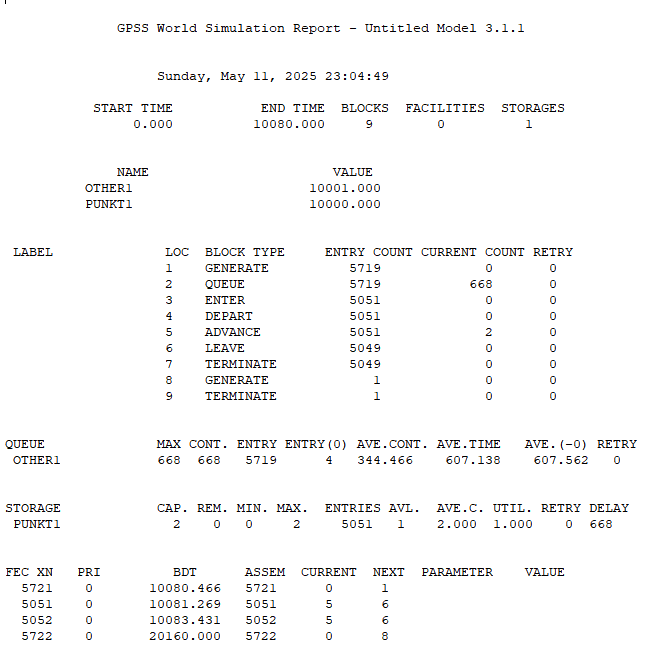
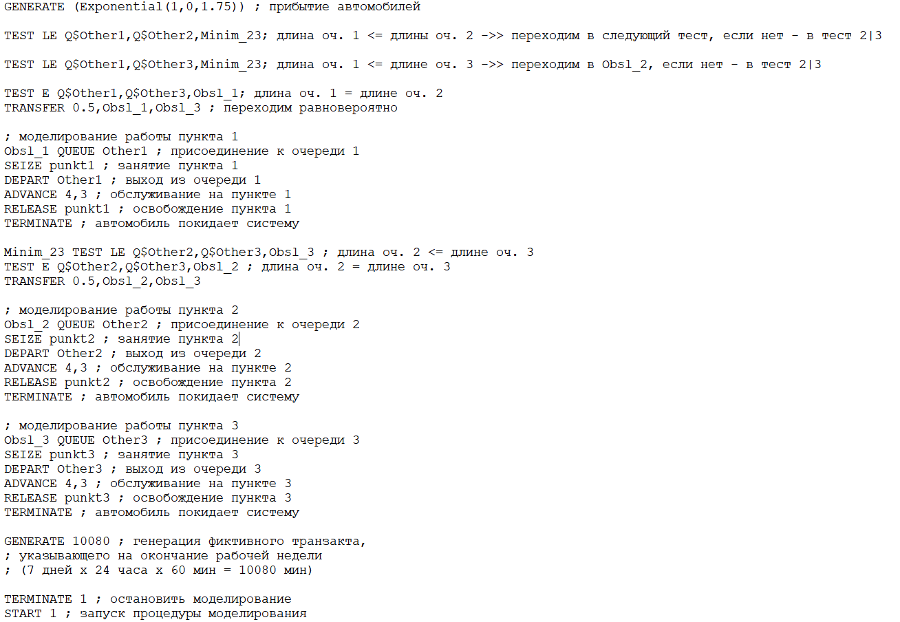
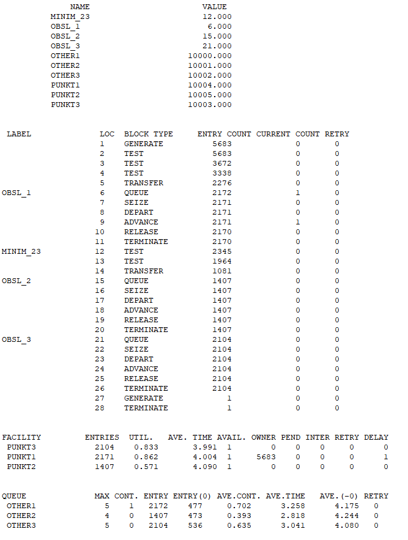
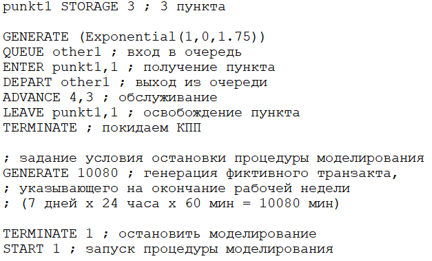
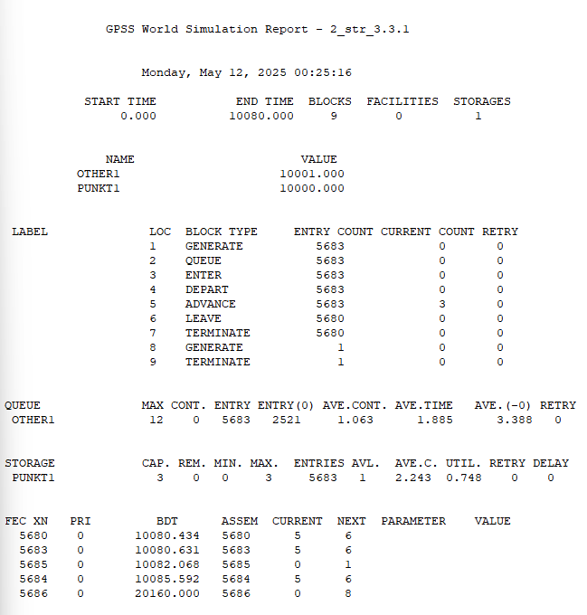
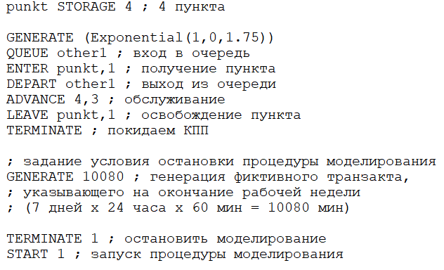
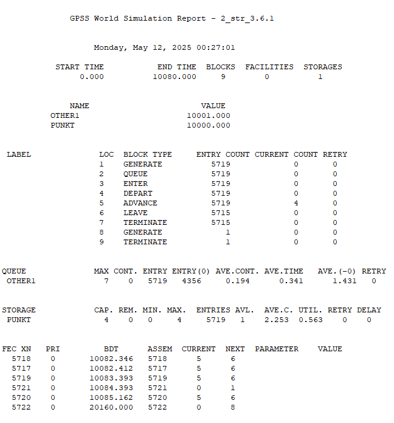

---
## Front matter
title: "Отчёт по лабораторной работе №16"
subtitle: "Задачи оптимизации. Модель двух стратегий обслуживания"
author: "Надежда Александровна Рогожина"

## Generic otions
lang: ru-RU
toc-title: "Содержание"

## Bibliography
bibliography: bib/cite.bib
csl: pandoc/csl/gost-r-7-0-5-2008-numeric.csl

## Pdf output format
toc: true # Table of contents
toc-depth: 2
lof: true # List of figures
lot: true # List of tables
fontsize: 12pt
linestretch: 1.5
papersize: a4
documentclass: scrreprt
## I18n polyglossia
polyglossia-lang:
  name: russian
  options:
	- spelling=modern
	- babelshorthands=true
polyglossia-otherlangs:
  name: english
## I18n babel
babel-lang: russian
babel-otherlangs: english
## Fonts
mainfont: IBM Plex Serif
romanfont: IBM Plex Serif
sansfont: IBM Plex Sans
monofont: IBM Plex Mono
mathfont: STIX Two Math
mainfontoptions: Ligatures=Common,Ligatures=TeX,Scale=0.94
romanfontoptions: Ligatures=Common,Ligatures=TeX,Scale=0.94
sansfontoptions: Ligatures=Common,Ligatures=TeX,Scale=MatchLowercase,Scale=0.94
monofontoptions: Scale=MatchLowercase,Scale=0.94,FakeStretch=0.9
mathfontoptions:
## Biblatex
biblatex: true
biblio-style: "gost-numeric"
biblatexoptions:
  - parentracker=true
  - backend=biber
  - hyperref=auto
  - language=auto
  - autolang=other*
  - citestyle=gost-numeric
## Pandoc-crossref LaTeX customization
figureTitle: "Рис."
tableTitle: "Таблица"
listingTitle: "Листинг"
lofTitle: "Список иллюстраций"
lotTitle: "Список таблиц"
lolTitle: "Листинги"
## Misc options
indent: true
header-includes:
  - \usepackage{indentfirst}
  - \usepackage{float} # keep figures where there are in the text
  - \floatplacement{figure}{H} # keep figures where there are in the text
---

# Задание

На пограничном контрольно-пропускном пункте транспорта имеются 2 пункта пропуска. Интервалы времени между поступлением автомобилей имеют экспоненциальное распределение со средним значением µ. Время прохождения автомобилями
пограничного контроля имеет равномерное распределение на интервале $[a, b]$.

Предлагается две стратегии обслуживания прибывающих автомобилей:
1. автомобили образуют две очереди и обслуживаются соответствующими пунктами пропуска;
2. автомобили образуют одну общую очередь и обслуживаются освободившимся пунктом пропуска.

Исходные данные: $\mu$ = 1.75 мин, $a$ = 1 мин, $b$ = 7 мин. [@lab] 

# Выполнение лабораторной работы

## Первая стратегия

Первоначально, была реализована первая стратегия. В данном случае, для обслуживания автомобилей на пунктах необходимо было реализовать равномерное распределение на интервале $[a, b]$. В коде это было сделано через стандартное значение оператора `ADVANCE` (где указывается распределение, только если оно не равномерное). Но это можно было сделать в явном виде - `ADVANCE (Uniform(1,1,7))`[@ruk]. (рис. [-@fig:001], рис. [-@fig:002]).

{#fig:001 width=70%}

{#fig:002 width=65%}

Здесь мы видим что у нас было пройдено 18 блоков, было 2 обслуживающих прибора. Всего на КПП приехало 5853 автомобилей, в 1 очередь попали 2928 автомобилей (387 из них находилось в там на момент окончания моделирования), во 2 - 2925 (там находились 387 автомобилей на момент окончания моделирования). Также по одному автомобилю находилось на проверке в каждом КПП. У каждого КПП утилизация около 99%, в среднем в каждом - находились около 4 минут, первый КПП проверил 2540 машин, второй - 2536.

Также, показатели очереди:

- Первая очередь:

  - Максимально было 393 машины

  - На момент окончания - 387 заявок

  - Среднее количество машин в очереди: 187.098 ($\approx$ 187)

  - Среднее время нахождения в очереди: 644.107 минут ($\approx$ 10.7 часов)

- Вторая очередь:

  - Максимально было 393 машины

  - На момент окончания - 388 заявок

  - Среднее количество машин в очереди: 187.114 ($\approx$ 187)

  - Среднее время нахождения в очереди: 644.823 минут ($\approx$ 10.7 часов)

## Вторая стратегия

Далее, была построена вторая модель (рис. [-@fig:003], согласно описанию второй стратегии) и получен отчет (рис. [-@fig:004]):

{#fig:003 width=70%}

{#fig:004 width=70%}

Здесь мы видим что у нас было пройдено 9 блоков, был 1 накопитель. Всего на КПП приехало 5719 автомобилей, 668 из них были в очереди на момент окончания моделирования. Также два автомобиля находилось на проверке. Уже было проверено - 5049 автомобилей. Утилизация нашего КПП - 100% (т.к. нет возможности простоя).

Также, показатели очереди:

- Очередь:

  - Максимально было 668 машины

  - На момент окончания - 668 заявок

  - Среднее количество машин в очереди: 344.466 ($\approx$ 345)

  - Среднее время нахождения в очереди: 607.138 минут ($\approx$ 10.1 часов)

## Подведение итогов

После получения обоих отчетов, была составлена таблица (рис. [-@fig:005]) сравнительной оценки моделей:

{#fig:005 width=70%}

## Определение оптимального числа

Далее, определим, сколько пропускных пунктов для каждой из стратегий необходимо для выполнения следующих условий (рис. [-@fig:006], рис. [-@fig:007], рис. [-@fig:008], рис. [-@fig:009], рис. [-@fig:010], рис. [-@fig:011]):
- коэффициент загрузки КПП принадлежит интервалу $[0.5; 0.95]$
- среднее число автомобилей, одновременно находящихся на контрольно-пропускном пункте, не должно превышать 3;
- среднее время ожидания обслуживания не должно превышать 4 мин.

{#fig:006 width=70%}

{#fig:007 width=70%}

{#fig:008 width=70%}

{#fig:009 width=70%}

{#fig:010 width=70%}

{#fig:011 width=70%}

По итогам моделирования - было определено, что оптимальное число для первой стратегии - 3 КПП, для второй подходят и 3, и 4 КПП.

# Выводы

В ходе работы мы построили 2 стратегии обслуживания автомобилей на КПП (с $n$ очередями и 1 КПП на каждую очередь, и с 1 очередью и $n$ КПП), а также определили оптимальное количество пропускных пунктов для каждой из стратегий.

# Список литературы{.unnumbered}

::: {#refs}
:::
