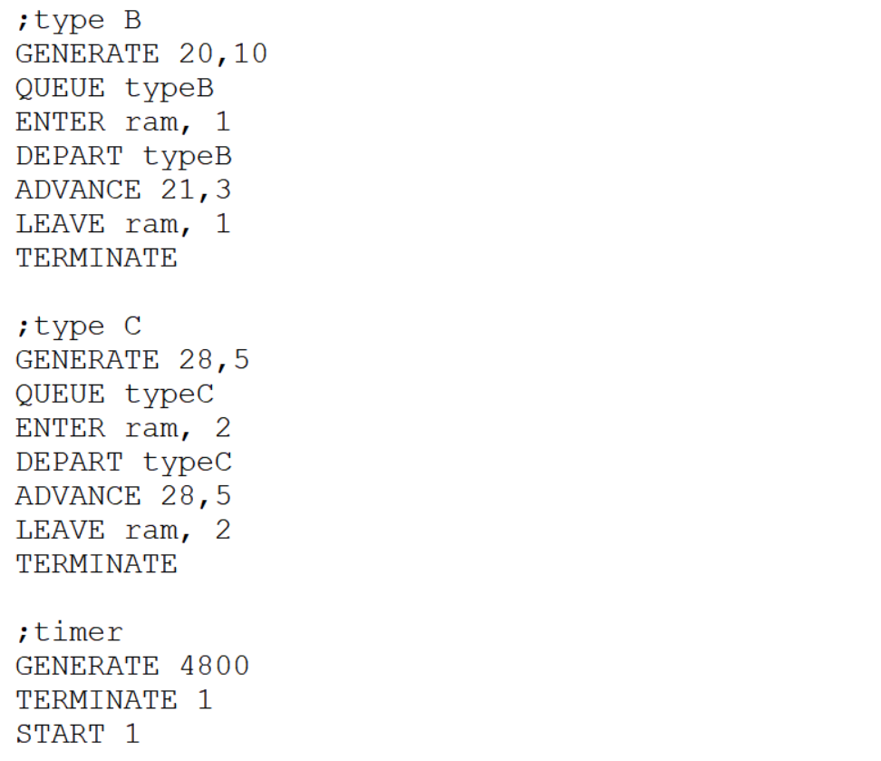

---
## Front matter
lang: ru-RU
title: Задания для самостоятельной работы
subtitle: Лабораторная работа №17.
author:
  - Рогожина Н.А.
institute:
  - Российский университет дружбы народов, Москва, Россия
date: 12 мая 2025

## i18n babel
babel-lang: russian
babel-otherlangs: english

## Formatting pdf
toc: false
toc-title: Содержание
slide_level: 2
aspectratio: 169
section-titles: true
theme: metropolis
header-includes:
 - \metroset{progressbar=frametitle,sectionpage=progressbar,numbering=fraction}
---

# Информация

## Докладчик

:::::::::::::: {.columns align=center}
::: {.column width="70%"}

  * Рогожина Надежда Александровна
  * студентка 3 курса НФИбд-02-22
  * Российский университет дружбы народов
  * <https://mikogreen.github.io/>

:::
::::::::::::::

# Задание

## Задание

1. Моделирование работы вычислительного центра

На вычислительном центре в обработку принимаются три класса заданий А, В и С. Исходя из наличия оперативной памяти ЭВМ задания классов А и В могут решаться одновременно, а задания класса С монополизируют ЭВМ. Задания класса А поступают через 20 ± 5 мин, класса В — через 20 ± 10 мин, класса С — через 28 ± 5 мин и требуют для выполнения: класс А — 20 ± 5 мин, класс В — 21 ± 3 мин, класс С — 28 ± 5 мин. Задачи класса С загружаются в ЭВМ, если она полностью свободна. Задачи классов А и В могут дозагружаться к решающей задаче. 

Смоделировать работу ЭВМ за 80 ч. Определить её загрузку.

## Задание

2. Модель работы аэропорта

Самолёты прибывают для посадки в район аэропорта каждые 10 ± 5 мин. Если взлетно-посадочная полоса свободна, прибывший самолёт получает разрешение на посадку. Если полоса занята, самолет выполняет полет по кругу и возвращается в аэропорт каждые 5 мин. Если после пятого круга самолет не получает разрешения на посадку, он отправляется на запасной аэродром.

В аэропорту через каждые 10 ± 2 мин к взлетно-посадочной полосе выруливают готовые к взлёту самолёты и получают разрешение на взлёт, если полоса свободна. Для взлета и посадки самолёты занимают полосу ровно на 2 мин. Если при свободной полосе одновременно один самолёт прибывает для посадки, а другой — для взлёта, то полоса предоставляется взлетающей машине.

## Задание

Требуется:

- выполнить моделирование работы аэропорта в течение суток;

- подсчитать количество самолётов, которые взлетели, сели и были направлены на запасной аэродром;

- определить коэффициент загрузки взлетно-посадочной полосы.

## Задание

3. Моделирование работы морского порта

Морские суда прибывают в порт каждые $[a ± \delta]$ часов. В порту имеется N причалов. Каждый корабль по длине занимает M причалов и находится в порту $[b ± \epsilon]$ часов.

Требуется построить GPSS-модель для анализа работы морского порта в течение полугода, определить оптимальное количество причалов для эффективной работы порта.

## Задание

Исходные данные:
1. a = 20 ч, δ = 5 ч, b = 10 ч, ε = 3 ч, N = 10, M = 3;

2. a = 30 ч, δ = 10 ч, b = 8 ч, ε = 4 ч, N = 6, M = 2.

# Выполнение лабораторной работы

## Моделирование работы вычислительного центра

Для выполнения задания за основу взялась работа накопителя с емкостью = 2. Далее мы генерировали заявки разного типа, две из которых могли сосуществовать и сообслуживаться в системе, в то время как третья требовала памятной монополии.

## Моделирование работы вычислительного центра

{#fig:001 width=70%}

## Моделирование работы вычислительного центра

{#fig:002 width=50%}

## Моделирование работы вычислительного центра

{#fig:003 width=40%}

## Модель работы аэропорта

{#fig:004 width=50%}

## Модель работы аэропорта

{#fig:005 width=40%}

## Модель работы аэропорта

{#fig:006 width=50%}

## Моделирование работы морского порта

Работа порта с $N$-причалами была реализована, также, с помощью накопителя. Необходимо было также определить оптимальное число причалов для каждого из случаев.

## Моделирование работы морского порта

{#fig:007 width=40%}

## Моделирование работы морского порта

{#fig:008 width=40%}

## Моделирование работы морского порта

{#fig:009 width=40%}

## Моделирование работы морского порта

{#fig:010 width=40%}

## Моделирование работы морского порта

{#fig:011 width=40%}

## Моделирование работы морского порта

{#fig:012 width=40%}

## Моделирование работы морского порта

В обоих случаях, емкость накопителя которая = $M$ имела наиболее оптимальные показатели утилизации.

# Выводы

## Выводы

В ходе работы было выполнено 3 задания - моделирование поведения ЭВМ, аэропорта и морского порта с $N$-причалами.
