---
## Front matter
title: "Отчёт по лабораторной работе №17"
subtitle: "Задания для самостоятельной работы"
author: "Надежда Александровна Рогожина"

## Generic otions
lang: ru-RU
toc-title: "Содержание"

## Bibliography
bibliography: bib/cite.bib
csl: pandoc/csl/gost-r-7-0-5-2008-numeric.csl

## Pdf output format
toc: true # Table of contents
toc-depth: 2
lof: true # List of figures
lot: true # List of tables
fontsize: 12pt
linestretch: 1.5
papersize: a4
documentclass: scrreprt
## I18n polyglossia
polyglossia-lang:
  name: russian
  options:
	- spelling=modern
	- babelshorthands=true
polyglossia-otherlangs:
  name: english
## I18n babel
babel-lang: russian
babel-otherlangs: english
## Fonts
mainfont: IBM Plex Serif
romanfont: IBM Plex Serif
sansfont: IBM Plex Sans
monofont: IBM Plex Mono
mathfont: STIX Two Math
mainfontoptions: Ligatures=Common,Ligatures=TeX,Scale=0.94
romanfontoptions: Ligatures=Common,Ligatures=TeX,Scale=0.94
sansfontoptions: Ligatures=Common,Ligatures=TeX,Scale=MatchLowercase,Scale=0.94
monofontoptions: Scale=MatchLowercase,Scale=0.94,FakeStretch=0.9
mathfontoptions:
## Biblatex
biblatex: true
biblio-style: "gost-numeric"
biblatexoptions:
  - parentracker=true
  - backend=biber
  - hyperref=auto
  - language=auto
  - autolang=other*
  - citestyle=gost-numeric
## Pandoc-crossref LaTeX customization
figureTitle: "Рис."
tableTitle: "Таблица"
listingTitle: "Листинг"
lofTitle: "Список иллюстраций"
lotTitle: "Список таблиц"
lolTitle: "Листинги"
## Misc options
indent: true
header-includes:
  - \usepackage{indentfirst}
  - \usepackage{float} # keep figures where there are in the text
  - \floatplacement{figure}{H} # keep figures where there are in the text
---

# Задание

1. Моделирование работы вычислительного центра

На вычислительном центре в обработку принимаются три класса заданий А, В и С. Исходя из наличия оперативной памяти ЭВМ задания классов А и В могут решаться одновременно, а задания класса С монополизируют ЭВМ. Задания класса А поступают через 20 ± 5 мин, класса В — через 20 ± 10 мин, класса С — через 28 ± 5 мин и требуют для выполнения: класс А — 20 ± 5 мин, класс В — 21 ± 3 мин, класс С — 28 ± 5 мин. Задачи класса С загружаются в ЭВМ, если она полностью свободна. Задачи классов А и В могут дозагружаться к решающей задаче.

Смоделировать работу ЭВМ за 80 ч. Определить её загрузку.

2. Модель работы аэропорта

Самолёты прибывают для посадки в район аэропорта каждые 10 ± 5 мин. Если взлетно-посадочная полоса свободна, прибывший самолёт получает разрешение на посадку. Если полоса занята, самолет выполняет полет по кругу и возвращается в аэропорт каждые 5 мин. Если после пятого круга самолет не получает разрешения на посадку, он отправляется на запасной аэродром.

В аэропорту через каждые 10 ± 2 мин к взлетно-посадочной полосе выруливают готовые к взлёту самолёты и получают разрешение на взлёт, если полоса свободна. Для взлета и посадки самолёты занимают полосу ровно на 2 мин. Если при свободной полосе одновременно один самолёт прибывает для посадки, а другой — для взлёта, то полоса предоставляется взлетающей машине.

Требуется:

- выполнить моделирование работы аэропорта в течение суток;

- подсчитать количество самолётов, которые взлетели, сели и были направлены на запасной аэродром;

- определить коэффициент загрузки взлетно-посадочной полосы.

3. Моделирование работы морского порта

Морские суда прибывают в порт каждые $[a ± \delta]$ часов. В порту имеется N причалов. Каждый корабль по длине занимает M причалов и находится в порту $[b ± \epsilon]$ часов.

Требуется построить GPSS-модель для анализа работы морского порта в течение полугода, определить оптимальное количество причалов для эффективной работы порта.

Исходные данные:
1. a = 20 ч, δ = 5 ч, b = 10 ч, ε = 3 ч, N = 10, M = 3;

2. a = 30 ч, δ = 10 ч, b = 8 ч, ε = 4 ч, N = 6, M = 2. [@lab] 

# Выполнение лабораторной работы

## Моделирование работы вычислительного центра

Для выполнения задания за основу взялась работа накопителя с емкостью = 2. Далее мы генерировали заявки разного типа, две из которых могли сосуществовать и сообслуживаться в системе, в то время как третья требовала памятной монополии (рис. [-@fig:001], рис. [-@fig:002], рис. [-@fig:003]).

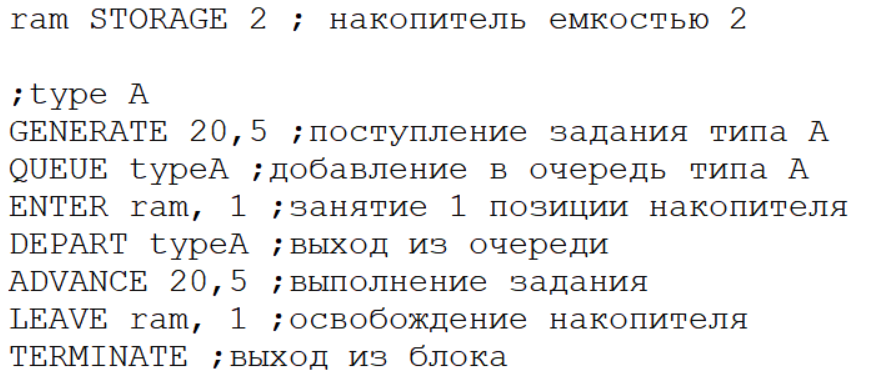{#fig:001 width=70%}

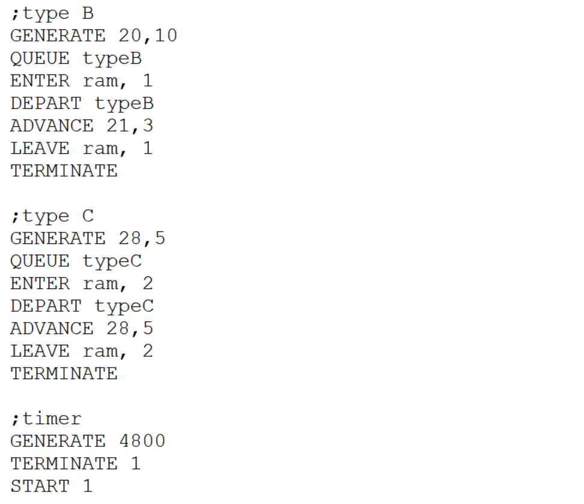{#fig:002 width=50%}

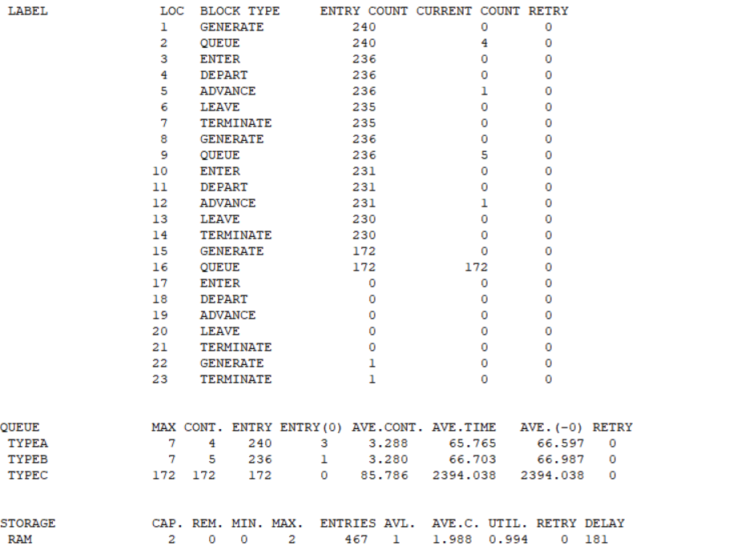{#fig:003 width=40%}

Здесь мы видим, что все заявки типа С на конец моделирования находились в очереди, т.к. у них нет приоритета обслуживания, но при этом для обслуживания заявок данного типа нужна вся оперативная память, а в условиях более часто поступающих в систему заявок типа А и В - время простоя обоих приборов представить сложно (такая вероятность крайне мала). Утилизация памят - 99.4%. В среднем в очередях А и В по 3 заявки, время ожидания обслуживания - около часа.

## Модель работы аэропорта

Для этой модели было реализовано несколько полос и несколько типов поведения, счетчик кругов `lap`, проверка занятости полосы `GATE NU` [@ruk] и приоритетность самолетов (рис. [-@fig:004], рис. [-@fig:005], рис. [-@fig:006]).

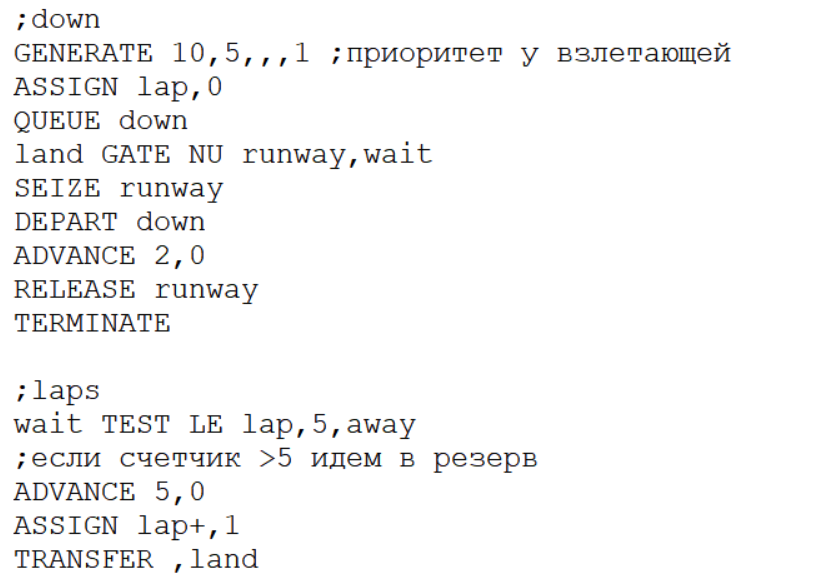{#fig:004 width=50%}

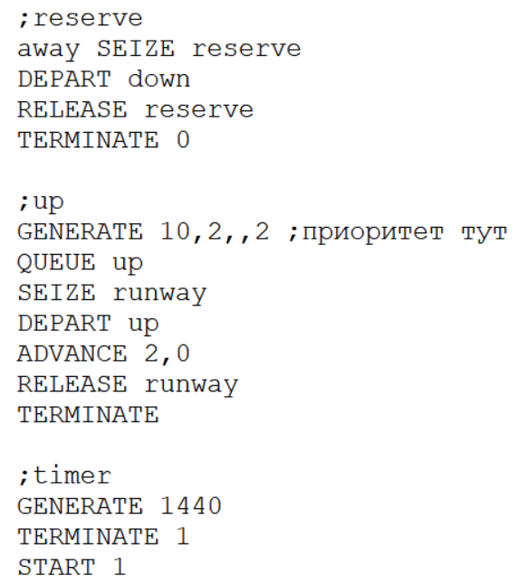{#fig:005 width=40%}

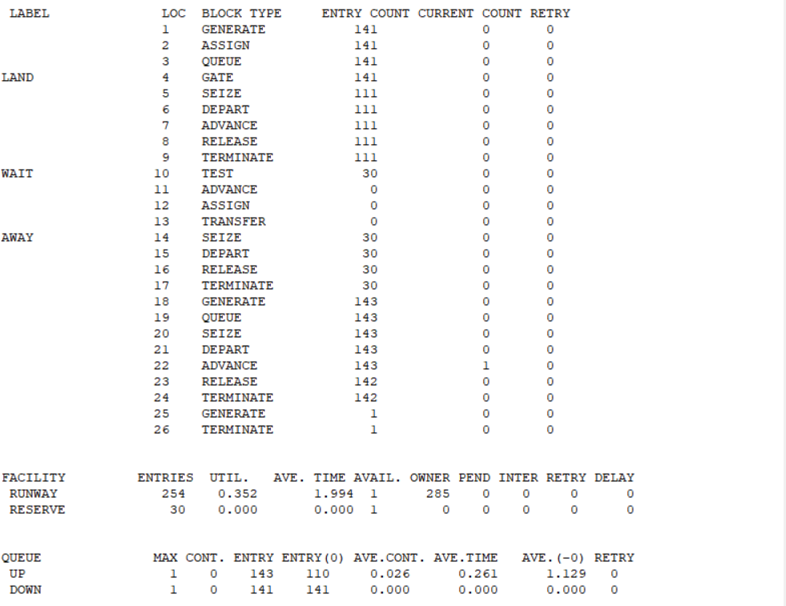{#fig:006 width=50%}

## Моделирование работы морского порта

Работа порта с $N$-причалами была реализована, также, с помощью накопителя. Необходимо было также определить оптимальное число причалов для каждого из случаев (рис. [-@fig:007], рис. [-@fig:008], рис. [-@fig:009], рис. [-@fig:010], рис. [-@fig:011], рис. [-@fig:012])

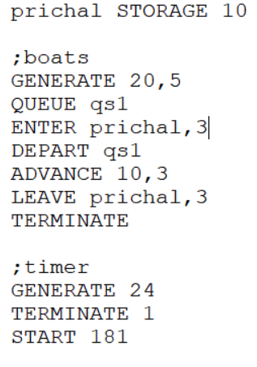{#fig:007 width=40%}

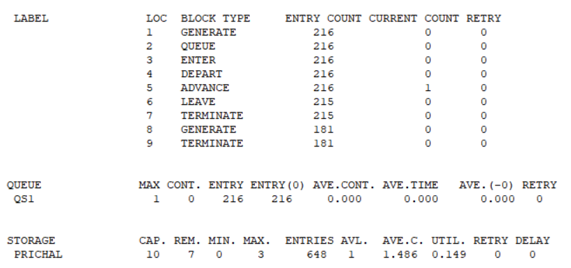{#fig:008 width=40%}

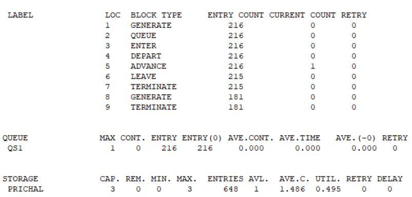{#fig:009 width=40%}

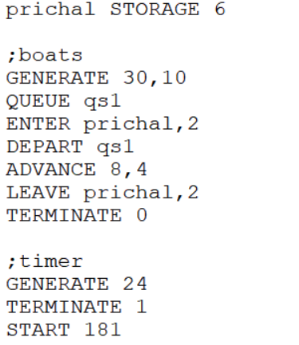{#fig:010 width=40%}

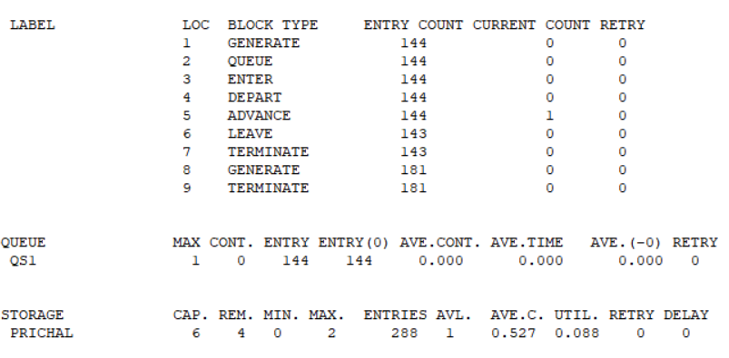{#fig:011 width=40%}

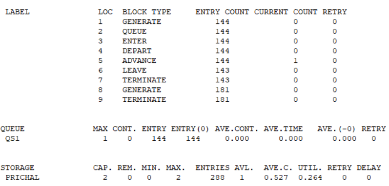{#fig:012 width=40%}

В обоих случаях, емкость накопителя которая = $M$ имела наиболее оптимальные показатели утилизации.

# Выводы

В ходе работы было выполнено 3 задания - моделирование поведения ЭВМ, аэропорта и морского порта с $N$-причалами.

# Список литературы{.unnumbered}

::: {#refs}
:::
