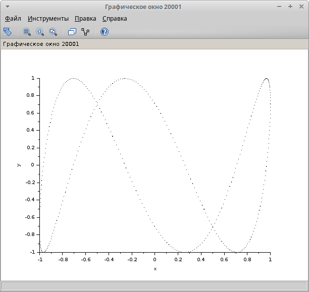

---
## Front matter
lang: ru-RU
title: Выполнение упражнения
subtitle: Задание для самостоятельного выполнения
author:
  - Рогожина Н.А.
institute:
  - Российский университет дружбы народов, Москва, Россия
date: 07 марта 2025

## i18n babel
babel-lang: russian
babel-otherlangs: english

## Formatting pdf
toc: false
toc-title: Содержание
slide_level: 2
aspectratio: 169
section-titles: true
theme: metropolis
header-includes:
 - \metroset{progressbar=frametitle,sectionpage=progressbar,numbering=fraction}
---

# Информация

## Докладчик

:::::::::::::: {.columns align=center}
::: {.column width="70%"}

  * Рогожина Надежда Александровна
  * студентка 3 курса НФИбд-02-22
  * Российский университет дружбы народов
  * <https://mikogreen.github.io/>

:::
::::::::::::::

# Цель

## Цель

Приобрести практические навыки работы с `xcos`.

# Задание

## Задание

**Задание**:

Постройте с помощью xcos фигуры Лиссажу со следующими параметрами:

1. A = B = 1, a = 2, b = 2, δ = 0; π/4; π/2; 3π/4; π;
2. A = B = 1, a = 2, b = 4, δ = 0; π/4; π/2; 3π/4; π;
3. A = B = 1, a = 2, b = 6, δ = 0; π/4; π/2; 3π/4; π;
4. A = B = 1, a = 2, b = 3, δ = 0; π/4; π/2; 3π/4; π.

# Теоретическое введение

## Теоретическое введение

Scilab — система компьютерной математики, предназначенная для решения вычислительных задач.
Основное окно Scilab содержит обозреватель файлов, командное окно, обозреватель переменных и журнал команд. Программа xcos является приложением к пакету Scilab. Для вызова окна xcos необходимо в меню основного окна Scilab выбрать Инструменты, Визуальное моделирование xcos. При моделировании с использованием xcos реализуется принцип визуального программирования, в соответствии с которым пользователь на экране из палитры блоков создаёт модель и осуществляет расчёты.

# Выполнение упражнения

## Выполнение упражнения

Скопировав визуальные элементы из лабораторной работы, получили следующую схему:

{#fig:001 width=45%}

## Выполнение упражнения

Обозначим А и В как амплитуды колебаний, a и b как частоты, а $\delta$ как сдвиг фаз.
Построим для `b = 2` различные варианты $\delta$.

## b = 2

{#fig:002 width=45%}

## b = 2

{#fig:003 width=45%}

## b = 2

{#fig:004 width=45%}

## b = 2

{#fig:005 width=45%}

## b = 2

{#fig:006 width=45%}

## Выполнение упражнения

Аналогично для `b = 4` различные варианты $\delta$.

## b = 4

{#fig:007 width=45%}

## b = 4

{#fig:008 width=45%}

## b = 4

{#fig:009 width=45%}

## b = 4

{#fig:010 width=45%}

## b = 4

{#fig:011 width=45%}

## Выполнение упражнения

Аналогично для `b = 6` различные варианты $\delta$.

## b = 6

{#fig:012 width=45%}

## b = 6

{#fig:013 width=45%}

## b = 6

{#fig:014 width=45%}

## b = 6

{#fig:015 width=45%}

## b = 6

{#fig:016 width=45%}

## Выполнение упражнения

И для `b = 8` различные варианты $\delta$.

## b = 8

{#fig:017 width=45%}

## b = 8

{#fig:018 width=45%}

## b = 8

{#fig:019 width=45%}

## b = 8

{#fig:020 width=45%}

## b = 8

{#fig:021 width=45%}

## Пример

Также, у нас был дан пример с параметрами A = B = 1, a = 3, b = 2, δ = π/2, мы ее также построили.

## Пример

{#fig:022 width=45%}

# Выводы

## Выводы

В ходе лабораторной работы мы визуализировали фигуры, указанные в упражнении, включая показанную в работе, приобрели базовые навыки работы с Scilab.
