---
## Front matter
title: "Отчёт по выполнению упражнения"
subtitle: "Задание для самостоятельного выполнения"
author: "Надежда Александровна Рогожина"

## Generic otions
lang: ru-RU
toc-title: "Содержание"

## Bibliography
bibliography: bib/cite.bib
csl: pandoc/csl/gost-r-7-0-5-2008-numeric.csl

## Pdf output format
toc: true # Table of contents
toc-depth: 2
lof: true # List of figures
lot: true # List of tables
fontsize: 12pt
linestretch: 1.5
papersize: a4
documentclass: scrreprt
## I18n polyglossia
polyglossia-lang:
  name: russian
  options:
	- spelling=modern
	- babelshorthands=true
polyglossia-otherlangs:
  name: english
## I18n babel
babel-lang: russian
babel-otherlangs: english
## Fonts
mainfont: IBM Plex Serif
romanfont: IBM Plex Serif
sansfont: IBM Plex Sans
monofont: IBM Plex Mono
mathfont: STIX Two Math
mainfontoptions: Ligatures=Common,Ligatures=TeX,Scale=0.94
romanfontoptions: Ligatures=Common,Ligatures=TeX,Scale=0.94
sansfontoptions: Ligatures=Common,Ligatures=TeX,Scale=MatchLowercase,Scale=0.94
monofontoptions: Scale=MatchLowercase,Scale=0.94,FakeStretch=0.9
mathfontoptions:
## Biblatex
biblatex: true
biblio-style: "gost-numeric"
biblatexoptions:
  - parentracker=true
  - backend=biber
  - hyperref=auto
  - language=auto
  - autolang=other*
  - citestyle=gost-numeric
## Pandoc-crossref LaTeX customization
figureTitle: "Рис."
tableTitle: "Таблица"
listingTitle: "Листинг"
lofTitle: "Список иллюстраций"
lotTitle: "Список таблиц"
lolTitle: "Листинги"
## Misc options
indent: true
header-includes:
  - \usepackage{indentfirst}
  - \usepackage{float} # keep figures where there are in the text
  - \floatplacement{figure}{H} # keep figures where there are in the text
---

# Цель

Приобрести практические навыки работы с `xcos`.

# Задание

**Задание**:

Постройте с помощью xcos фигуры Лиссажу со следующими параметрами:

1. A = B = 1, a = 2, b = 2, $\delta$ = 0; $\pi$/4; $\pi$/2; 3$\pi$/4; $\pi$;
2. A = B = 1, a = 2, b = 4, $\delta$ = 0; $\pi$/4; $\pi$/2; 3$\pi$/4; $\pi$;
3. A = B = 1, a = 2, b = 6, $\delta$ = 0; $\pi$/4; $\pi$/2; 3$\pi$/4; $\pi$;
4. A = B = 1, a = 2, b = 3, $\delta$ = 0; $\pi$/4; $\pi$/2; 3$\pi$/4; $\pi$.

# Теоретическое введение

Scilab — система компьютерной математики, предназначенная для решения вычислительных задач.
Основное окно Scilab содержит обозреватель файлов, командное окно, обозреватель переменных и журнал команд. Программа xcos является приложением к пакету Scilab [@main]. Для вызова окна xcos необходимо в меню основного окна Scilab выбрать Инструменты, Визуальное моделирование xcos. При моделировании с использованием xcos реализуется принцип визуального программирования, в соответствии с которым пользователь на экране из палитры блоков создаёт модель и осуществляет расчёты.

Более подробно про `Scilab` и `xcos` см. в [@simmod]. 

# Выполнение лабораторной работы

Скопировав визуальные элементы из лабораторной работы, получили следующую схему (рис. [-@fig:001]):

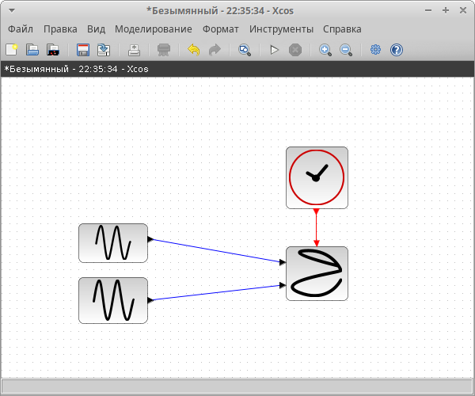{#fig:001 width=70%}

Обозначим А и В как амплитуды колебаний, a и b как частоты, а $\delta$ как сдвиг фаз.

Построим для `b = 2` различные варианты $\delta$ (рис. [-@fig:002], рис. [-@fig:003], рис. [-@fig:004], рис. [-@fig:005], рис. [-@fig:006]).

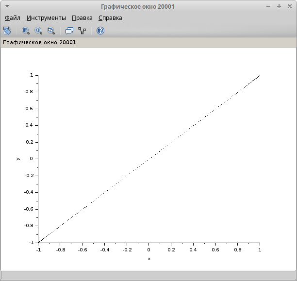{#fig:002 width=70%}

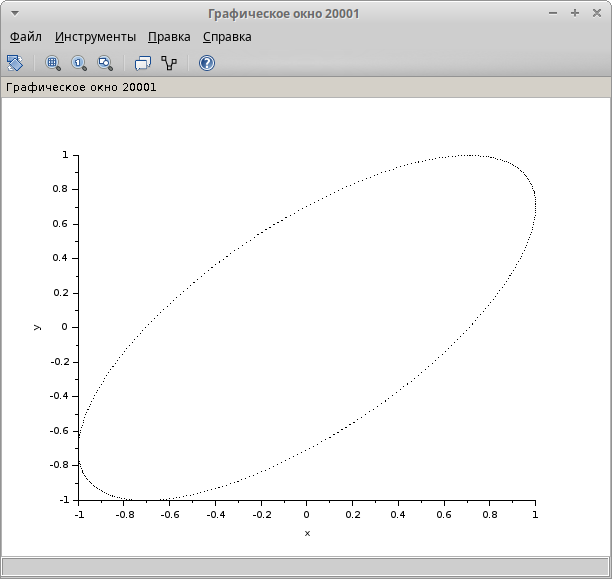{#fig:003 width=70%}

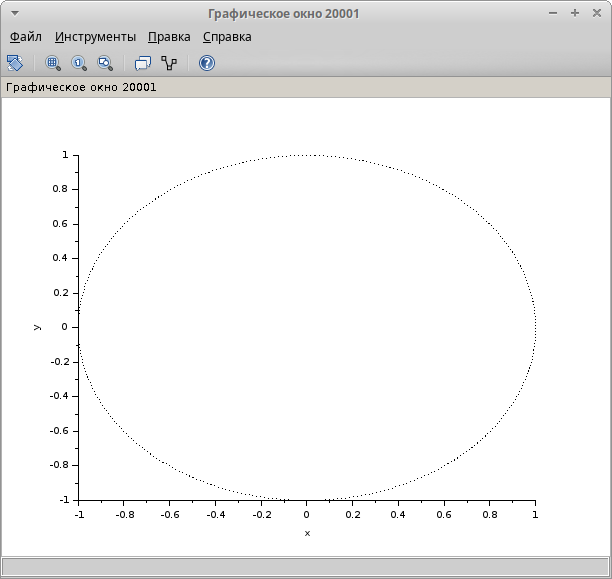{#fig:004 width=70%}

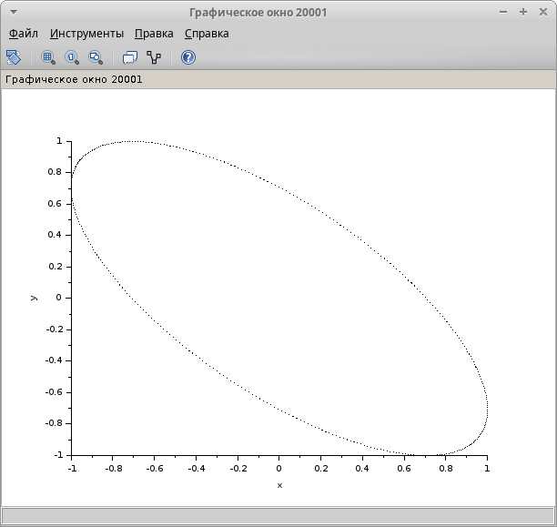{#fig:005 width=70%}

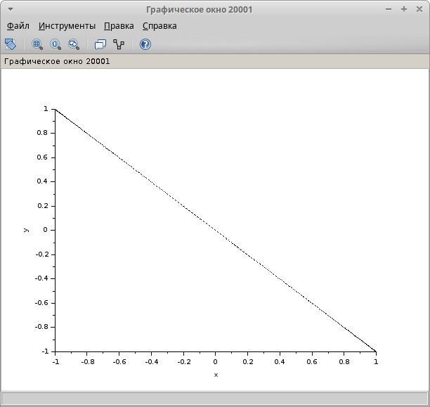{#fig:006 width=70%}

Аналогично для `b = 4` различные варианты $\delta$ (рис. [-@fig:007], рис. [-@fig:008], рис. [-@fig:009], рис. [-@fig:010], рис. [-@fig:011]):

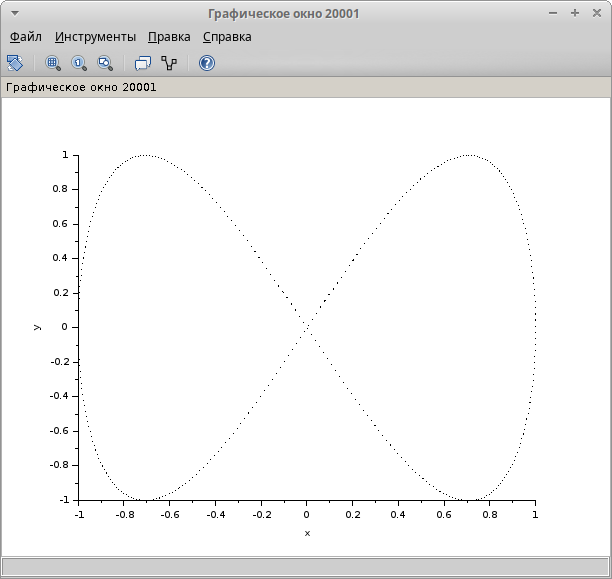{#fig:007 width=70%}

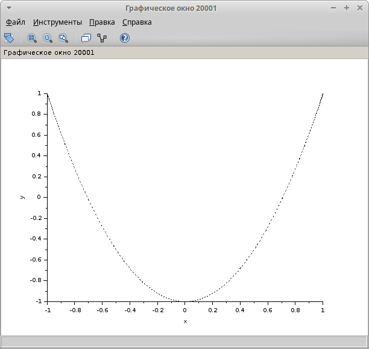{#fig:008 width=70%}

{#fig:009 width=70%}

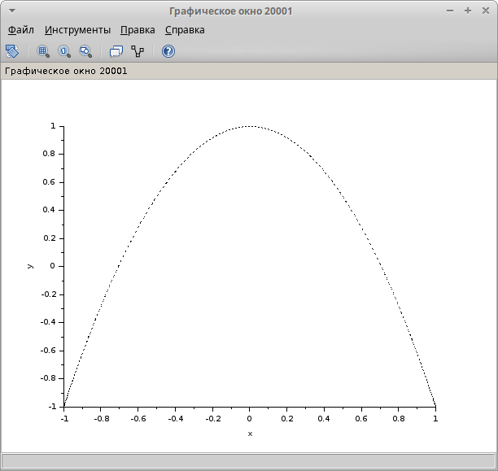{#fig:010 width=70%}

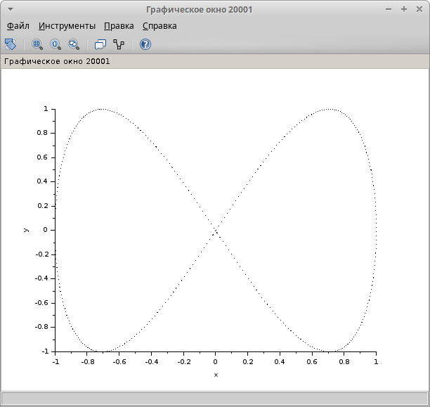{#fig:011 width=70%}

Аналогично для `b = 6` различные варианты $\delta$ (рис. [-@fig:012], рис. [-@fig:013], рис. [-@fig:014], рис. [-@fig:015], рис. [-@fig:016]):

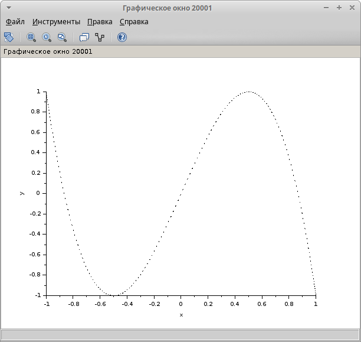{#fig:012 width=70%}

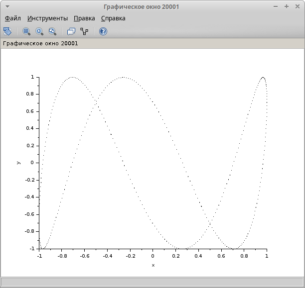{#fig:013 width=70%}

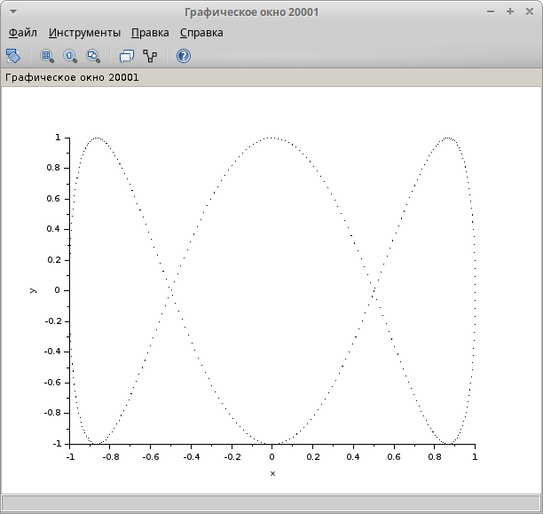{#fig:014 width=70%}

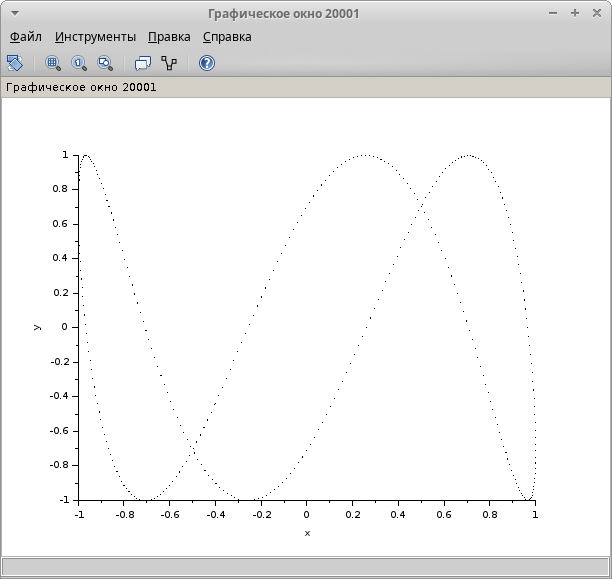{#fig:015 width=70%}

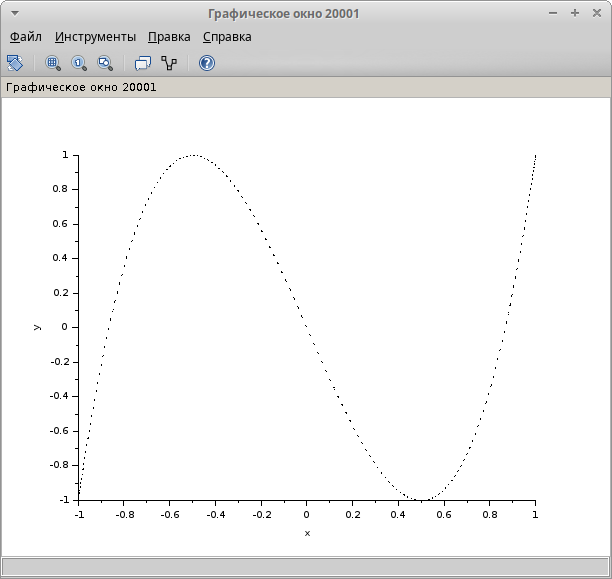{#fig:016 width=70%}

И для `b = 8` различные варианты $\delta$ (рис. [-@fig:017], рис. [-@fig:018], рис. [-@fig:019], рис. [-@fig:020], рис. [-@fig:021]):

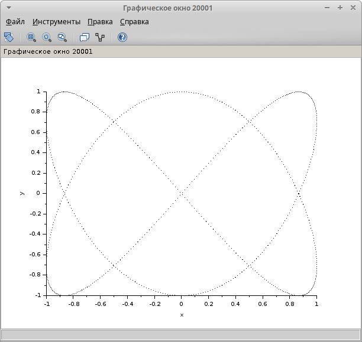{#fig:017 width=70%}

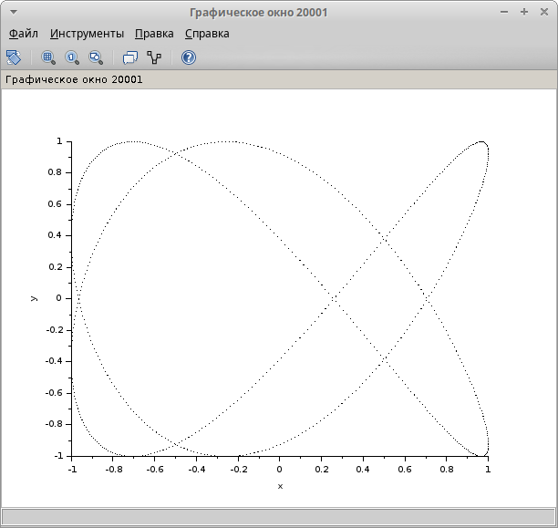{#fig:018 width=70%}

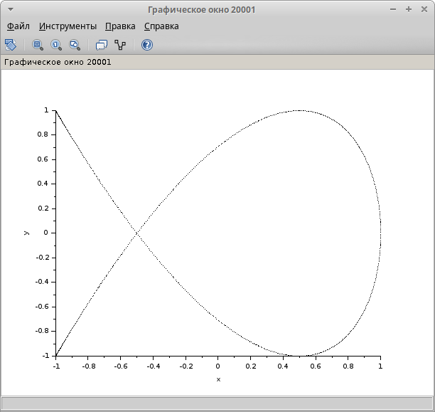{#fig:019 width=70%}

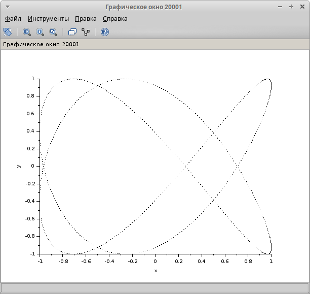{#fig:020 width=70%}

{#fig:021 width=70%}

Также, у нас был дан пример с параметрами A = B = 1, a = 3, b = 2, $\delta$ = $\pi$/2, мы ее также построили (рис. [-@fig:022]):

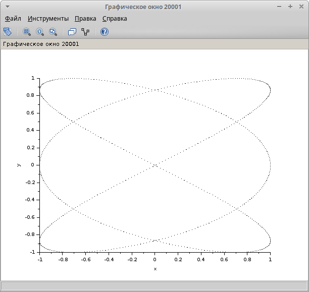{#fig:022 width=70%}

# Выводы

В ходе лабораторной работы мы визуализировали фигуры, указанные в упражнении, включая показанную в работе.

# Список литературы{.unnumbered}

::: {#refs}
:::

